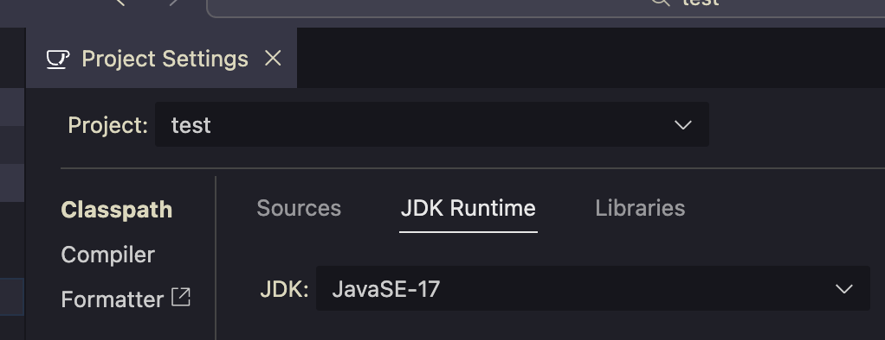
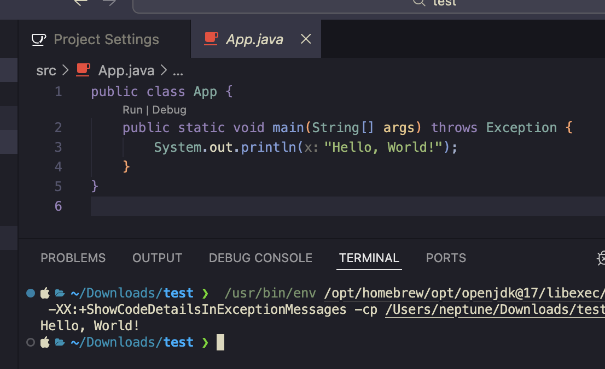

# JAVA (OpenJDK 17) 개발 환경 구축

JAVA 강의 학습을 위해 실습 환경을 구축하는 가이드 입니다.  
WIndows 환경의 경우, 내용 보강 예정입니다.

## macOS (Visual Studio Code)

Homebrew를 활용한 macOS용 OpenJDK 17 설치 및 환경 변수 설정 가이드입니다. 심볼릭 링크 설정을 통해 시스템이 JDK를 인식하도록 구성했습니다.  

### 0. Homebrew 설치

* **[Homebrew](https://brew.sh/)**

```Bash
/bin/bash -c "$(curl -fsSL https://raw.githubusercontent.com/Homebrew/install/HEAD/install.sh)"
```

* **Homebrew 설치 확인**  

```Bash
brew --version
#Homebrew 5.0.8
```

### 1. homebrew로 OpenJDK 17 버전 설치

```Bash
brew install openjdk@17
```

### 2. 심볼릭 링크 설정

* **Apple Silicon (M1 or later)**  

```Bash
sudo ln -sfn /opt/homebrew/opt/openjdk@17/libexec/openjdk.jdk /Library/Java/JavaVirtualMachines/openjdk-17.jdk
```

* **Intel**  

```Bash
sudo ln -sfn /usr/local/opt/openjdk@17/libexec/openjdk.jdk /Library/Java/JavaVirtualMachines/openjdk-17.jdk
```

### 3. 환경 변수 설정

* **쉘 환경 변수 수정**  

```Bash
nano ~/.zshrc
```

* **아래의 내용을 파일 끝에 추가**  

```Plain text
# Java Home Setup
export JAVA_HOME=$(/usr/libexec/java_home -v 17)
export PATH="$JAVA_HOME/bin:$PATH"
```

* **변경된 쉘 환경 변수 적용**  

```Bash
source ~/.zshrc
```

### 4. 설치 확인

```Bash
java -version
```

```Bash
javac -version
```

* **출력이 아래와 같아야 함**  

```Plain Text
openjdk version "17.0.17" 2025-10-21
OpenJDK Runtime Environment Homebrew (build 17.0.17+0)
OpenJDK 64-Bit Server VM Homebrew (build 17.0.17+0, mixed mode, sharing)
```

```Plain Text
javac 17.0.17
```

### 5. Visual Studio Code 환경 설정

* **필수 확장 프로그램 설치 - [Extension Pack for Java (Microsoft)](https://marketplace.visualstudio.com/items?itemName=vscjava.vscode-java-pack)**  

* **Settings.json 설정 추가 - 아래 설정 중 본인 환경에 맞는 하나만 추가하세요.**

```Json
    //Apple Silicon (M1 or later)
    "java.configuration.runtimes": [
        {
            "name": "JavaSE-17",
            "path": "/opt/homebrew/opt/openjdk@17/libexec/openjdk.jdk/Contents/Home",
            "default": true
        }
    ],
```

```Json
    //Intel
    "java.configuration.runtimes": [
        {
            "name": "JavaSE-17",
            "path": "/usr/local/opt/openjdk@17/libexec/openjdk.jdk/Contents/Home",
            "default": true
        }
    ],
```

### 6. JAVA 실행 테스트

1. `cmd + shift + p` → `Java: Create Java Project...` → `No build tools`
2. 프로젝트 저장 경로 지정
3. 프로젝트 이름 지정
4. `cmd + shift + p` → `Java: Configure Java Runtime`



5. `src/App.java 실행 테스트`



## Windows

Windows 환경에서 OpenJDK 17 압축 파일을 활용하여 수동으로 개발 환경을 구축하는 가이드입니다. 특정 디렉토리에 개발 도구를 모아 관리하며 환경 변수를 직접 설정합니다.

### 1. OpenJDK 다운로드
    
**[Archived OpenJDK GA Releases](https://jdk.java.net/archive/)**  
    
**17 GA (build 17+35) - Windows	64-bit**
    
**압축 해제 후 → `C:₩ce06₩devEnv`로 이동**

### 2. 환경 변수 설정 (PATH)
    

**시스템 속성 → 고급 → 환경 변수 → 시스템 변수 → 새로 만들기**  

**변수 이름 : `JAVA_HOME`**  

**변수 값 : `C:₩ce06₩devEnv₩jdk-17`**
    
    
### 3. 환경 변수 설정 (JAVA_HOME)
    
**시스템 속성 → 고급 → 환경 변수 → 시스템 변수 → Path → 새로 만들기**
    
**`%JAVA_HOME%₩bin`**
    
**위로 이동으로 추가한 변수가 최상단에 위치 하도록 설정**
    
### 4. Eclipse
    
**[Eclipse IDE 2025-12 R Packages | Eclipse Packages](https://www.eclipse.org/downloads/packages/)**  
    
**2025-06 R - Windows: x86_64**
    
**압축 해제 후 → `C:₩ce06₩devEnv`로 이동**
    
**`eclipse.exe` 실행**  