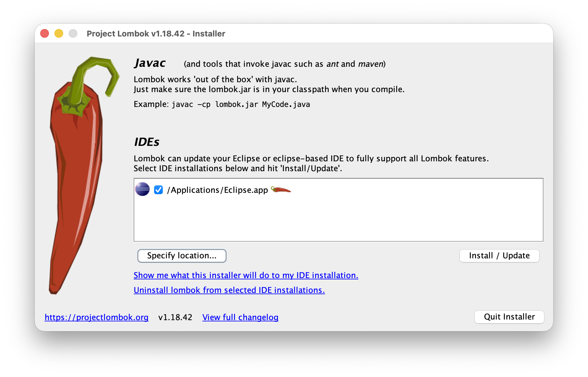
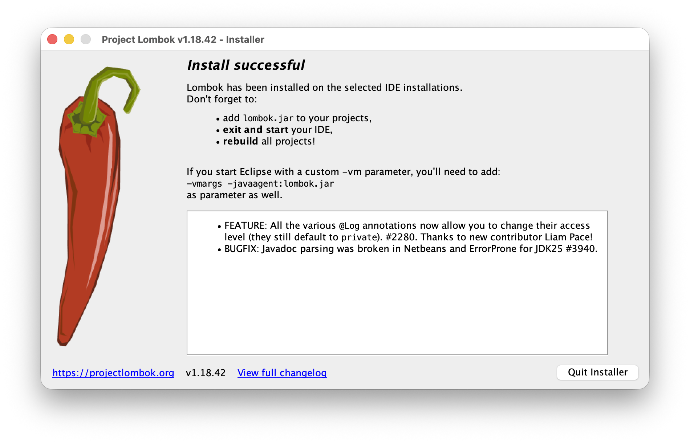

# JAVA (OpenJDK 17) 개발 환경 구축

JAVA Lombok 플러그인을 설치하는 가이드입니다.

## macOS (Visual Studio Code)

**[이전 구성]([2025.12.30]_JAVA_Env_Setup.md)을 완료했다면, VS Code에서는 추가적인 설치 과정이 필요 없습니다..**

**동작 원리: Language Support for Java(TM) by Red Hat 확장 프로그램에 Lombok 지원 기능이 내장되어 있습니다.**

**설정: 프로젝트의 `pom.xml` (Maven)이나 `build.gradle` (Gradle)에 Lombok 의존성이 추가되면, IDE가 이를 감지하여 자동으로 언어 서버에 로드합니다.**

## macOS (Eclipse)

Windows 환경도 설치 프로세스(jar 실행 및 경로 지정)가 macOS와 유사하므로 본 가이드를 참고하여 진행할 수 있습니다.

### 0. Lombok 다운로드

**[Project Lombok 공식 사이트](https://projectlombok.org/)에서 lombok.jar를 다운로드합니다.**  

### 1. Lombok 실행

```Bash
#파일 경로는 기기마다 다를 수 있습니다.
java -jar ./Downloads/lombok.jar
```

### 2. Lombok 설치



* **IDEs에 Eclipse가 보이지 않는 경우, `Specify location...`으로 수동으로 IDE를 선택**  

* **`Install / Update`**  



* **`Quit Installer`**  

### 3. Lombok 설치 확인

* **Applications 폴더로 이동 -  Finder에서 `cmd + shift + g` → `/Applications` 입력 → 엔터**  

* **`Eclipse.app` 우클릭 → `Show Package Contents` → `Contents` → `Eclipse`**  

* **`lombok.jar` 파일 확인**  

* **`eclipse.ini` 맨 아래 내용 추가 확인**  
```Plain Text
-javaagent:/Applications/Eclipse.app/Contents/Eclipse/lombok.jar
```