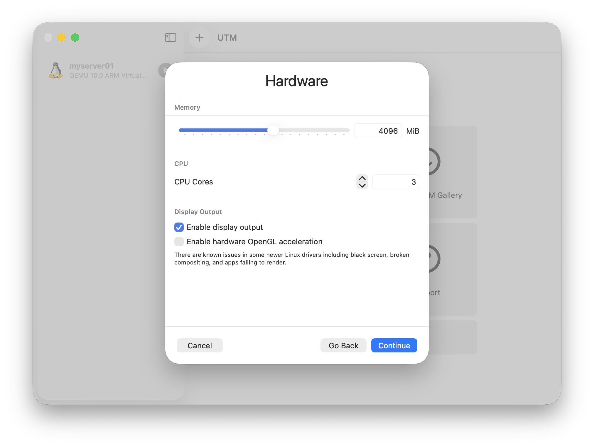
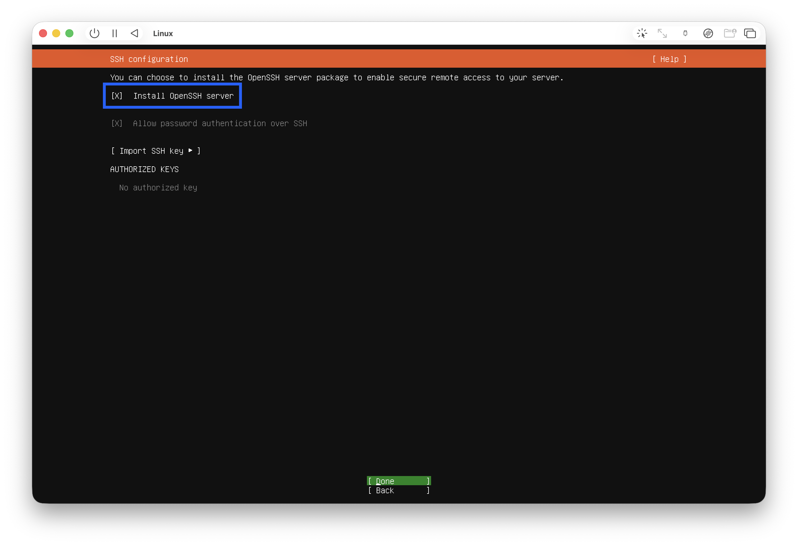
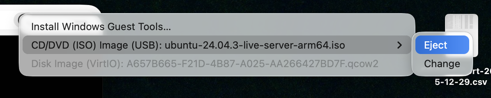
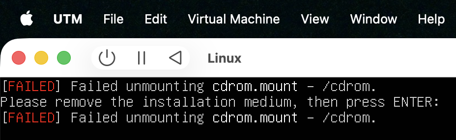
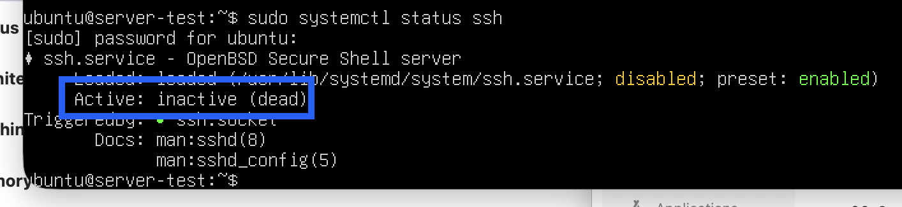
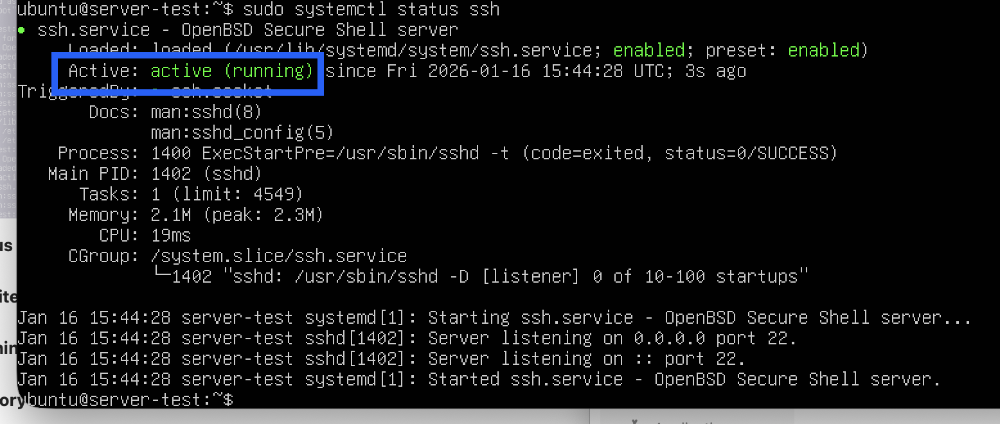
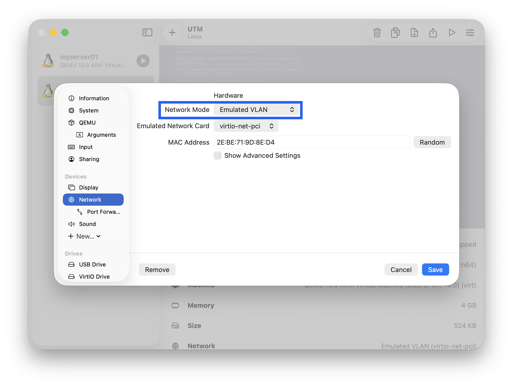
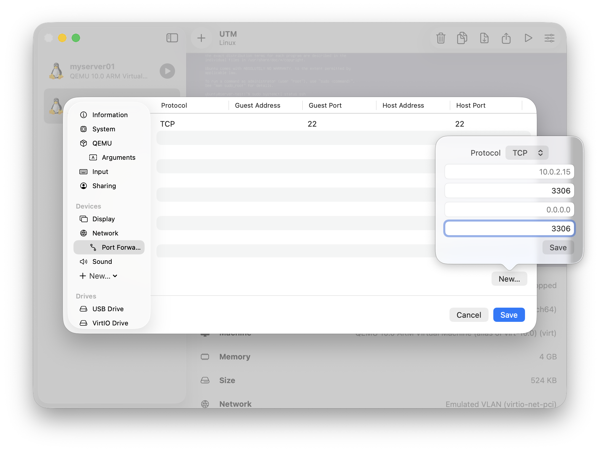
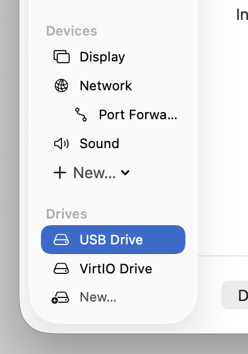
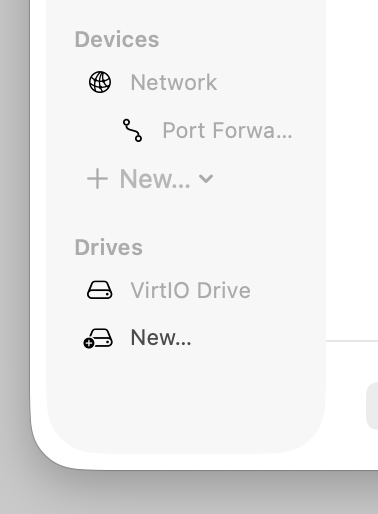

# UTM을 이용해 Ubuntu 가상머신 설치

**해당 가이드는 Apple Silicon (M1 or later) Mac 환경을 기준으로 작성되었습니다. x86_64 (AMD64)가 아닌 AArch64 (ARM64) 리눅스를 설치하므로, 기존 인텔용 패키지와 일부 호환성 차이가 발생할 수 있습니다.**

## 0. 사전 준비

### 0.1 UTM 설치

* Homebrew

    ```Bash
    brew install --cask utm
    ```

* Official Homepage [mac.getutm.app](https://mac.getutm.app/)

### 0.2 AArch64 Ubuntu 이미지 다운로드

* 작성일 기준 `Download 24.04.3 LTS`

    [Ubuntu Server for ARM](https://ubuntu.com/download/server/arm)

## 1. UTM 가상머신 생성

### 1.1 `Create a New Virtual Machine` → `Virtualize` → `Linux`

### 1.2 Memory와 CPU Cores는 사용중인 사양에 맞게 조절 (e.g. M3 Pro with 18GB Memory)



### 1.3 `Browse...` → 다운로드 받은 Ubuntu ISO 이미지 선택

### 1.4 Storage 용량 지정 → Shared Directory 지정 → Name 지정 및 최종 확인

## 2. Ubuntu 설치 중 참고사항

* OpenSSH 설치 체크

    

* Reboot now 이후 수동으로 CDROM Eject 필수

    

    

## 3. SSH 관련 설정

### 3.1 SSH 서비스 상태 확인

```Bash
sudo systemctl status ssh
```

* 아래와 같이 inactive 상태

    

### 3.2 SSH 서비스 활성화 및 실행

```Bash
# 자동 시작 설정 및 즉시 실행
sudo systemctl enable --now ssh
```



## 4. 추가 설정

### 4.1 가상머신 완전 종료 후 설정

```Bash
sudo shutdown now
```

### 4.2 SSH (및 다른 서비스) 포트 포워딩 설정





* Host Address를 비워두거나 127.0.0.1로 설정하여 로컬 접속 환경을 구축

### 4.3 `Display`, `Sound`, `USB Drive` 삭제




* `Display` → 이후 모든 작업은 SSH 연결 후 수행

* Display 삭제 시 GUI 환경을 사용할 수 없으며, 네트워크 오류 등으로 SSH 접속이 불가할 경우 문제를 해결하기 어렵기 때문에 초기 설정이 완벽히 끝난 후 삭제를 권장

    ```Bash
    # 생성된 VM 리스트와 상태 확인
    utmctl list
    # cli command를 이용해 가상머신 ON/OFF 가능
    utmctl start <VIRTUAL MACHINE NAME>
    utmctl stop <VIRTUAL MACHINE NAME>
    ```