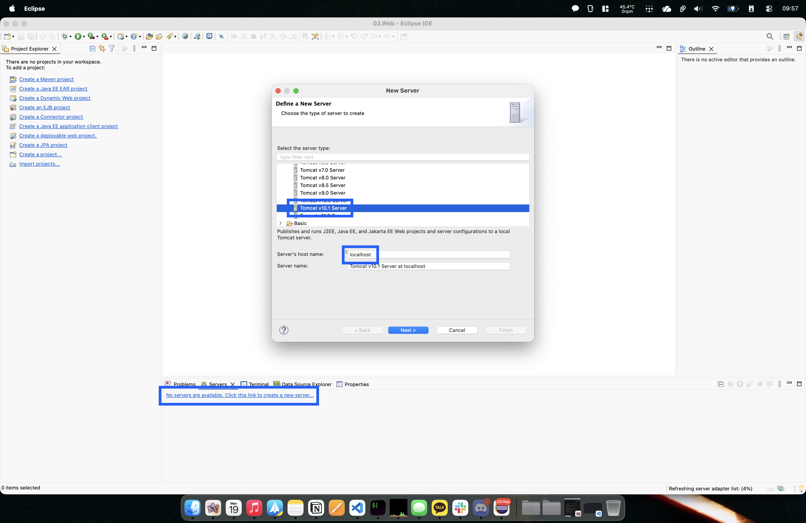
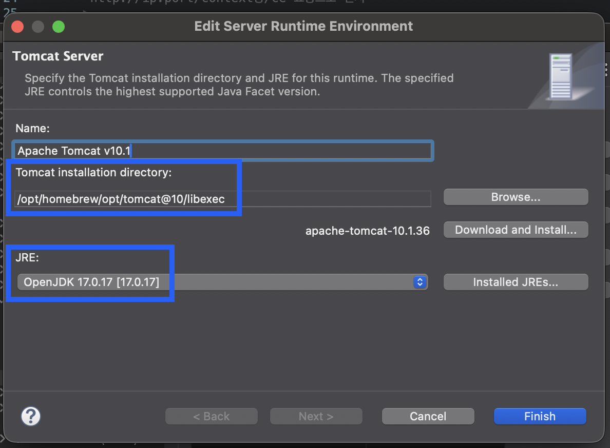

# macOS에 Tomcat 설치하기

### 0. JAVA 설치 확인

```Bash
# Tomcat 10은 Java 11 이상 필수
java -version
```

* 출력 확인

    ```Plain text
    openjdk version "17.0.17" 2025-10-21
    OpenJDK Runtime Environment Homebrew (build 17.0.17+0)
    OpenJDK 64-Bit Server VM Homebrew (build 17.0.17+0, mixed mode, sharing)
    ```

### 1. Homebrew로 Tomcat 10.x 설치

```Bash
brew install tomcat@10
```

### 2. Tomcat 환경변수 설정

```Bash
nano ~/.zshrc
```

* Apple Silicon (M1 or later)

    ```Bash
    # Tomcat 환경 변수 설정
    export CATALINA_HOME="/opt/homebrew/opt/tomcat@10/libexec"
    export PATH="$PATH:$CATALINA_HOME/bin"
    ```

* Intel

    ```Bash
    # Tomcat 환경 변수 설정
    export CATALINA_HOME="/usr/local/opt/tomcat@10/libexec"
    export PATH="$PATH:$CATALINA_HOME/bin"
    ```

* 추가 옵션: catalina.sh - catalina 매핑

    ```Bash
    # opt
    alias catalina='catalina.sh'
    ```

* 변경사항 적용

    ```Bash
    source ~/.zshrc
    ```

### 3. 설치 확인

```Bash
# 추가 옵션을 하지 않은 경우
catalina.sh version
# 추가 옵션을 넣은 경우
catalina version
```

* 출력 확인

    ```Plain text
    Using CATALINA_BASE:   /opt/homebrew/opt/tomcat@10/libexec
    Using CATALINA_HOME:   /opt/homebrew/opt/tomcat@10/libexec
    Using CATALINA_TMPDIR: /opt/homebrew/opt/tomcat@10/libexec/temp
    Using JRE_HOME:        /opt/homebrew/Cellar/openjdk@17/17.0.17/libexec/openjdk.jdk/Contents/Home
    Using CLASSPATH:       /opt/homebrew/opt/tomcat@10/libexec/bin/bootstrap.jar:/opt/homebrew/opt/tomcat@10/libexec/bin/tomcat-juli.jar
    Using CATALINA_OPTS:
    Server version: Apache Tomcat/10.1.50
    Server built:   Dec 2 2025 22:57:41 UTC
    Server number:  10.1.50.0
    OS Name:        Mac OS X
    OS Version:     26.2
    Architecture:   aarch64
    JVM Version:    17.0.17+0
    JVM Vendor:     Homebrew
    ```

* **주의: brew services와 catalina.sh 명령어를 혼용하지 마세요. 하나를 선택해 관리하는 것을 권장합니다.**

    * Homebrew

        ```Bash
        # 서비스 시작, 재부팅시 자동 실행
        brew services start tomcat@10
        # 서비스 종료, 재부팅시 자동으로 켜지지 않음
        brew services stop tomcat@10
        # 서비스 재시작
        brew services restart tomcat@10
        # 서비스 목록 확인
        brew services list
        ```

    * Native

        ```Bash
        # 서비스 실행 (Foreground)
        catalina.sh run
        # 서비스 실행 (Background)
        catalina.sh start
        # 서비스 종료 (Background)
        catalina.sh stop
        ```

### 4. 작업 경로 확인

* Apple Silicon (M1 or later)

    * 홈 디렉토리: `/opt/homebrew/opt/tomcat@10/libexec`

    * 설정 파일 (conf): `/opt/homebrew/etc/tomcat@10` (또는 `libexec/conf`와 연결됨)

    * 웹 앱 배포 (webapps): `/opt/homebrew/opt/tomcat@10/libexec/webapps`

* Intel

    * 홈 디렉토리: `/usr/local/opt/tomcat@10/libexec`

    * 설정 파일 (conf): `/usr/local/etc/tomcat@10`


### 5. Eclipse에 연동

#### 5.1 서버 타입 선택



* Eclipse 하단의 Servers 탭에서 `No servers are available...` 링크를 클릭

* Apache 폴더 내에서 설치한 버전과 일치하는 Tomcat v10.1 Server를 선택

* `Server's host name` 확인

#### 5.2 Tomcat 런타임 설정



* `Tomcat installation directory`의 `Browse...` 버튼을 눌러 다음 경로를 지정

* 앞서 설정한 `CATALINA_HOME`인 `libexec` 폴더까지 지정

    * e.g. `/opt/homebrew/opt/tomcat@10/libexec` (심볼릭 링크 경로 사용 권장)

* 설치 확인 시 체크했던 Java 버전 (OpenJDK 17)이 선택되었는지 확인