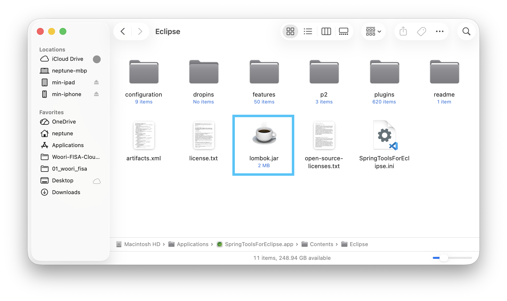
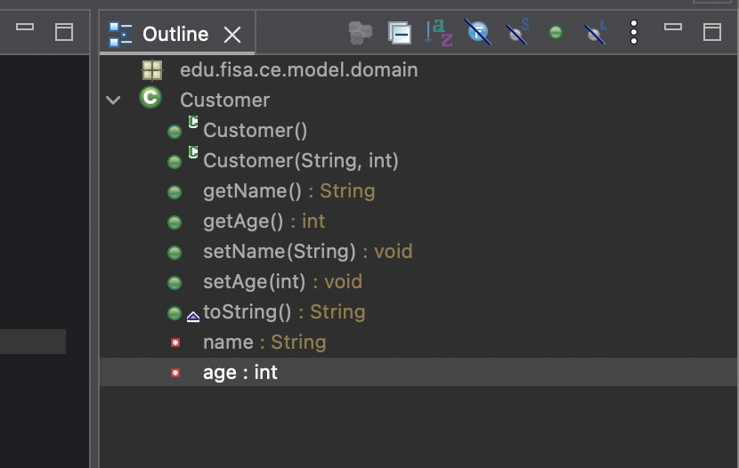

# SpringToolsForEclipse + Lombok 설치

## 1. `SpringToolsForEclipse.ini` 파일 수정

* 경로: `/Applications/SpringToolsForEclipse.app`

* 방법: 해당 앱 우클릭 → 내용 콘텐츠 보기 (Show Package Contents) 선택

* 수정: `Contents/Eclipse/SpringToolsForEclipse.ini` 파일 최하단에 아래 라인 추가

    ```ini
    -javaagent:/Applications/SpringToolsForEclipse.app/Contents/Eclipse/lombok.jar
    ```

## 2. `lombok.jar` 복사

* 설정 파일에 입력한 경로와 동일한 위치에 lombok.jar 파일을 복사합니다.

* 일반적으로 `SpringToolsForEclipse.ini` 파일이 위치한 `Contents/Eclipse/` 폴더 내에 배치하는 것이 관리하기 가장 편합니다.

    

## 3. 적용 확인

```Java
package edu.fisa.ce.model.domain;

import lombok.AllArgsConstructor;
import lombok.Getter;
import lombok.NoArgsConstructor;
import lombok.Setter;
import lombok.ToString;

@NoArgsConstructor
@AllArgsConstructor
@Getter
@Setter
@ToString
public class Customer {
	private String name;
	private int age;
}

```

