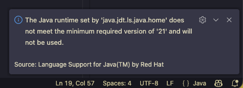
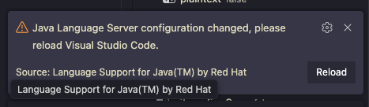

# Plugin JDK Version Conflict

## 1. 문제 상황

`Language Support for Java(TM) by Red Hat` 플러그인이 `JDK 21 or more recent is required` 라는 경고 메시지와 함깨 플러그인이 느리게 작동하거나 정상적으로 작동하지 않음.



## 2. 문제 원인

확장 프로그램의 구동 엔진 (Language Server)이 JDK 21 이상의 런타임을 요구하지만, [아카데미 개발환경](../01_Environment_Setup/[2025.12.30]_JAVA_Env_Setup.md)이 JDK 17 환경이기 때문에 발생하는 문제

## 3. 해결 방안

### 3.1 시스템에 추가적으로 JDK 21 설치

```Bash
brew install openjdk@21
```

### 3.2 Language Server가 JDK 21을 사용하도록 설정

* `cmd + shift + p`

* `Preference: Open User Settings (JSON)`

* 아래 내용 추가

```Json
//Apple Silicon (M1 or later)
"java.jdt.ls.java.home": "/opt/homebrew/opt/openjdk@21/libexec/openjdk.jdk/Contents/Home",
```



* `Reload`