# Kibana를 이용해 Elasticsearch에 데이터 적재하고 시각화 해보기

## 0. 환경 준비 확인

### 0.1 Elasticsearch

* https://localhost:9200 확인

    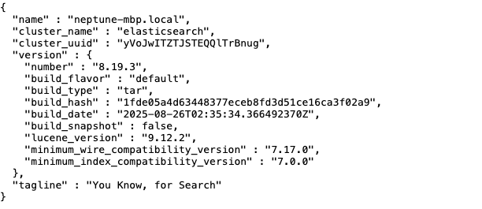

### 0.2 Kibana

* http://localhost:5601 확인

* 이후 로그인 진행

    

## 1. 데이터 예제

* **본 실습은 [개인 보유 데이터](/03_Lectures_Summary/01_Web_Service/SQL/[2026.01.09]_V_example.csv)를 기반으로 하며, 풍부한 시각화 분석을 위해 AI (Gemini)로 합성 데이터를 생성하여 수행되었습니다.**

* 8개의 컬럼, 100개의 데이터

    ```Plain text
    구매일,상품명,카테고리,판매처,판매지역,수량,가격,구매자수
    20260114,Gawr Gura Plushie,Apparel,Online Store,Seoul,15,45000,12
    20260113,Mori Calliope Vinyl,Music,Pop-up Store,Tokyo,8,65000,8
    20260112,Hoshimachi Suisei Acrylic,Accessory,Collab Cafe,Busan,25,15000,20
    20260111,Hololive English T-Shirt,Apparel,Online Store,LA,12,35000,10
    ```

## 2. 데이터 적재

### 2.1 `Analytics` 탭에서 `Machine Learning` 선택


### 2.2 `Visualize data from a file` 섹션에서 `Select file` 선택 → [예제 데이터](./[2026.01.14]_II_example.csv) 선택 → 아래쪽 `File stats`에서 기본적인 데이터 통계 확인 가능

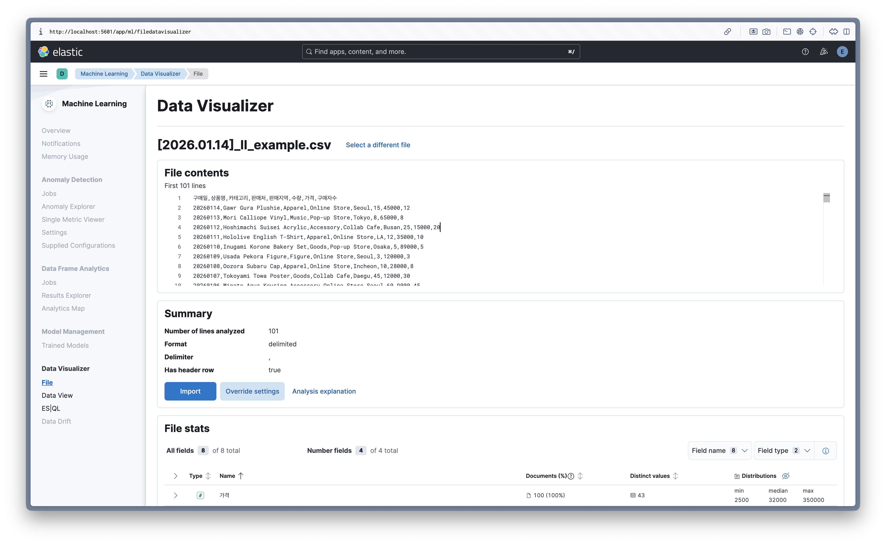

### 2.3 `Override settings` → `Contains time field` 체크 후 시계열 필드 설정

* 예제 데이터의 시간 포맷과 필드를 지정 (`yyyyMMdd` 타입이므로 수동으로 지정 필요)

    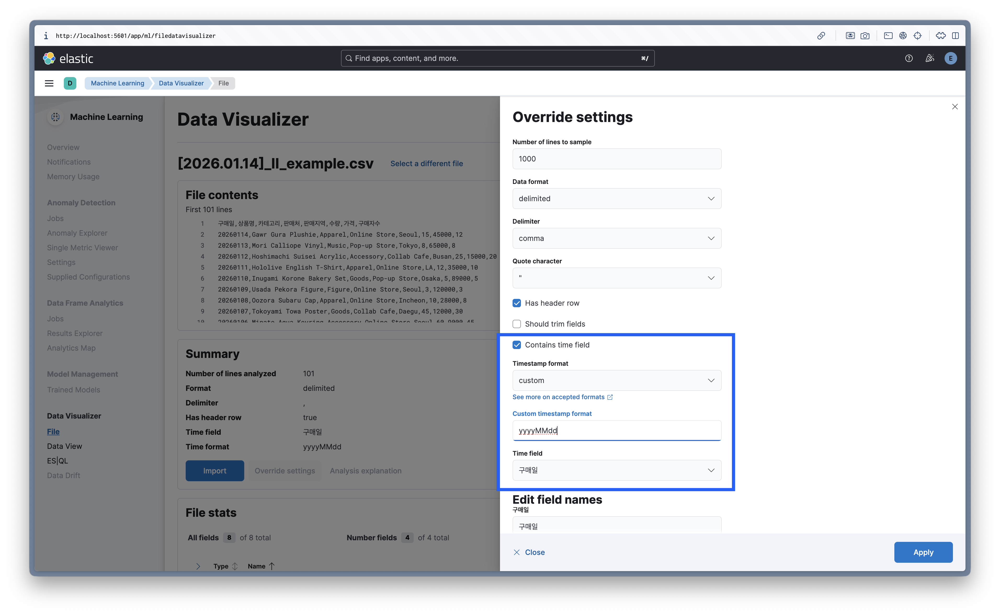

### 2.4 `Apply` → `Import` → `Index name` 지정 → `Import`

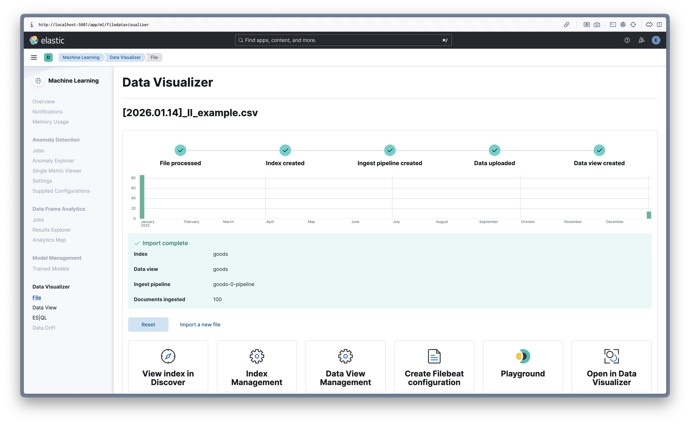

### 2.5 데이터 적재 확인

* `Analytics` → `Discover` 에서 데이터 확인

    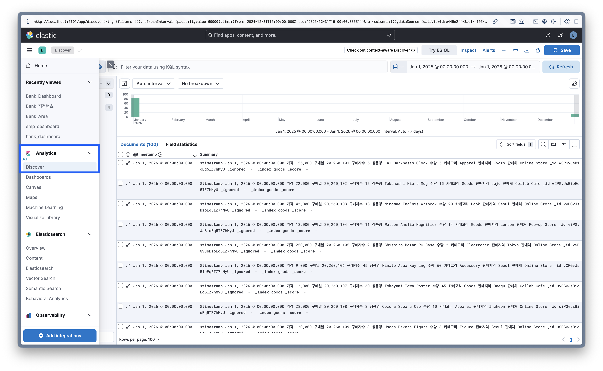

* Elasticsearch Tools

    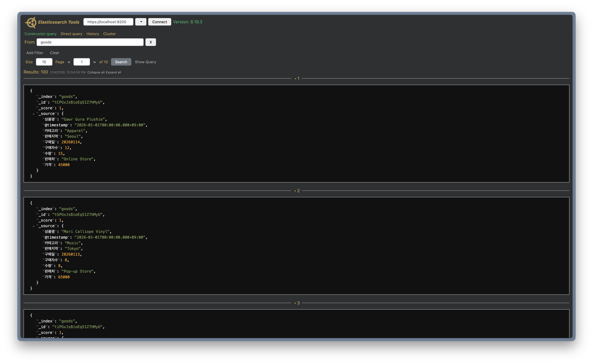

* Elasticsearch Heads

    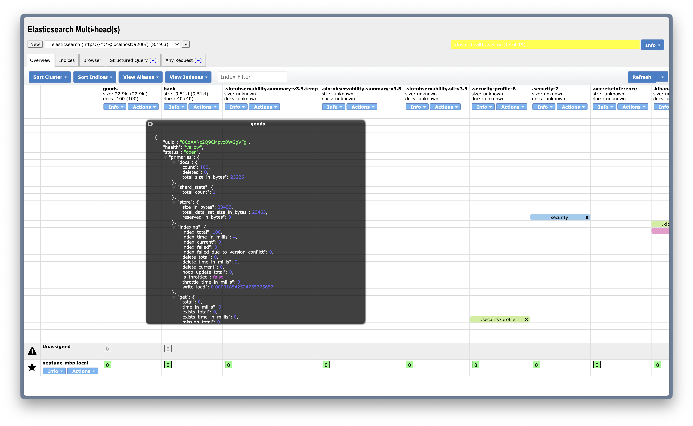

## 3. 시각화 연습

### 3.1 Dashboard 생성

* `Analytics` → `Dashboards` → `Create dashboard`

    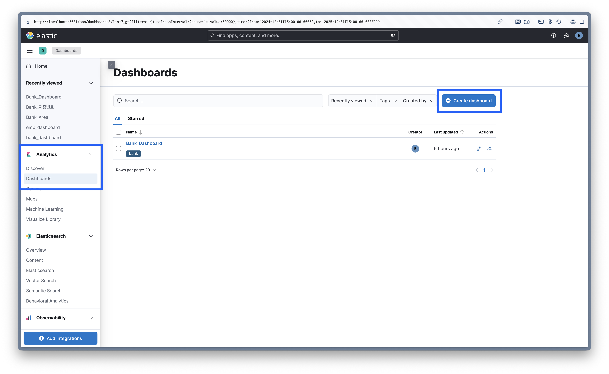

* `Editing New Dashboard`에서 이름 설정 → `Save`

    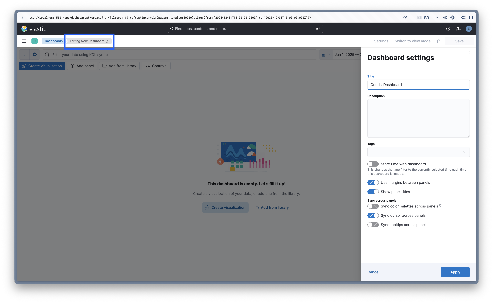

### 3.2 `Visualize Library` 혹은 Dashboard에서 `Create visualization` → `Lens`

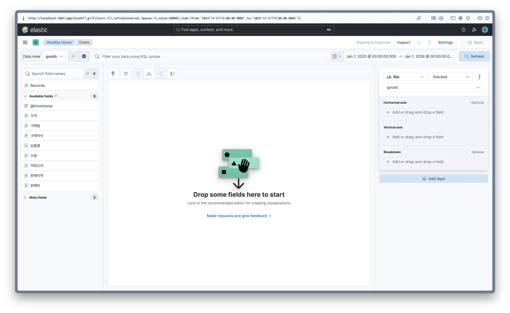

### 3.3 세부 옵션 설명

* 왼쪽: 적재한 goods 인덱스의 필드들이 나타납니다. 카테고리, 구매자수, 수량 등의 필드를 확인할 수 있습니다.

* 오른쪽: 필드를 드래그 앤 드롭하면 데이터에 맞는 최적의 그래프를 Kibana가 자동으로 추천합니다.

    * 가로축 (Horizontal axis): 주로 '카테고리'나 '날짜' 필드를 배치합니다.

    * 세로축 (Vertical axis): '수량의 합계'나 '평균 가격' 등 통계 수치(Metrics)를 배치합니다.

    * 구분자(Breakdown): 하나의 막대나 선을 더 세분화해서 보고 싶을 때 사용합니다. (예: 카테고리 내에서 '판매지역'별로 나눠 보기)

* 그래프 옵션 상세

    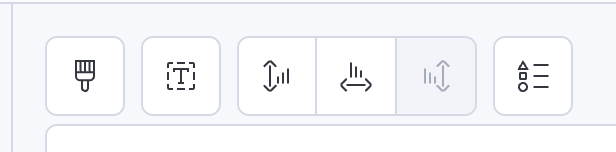

    1. Appearance: 그래프 색상 테마, 막대 두께, 불투명도 조절

    2. Titles and text: 차트 제목, 설명 추가

    3. Left axis: Y축 눈금 단위, 최소/최대값 고정, 레이블 설정

    4. Bottom axis: X축 레이블 각도 조절, 생략된 텍스트 표시 여부

    5. Right axis: 보조 Y축(이중축) 사용 시 설정

    6. Legend: 범례의 위치(상/하/좌/우), 표시 여부 설정

* 제목 설정 후 대시보드를 지정하여 시각화 작업 저장

    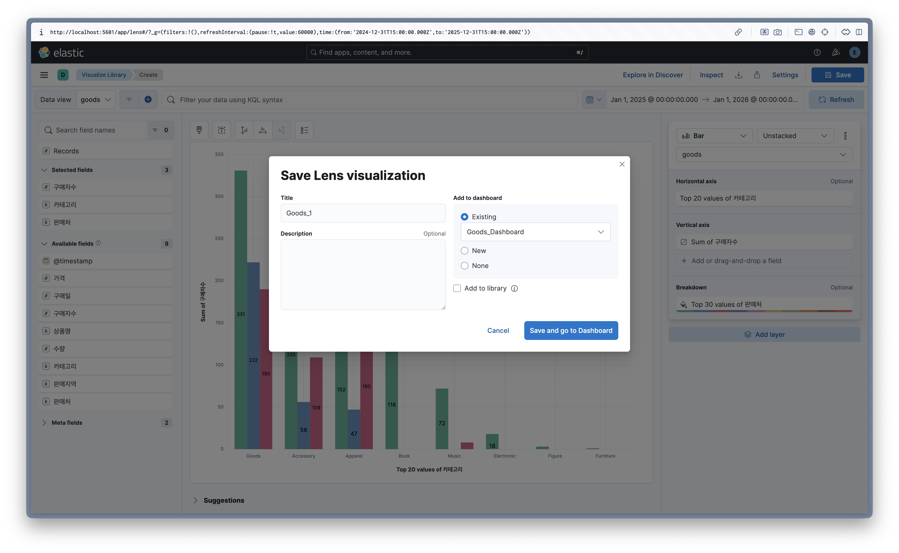

## 4. 예제

### 4.1 상품 카테고리별 구매자 수 및 판매처 분포 분석

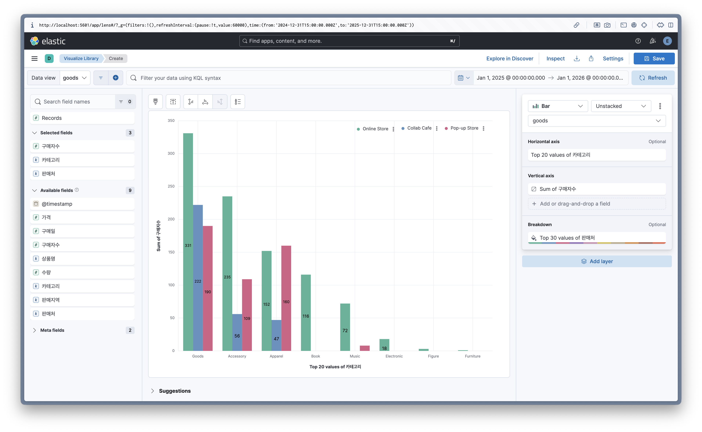

### 4.2 구매 카테고리별 비율을 파이로 표현

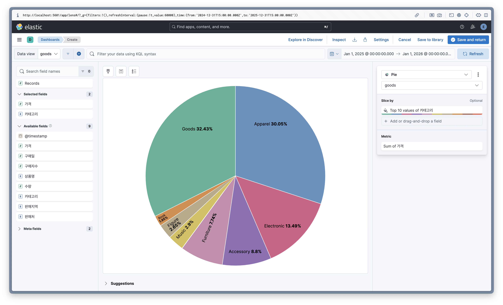

### 4.3 상품 판매처별 총 판매 금액 및 카테고리 분포 분석

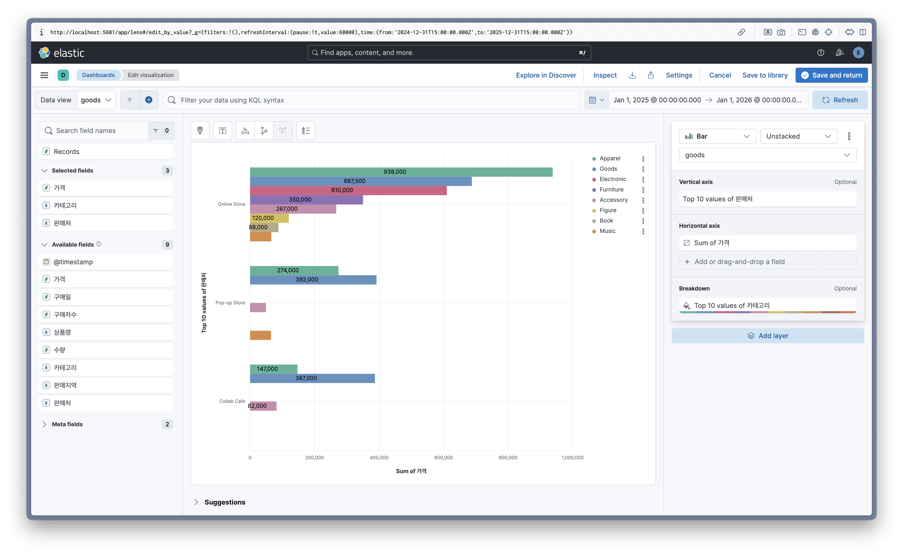

### 4.4 전체 대시보드

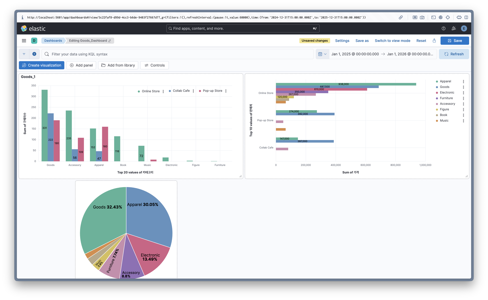