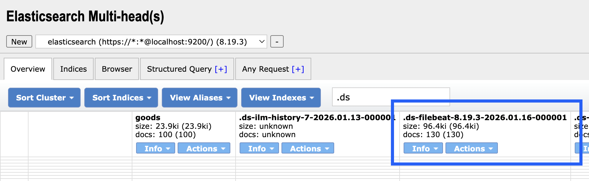
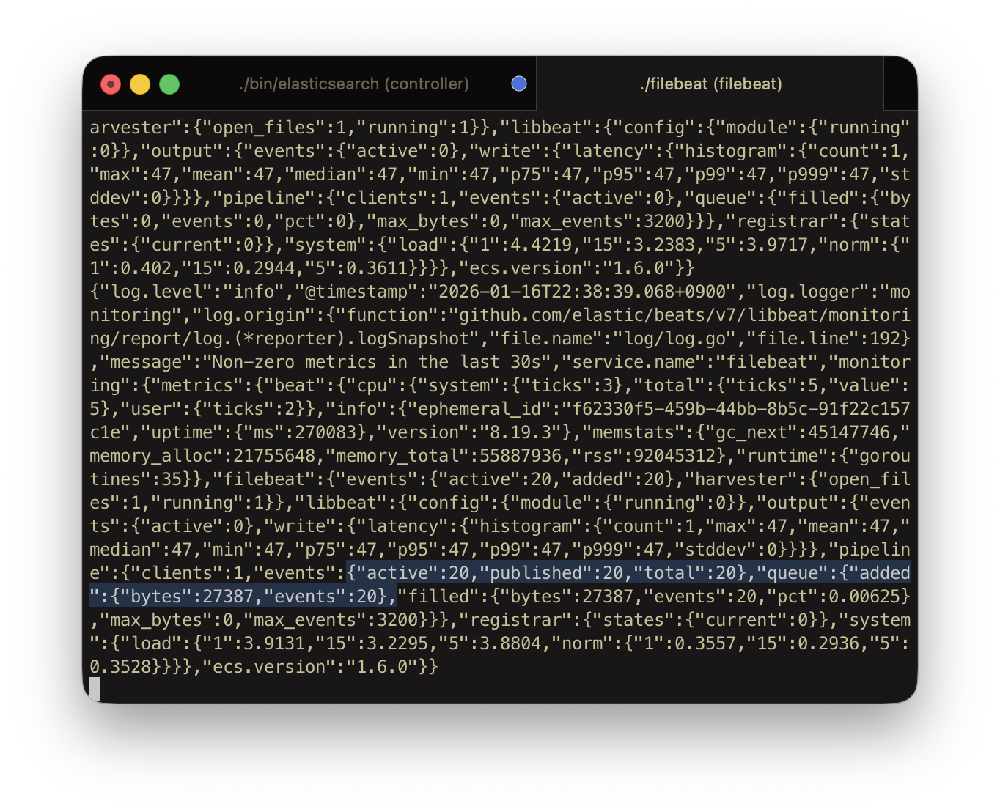
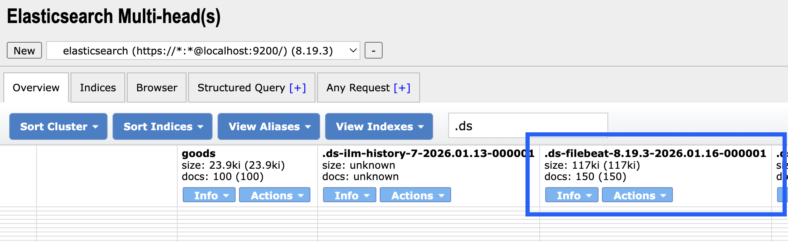
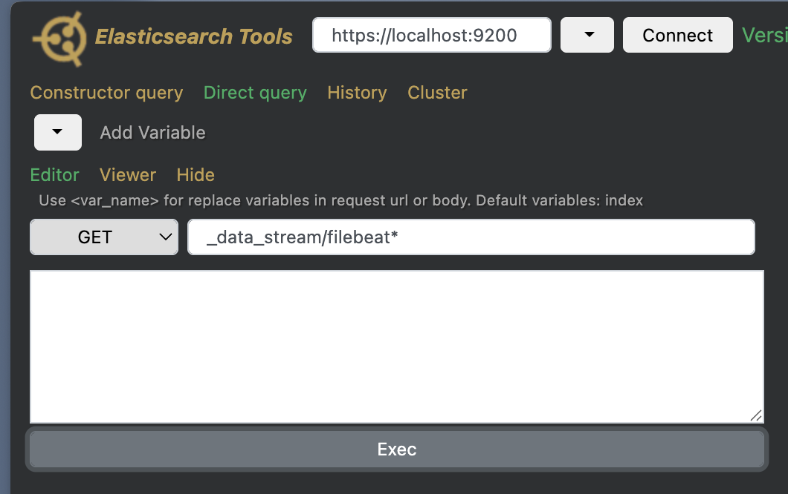
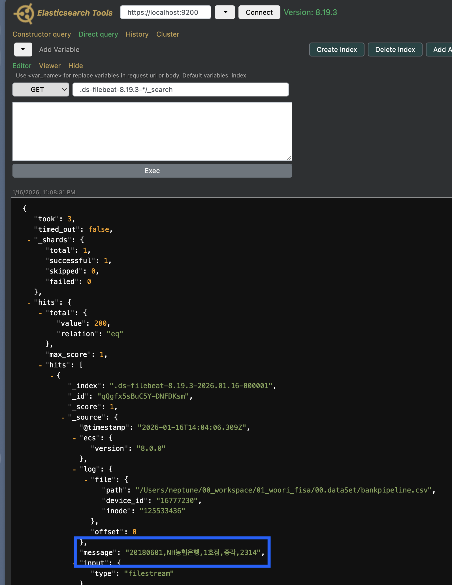
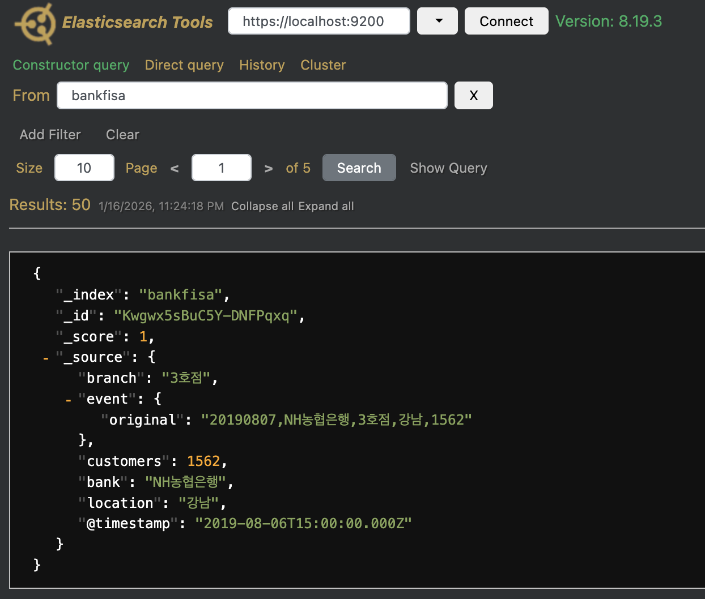
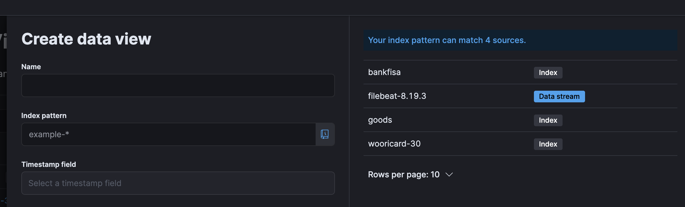

# Filebeat와 Logstash를 활용한 데이터 자동 포맷팅 및 적재 해보기

## 0. 전체 Pipeline 개요

1. Filebeat → Elasticsearch : 가정 가볍고 직접적인 수집 방식

2. Filebeat → Logstash (Unfiltered) → Elasticsearch : 중간 전달자로서의 Logstash

3. Filebeat → Logstash (Filtered) → Elasticsearch : 필터를 통한 데이터 구조화 및 자동 포맷팅

## 1. Direct Ingestion

Filebeat가 데이터 파일을 읽어 특별한 전처리 없이 바로 Elasticsearch로 전송하는 환경입니다.

### 1.1 Filebeat Input/Output 설정

Filebeat의 `filebeat.yml`을 수정해 Elasticsearch와 직접 연결되도록 합니다.

* Before

    ```Yaml
    # ============================== Filebeat inputs ===============================
    filebeat.inputs:
    - type: filestream
      id: my-filestream-id
      enabled: false
      paths:
        - /var/log/*.log
        #- c:\programdata\elasticsearch\logs\*
    # ---------------------------- Elasticsearch Output ----------------------------
    output.elasticsearch:
      hosts: ["localhost:9200"]
      preset: balanced
    ```

* After

    ```Yaml
    # ============================== Filebeat inputs ===============================
    filebeat.inputs:
    - type: filestream
      # 각 Input의 고유 ID 설정 (상태 추적용)
      id: bankpipeline-raw
      enabled: true
      paths:
        # 절대 경로 권장, 수집하고자 하는 파일명 명시
        - /Users/neptune/00_workspace/01_woori_fisa/00.dataSet/bankpipeline.csv
    # ---------------------------- Elasticsearch Output ----------------------------
    output.elasticsearch:
      # ES 8.x부터 보안 강화로 인해 https 사용이 필수
      hosts: ["https://localhost:9200"]
      preset: balanced
      # 인증 정보 입력
      username: "elastic"
      password: "<REDACTED>"
      # 로컬 테스트 시 인증서 검증을 건너뜀
      ssl.verification_mode: none
    ```

### 1.2 Filebeat과 Elasticsearch 연결 확인

```Bash
# Filebeat 설치 폴더에서 아래 명령어 실행
./filebeat test output
```

```Plain text
elasticsearch: https://localhost:9200...
  parse url... OK
  connection...
    parse host... OK
    dns lookup... OK
    addresses: ::1, 127.0.0.1
    dial up... OK
  TLS...
    security... WARN server's certificate chain verification is disabled
    handshake... OK
    TLS version: TLSv1.3
    dial up... OK
  talk to server... OK
  version: 8.19.3
```

* `security... WARN` 메시지는 앞서 `ssl.verification_mode: none` 설정을 통해 인증서 검증을 의도적으로 생략했기 때문에 발생하는 경고

### 1.3 Filebeat 실행 및 데이터 확인

```Bash
# Filebeat 설치 폴더에서 아래 명령어 실행
./filebeat -e
```

* Elasticsearch Head를 통해 `.ds-filebeat...`로 시작하는 데이터 스트림 인덱스가 생성되었는지 확인하고, 초기 데이터가 정상적으로 인덱싱되었는지 체크

    

### 1.4 실시간 로그 업데이트 감지 및 증분 적재 검증

Filebeat의 핵심 기능인 실시간 추적이 정상 작동하는지 확인하기 위해 원본 로그 파일에 데이터를 추가하고 변화를 관찰

* 원본 CSV 파일에 내용 추가 후, Filebeat 콘솔에서 새로운 이벤트가 발행되는 것을 실시간으로 확인

    

* Elasticsearch Head에서 전체 문서 수가 증가 (130건 → 150건)한 것을 확인하여, 데이터 파이프라인의 실시간 증분 적재가 성공했음을 최종 검증

    

## 2. Filebeat → Logstash (Unfiltered) → Elasticsearch

### 2.1 Filebeat Output 편집

```Yaml
# ---------------------------- Elasticsearch Output ----------------------------
# 해당 파트 내용 전부 주석 처리
# ------------------------------ Logstash Output -------------------------------
output.logstash:
  #Logstash의 Beats 입력 포트와 일치해야함
  hosts: ["localhost:5044"]
```

### 2.2 Logstash 설정 파일 생성

Logstash 설치 폴더 아래의 config 폴더에 `bankfisa.conf` 파일 생성

```Ruby
input {
  beats {
    # Filebeat로부터 데이터를 받을 포트
    port => 5044
  }
}

filter {
  # (이후 단계에서 필터 추가 예정)
}

output {
  # 터미널에서 실시간 데이터 흐름을 확인하기 위한 출력
  stdout {
    codec => rubydebug
  }
  # Elasticsearch로 데이터 최종 전송
  elasticsearch {
    # 접속 정보 입력
    hosts => ["https://localhost:9200"]
    user => "elastic"
    password => "<REDACTED>"
    # 로컬 테스트 시 인증서 검증 생략
    ssl => true
    ssl_verification_mode => "none"
    # 적재될 인덱스명 지정
    index => "bankpipeline"
  }
}
```

### 2.3 실행 및 데이터 적재 검증

**같은 파일로 실습을 할 경우 `filebeat/data` 경로 하위에 있는 `registry` 폴더를 삭제 후 진행**

**기존 파일 추적 내용을 전부 삭제하는 작업이므로 실제 서비스 환경에서는 수행 금지**

```Bash
# Logstash 설치 폴더에서 아래 명령어 실행
# 설정 파일은 절대 경로로 지정 권장, 상대 경로의 경우 설정 파일을 못찾는 경우가 다수
./bin/logstash -f /Users/neptune/00_workspace/01_woori_fisa/env_ELK/logstash/config/bankfisa.conf
```

```Bash
# Filebeat 설치 폴더에서 아래 명령어 실행
./filebeat -e
```

* Filebeat & Logstash 콘솔에서 새로운 이벤트가 발행되는 것을 실시간으로 확인

* Elasticsearch Tools의 Direct query를 통해 확인

    * Datastream 확인

        

    * 데이터 적재 확인

        

## 3. Filebeat → Logstash (Filtered) → Elasticsearch

### 2.1 Logstash 설정 파일 내용 추가

```Ruby
filter {
  # CSV 형태의 message 필드를 , 기준으로 분리
  # 하나의 문자열(csv에서 한 라인)이 message라는 속성에 매핑
  # 토큰화 후에 field 매핑
  mutate {
    split => ["message", ","]
    add_field => {
      "date"      => "%{[message][0]}"
      "bank"      => "%{[message][1]}"
      "branch"    => "%{[message][2]}"
      "location"  => "%{[message][3]}"
      "customers" => "%{[message][4]}"
    }

    # Filebeat / ECS 관련 자동 생성된 속성들 불필요 필드 제거
    remove_field => [
      "message", "ecs", "host", "agent", "log", "input", "tags", "@version"
    ]
  }

  # date 필드를 @timestamp 로 변환
  # ES는 데이터를 시계열로 
  date {
    match    => ["date", "yyyyMMdd"]
    timezone => "Asia/Seoul"
    target   => "@timestamp"
  }

  # 숫자 타입 변환 및 임시 필드 제거
  mutate {
    convert => {
      "customers" => "integer"
    }
    remove_field => ["date"]
  }
}
```

### 2.2 실행 및 데이터 전처리 후 적재 검증

```Bash
# Logstash 설치 폴더에서 아래 명령어 실행
# 설정 파일은 절대 경로로 지정 권장, 상대 경로의 경우 설정 파일을 못찾는 경우가 다수
./bin/logstash -f /Users/neptune/00_workspace/01_woori_fisa/env_ELK/logstash/config/bankfisa.conf
```

```Bash
# Filebeat 설치 폴더에서 아래 명령어 실행
./filebeat -e
```

* Filebeat & Logstash 콘솔에서 새로운 이벤트가 발행되는 것을 실시간으로 확인

* Elasticsearch Tools를 통해 확인

    

* Kibana에서 확인

    