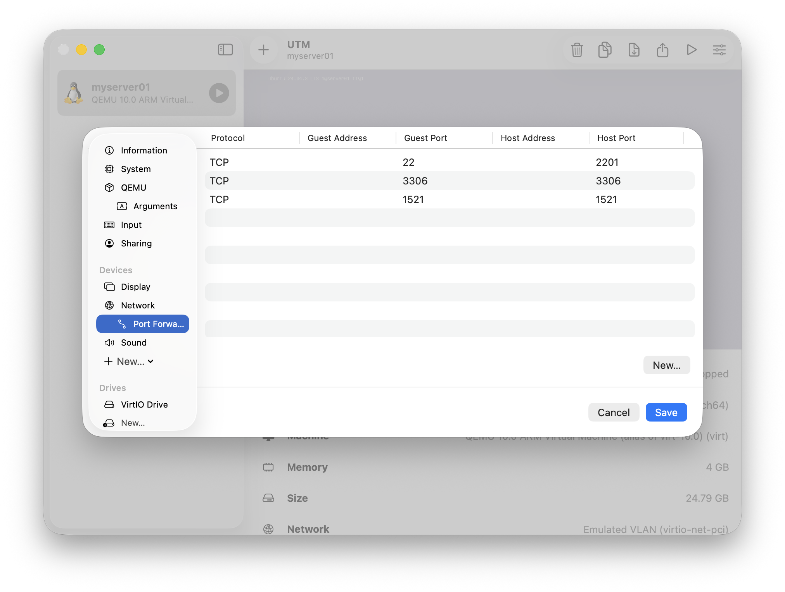
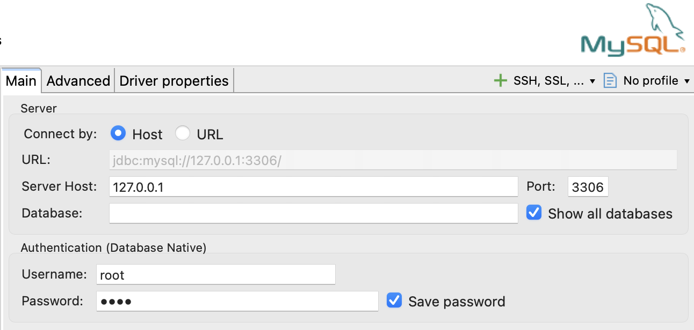
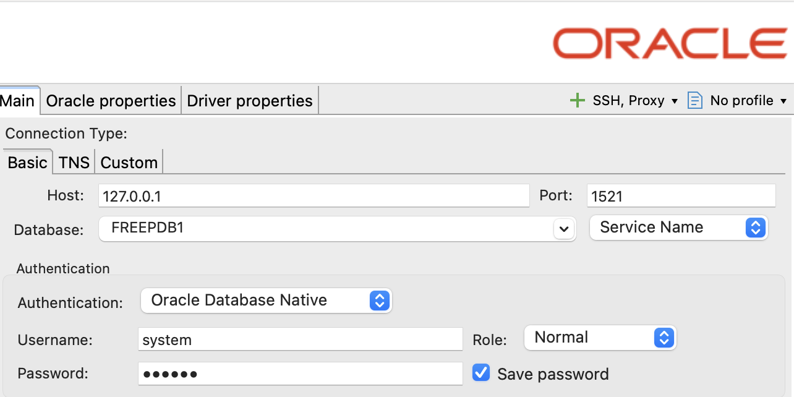

# 데이터베이스 외부 접속 설정 및 환경 구축

[Linux 가상머신에 설치된 MySQL](/03_Lectures_Summary/02_Infra_System/Linux/[2026.01.02]_II_MySQL.md)의 외부 접속 설정 과정과 Docker를 활용한 Oracle XE 환경 구축 및 외부 도구 (DBeaver) 연동 방법을 다룹니다.

## 1. MySQL 설정 파일 수정

### 1.1 MySQL 설정 파일 찾기

```Bash
sudo find / -name "mysqld.cnf"
```

```Plain text
/etc/mysql/mysql.conf.d/mysqld.cnf
```

### 1.2 MySQL 설정 파일 편집

```Bash
sudo nano /etc/mysql/mysql.conf.d/mysqld.cnf
#sudo vi /etc/mysql/mysql.conf.d/mysqld.cnf
```

* bind-address 부분을 아래와 같이 수정 필요

    ```Plain text
    #bind-address          =127.0.0.1
    bind-address           =0.0.0.0
    ```

### 1.3 MySQL 재시작

```Bash
sudo systemctl restart mysql
#sudo service mysql restart
```

### 1.4 MySQL 시작 확인

```Bash
sudo systemctl status mysql
```

```Plain text
● mysql.service - MySQL Community Server
     Loaded: loaded (/usr/lib/systemd/system/mysql.service; enabled; preset: enabled)
     Active: active (running) since Thu 2026-01-08 15:15:26 KST; 1h 55min ago
    Process: 676 ExecStartPre=/usr/share/mysql/mysql-systemd-start pre (code=exited, status=0/SUCCESS)
   Main PID: 793 (mysqld)
     Status: "Server is operational"
      Tasks: 44 (limit: 4546)
     Memory: 438.8M (peak: 466.7M)
        CPU: 1min 39.377s
     CGroup: /system.slice/mysql.service
             └─793 /usr/sbin/mysqld
```

## 2. 연결용 계정 설정 (실습에서는 root로 진행)

### 2.1 외부 접속용 root 계정 생성

```SQL
CREATE USER 'root'@'%' IDENTIFIED BY 'root';
```

### 2.2 계정 생성 확인

```SQL
CREATE USER 'root'@'%' IDENTIFIED BY 'root';
```

```Plain text
+-----------+------------------+
| host      | user             |
+-----------+------------------+
| %         | root             |
| localhost | debian-sys-maint |
| localhost | mysql.infoschema |
| localhost | mysql.session    |
| localhost | mysql.sys        |
| localhost | root             |
+-----------+------------------+
6 rows in set (0.00 sec)
```

### 2.3 모든 권한 부여

```SQL
GRANT ALL PRIVILEGES ON *.* TO 'root'@'%' WITH GRANT OPTION;
```

### 2.4 비밀번호 설정

```SQL
ALTER USER 'root'@'%' IDENTIFIED WITH mysql_native_password BY '비밀번호';
ALTER USER 'root'@'localhost' IDENTIFIED WITH mysql_native_password BY '비밀번호';
```

### 2.5 설정 적용

```SQL
FLUSH PRIVILEGES;
```

## 3. Docker를 이용한 Oracle-xe 설치 및 접속 (macOS Specific)

[Linux에 Docker 설치하기](/03_Lectures_Summary/03_Cloud_Engineering/Docker/[2026.01.02]_I_Docker_Basics.md)

### 3.1 Docker 컨테이너 실행

```Bash
docker run -d --name oracle-xe -p 1521:1521 -e ORACLE_PASSWORD=oracle gvenzl/oracle-free:23-slim
```

### 3.2 컨테이너 실행 여부 판단

```Bash
docker ps
```

```Plain text
CONTAINER ID   IMAGE                        COMMAND                  CREATED       STATUS       PORTS                                         NAMES
9ce96c88392b   gvenzl/oracle-free:23-slim   "container-entrypoin…"   2 hours ago   Up 2 hours   0.0.0.0:1521->1521/tcp, [::]:1521->1521/tcp   oracle-xe
```

```Bash
docker logs -f oracle-xe
```

* 아래의 문구가 보이면 Database 접속 준비 완료

    ```Plain text
    #########################
    DATABASE IS READY TO USE!
    #########################
    ```

## 4. UTM에서 DB 접속 포트 개방 (포트포워딩)



## 5. DBeaver로 접속

### 5.1 MySQL

* **Password: [비밀번호 설정](#24-비밀번호-설정)에 작성한 값이 관리자 계정 (root) 비밀번호**



### 5.2 Oracle DB

* **Database: FREEPDB1**

* **Password: [컨테이너 실행 명령어](#31-docker-컨테이너-실행) 중에 `-e ORACLE_PASSWORD=oracle`에 기록한 값이 관리자 계정 (system) 비밀번호**



## 6. 실습용 계정 생성

### 6.1 MySQL: 데이터베이스 기반 권한 관리

* `계정명@접속위치`를 하나의 세트로 관리하며, CRUD 작업 전 대상 데이터베이스(Schema)가 먼저 존재해야 함

* Database 생성 및 선택

    ```SQL
    -- fisa 라는 database 생성
    create database fisa;
    use fisa;
    ```

* 계정 생성: 보안을 위해 접속 위치별로 계정을 생성

    ```SQL
    -- 로컬 접속용
    -- CREATE USER 'user_name'@'localhost' identified BY 'password'
    CREATE USER 'user01'@'localhost' identified BY 'user01';
    -- 외부 접속용
    CREATE USER 'user01'@'%' identified BY 'user01';
    ```

* 권한 부여 및 즉시 적용: fis DB에 대해서만 모든 권한을 부여

    ```SQL
    -- 모든 데이터베이스에 권한 부여
    -- grant all privileges on *.* to 'user01'@'%';
    -- fisa 데이터베이스에 권한 부여
    GRANT ALL PRIVILEGES ON fisa.* TO 'user01'@'%';
    GRANT ALL PRIVILEGES ON fisa.* TO 'user01'@'localhost';
    -- 권한 설정 즉시 적용
    FLUSH PRIVILEGES;
    ```

* 부여된 권한 리스트를 확인

    ```SQL
    SHOW GRANTS FOR 'user01'@'localhost';
    ```
    ```Plain text
    +--------------------------------------------------------------+
    | Grants for user01@localhost                                  |
    +--------------------------------------------------------------+
    | GRANT USAGE ON *.* TO `user01`@`localhost`                   |
    | GRANT ALL PRIVILEGES ON `fisa`.* TO `user01`@`localhost`     |
    +--------------------------------------------------------------+
    ```

### 6.2 Oracle: 스키마 및 시스템 권한 관리

* Oracle은 MySQL과 달리 사용자(User) 자체가 하나의 스키마(공간)가 되며, 세밀한 시스템 권한 부여가 필요

* 사용자 생성

    ```SQL
    -- 사용자 생성 및 로그인 권한 부여 
    CREATE USER scott IDENTIFIED BY tiger;
    ```

* 저장 공간 및 실행 권한 부여: 로그인 권한뿐만 아니라 데이터를 저장할 공간 (QUOTA)과 테이블 생성 등의 권한을 각각 부여해야 실습이 가능
    
    ```SQL
    -- 권한 부여 
    ALTER USER SCOTT QUOTA UNLIMITED ON USERS;
    GRANT CREATE SESSION TO scott;
    GRANT CREATE TABLE TO scott;
    GRANT CREATE VIEW TO scott;
    GRANT CREATE SEQUENCE TO scott;
    GRANT CREATE PROCEDURE TO scott;
    ```