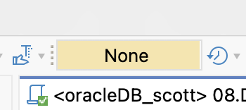

# SQL DML Practice

## 0. 사전 개념 정리

### 0.1  DML: Data Manipulation Language

데이터베이스 내의 데이터를 관리하는 언어로, 테이블의 레코드를 생성, 수정, 삭제, 조회할 때 사용

* 주요 명령어: `SELECT` / `INSERT` / `UPDATE` / `DELETE`

    * `SELECT` 는 데이터를 조회만 하므로 DQL로 따로 분류하기도 하지만, 넓은 의미에서 DML에 포함

* 트랜잭션 관리: `COMMIT` / `ROLLBACK` 이 적용되는 명령어는 데이터를 실제로 변경하는 `INSERT` / `UPDATE` / `DELETE`

### 0.2 DB 특성

트랜잭션은 All or Nothing의 원칙으로 수행되는 논리적 작업 단위

* MySQL: 기본적으로 `AUTO COMMIT;` 모드가 활성화되어 있어, 명령어 실행 즉시 DB에 영구 반영

    ```SQL
    -- auto commit 확인
    SELECT @@AUTOCOMMIT;
    -- auto commit on
    SET AUTOCOMMIT = 1;
    -- auto commit off
    SET AUTOCOMMIT = 0;
    ```

* Oracle: 기본적으로 Manual-Commit, 데이터 변경 후 개발자가 직접 `COMMIT` 또는 `ROLLBACK` 명령어를 입력해야 실제 데이터베이스에 최종 반영

### 0.3 DBeaver 특성

* 기본 설정: `Auto-Commit` 모드로 설정

* 설정 변경: 실습 시 실수로 데이터를 날리는 것을 방지하기 위해 상단 UI 메뉴에서 `Manual Commit` 모드로 전환

    

    

### 0.4 실습 주의 사항

* 원본 보존: 기존 emp, dept 테이블은 조회의 용도로만 사용, DML 작업은 절대 금지

* 연습용 복제: 반드시 원본 테이블을 복제하거나 새로 생성한 테이블에서 CRUD 실습을 진행

    * Oracle

        ```SQL
        -- 1. 기존 테스트 테이블 삭제
        DROP TABLE emp01;
        DROP TABLE emp02;
        DROP TABLE emp03;
        -- 2. 전체 복제 (데이터 + 구조)
        -- 제약 조건(PK, FK)과 인덱스는 복제되지 않음에 주의
        CREATE TABLE emp01 AS SELECT * FROM emp;
        -- 3. 특정 컬럼만 선택하여 복제
        CREATE TABLE emp01 AS SELECT ename, empno FROM emp;
        -- 4. 구조만 복제 (데이터 제외)
        -- WHERE 절에 '항상 거짓'인 조건을 부여하여 빈 테이블만 생성
        CREATE TABLE emp01 AS SELECT * FROM emp WHERE 1 = 0;
        ```

    * MySQL

        ```SQL
        -- 1. 안전한 테이블 삭제 (존재할 때만 삭제)
        DROP TABLE IF EXISTS emp01;
        DROP TABLE IF EXISTS emp02;
        DROP TABLE IF EXISTS emp03;
        -- 2. 전체 복제 (데이터 + 구조)
        -- 제약 조건(PK, FK)과 인덱스는 복제되지 않음에 주의
        CREATE TABLE emp01 AS SELECT * FROM emp;
        -- 3. 특정 컬럼만 선택하여 복제
        CREATE TABLE emp01 AS SELECT ename, empno FROM emp;
        -- 4. 구조만 복제 (데이터 제외)
        -- WHERE 절에 '항상 거짓'인 조건을 부여하여 빈 테이블만 생성
        CREATE TABLE emp01 AS SELECT * FROM emp WHERE 1 = 0;
        ```

## 1. `INSERT` : 데이터 삽입

* Oracle & MySQL

    ```SQL
    -- 1. 컬럼명을 명시하여 안전하게 저장
    INSERT INTO emp01 (ename, empno) VALUES ('재석', '1');
    -- 2. 컬럼명 생략 시 모든 컬럼의 데이터를 순서대로 입력해야 함
    INSERT INTO emp01 VALUES ('연아', 2, 'SALES', 3000);
    -- 3. 다중 행 삽입
    -- MySQL과 Oracle 23c 이상에서 표준 문법으로 지원
    INSERT INTO emp01 (ename, empno) VALUES ('재석', 1), ('연아', 2);
    ```

* Oracle (23c 이전 버전)

    ```SQL
    INSERT ALL
        INTO emp01 (ename, empno) VALUES ('재석', 1)
        INTO emp01 (ename, empno) VALUES ('연아', 2)
    SELECT * FROM dual;
    ```

## 2. `TRUNCATE` : 초고속 전체 삭제

* **트랜잭션 로그를 남기지 않으므로 처리 속도가 매우 빠르나, `ROLLBACK`이 불가능**

* Oracle & MySQL

    ```SQL
    -- 트랜잭션과 무관하게 완전 삭제 (순삭)
    TRUNCATE TABLE emp01;
    -- 복구 불가
    ROLLBACK;
    ```

## 3. `UPDATE` : 데이터 수정

* **`WHERE` 절을 생략하면 테이블의 모든 행이 변경**

* Oracle & MySQL

    ```SQL
    -- 특정 부서의 소속 및 직무 일괄 변경
    UPDATE emp01 SET deptno = 50, job = 'MANAGER' WHERE deptno = 10;
    -- 수식 연산을 통한 급여 인상
    UPDATE emp01 SET sal = sal * 1.1 WHERE sal >= 3000;
    ```

* Oracle

    ```SQL
    -- SYSDATE는 초 단위까지 포함하는 서버 시간
    UPDATE emp01 SET hiredate = sysdate;
    ```

* MySQL

    ```SQL
    -- NOW(): 날짜 + 시간, CURDATE(): 날짜만
    UPDATE emp01 SET hiredate = NOW();
    ```

## 4. 서브쿼리 (Sub Query) & 인라인 뷰 (Inline View)

* WHERE 절 서브쿼리

    * Oracle & MySQL

        ```SQL
        SELECT * FROM emp01
        WHERE deptno = (SELECT deptno FROM dept WHERE loc = 'DALLAS');

        UPDATE emp01 SET sal = sal + 1000
        WHERE deptno = (SELECT deptno FROM dept WHERE loc = 'DALLAS');
        ```

* FROM 절 서브쿼리 (인라인 뷰 / Inline View)

    * 전제 조건: `FROM` 절은 물리적인 테이블뿐만 아니라 테이블 구조를 갖춘 데이터 셋이 필요

    * 원리: 서브쿼리의 실행 결과가 메모리상에 생성, 실존하는 테이블처럼 메인쿼리에 데이터를 제공

    * 용도: 대량의 데이터 중 필요한 부분만 먼저 필터링, 집계된 결과를 바탕으로 다시 연산

    * Oracle

        ```SQL
        -- 한 칸 띄운뒤 별칭 작성
        SELECT * FROM (SELECT empno, ename FROM emp01) temp_table;
        -- 별칭 생략 가능
        SELECT * FROM (SELECT empno, ename FROM emp01);
        ```

    * MySQL: 서브쿼리 결과에 반드시 'AS 별칭'이 필요

        ```SQL
        SELECT * FROM (SELECT empno, ename FROM emp01) AS temp_table;
        ```

## 5. `DELETE` : 데이터 삭제

* `TRUNCATE` 와 달리 트랜잭션 관리가 가능하여 `ROLLBACK` 으로 복구 가능

* Oracle은 `FROM` 생략 가능하지만, 호환성을 위해 사용하는 것을 권장

* Oracle & MySQL

    ```SQL
    -- 조건에 맞는 데이터 삭제
    DELETE FROM emp01 WHERE deptno = 30;

    -- NULL 여부에 따른 조건부 삭제
    DELETE FROM emp01 WHERE comm IS NULL;

    -- 전체 행 삭제 (WHERE 절 생략)
    -- 데이터는 삭제되지만 테이블 용량은 유지됨 (ROLLBACK 가능)
    DELETE FROM emp01;
    ```