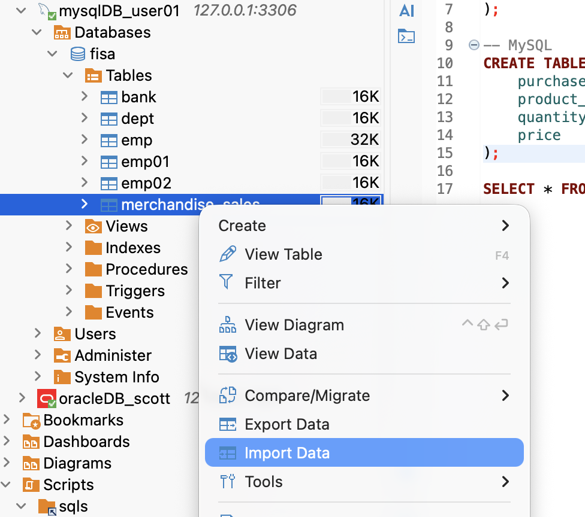
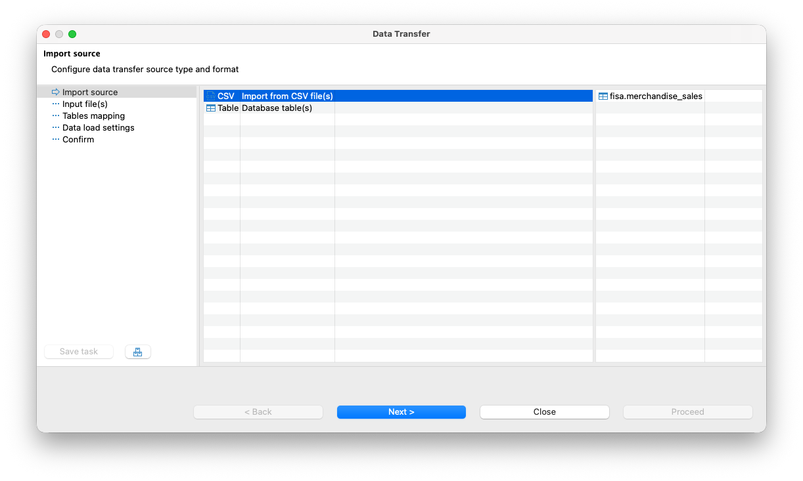
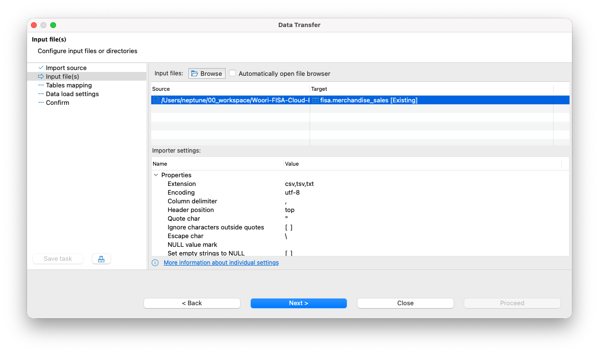
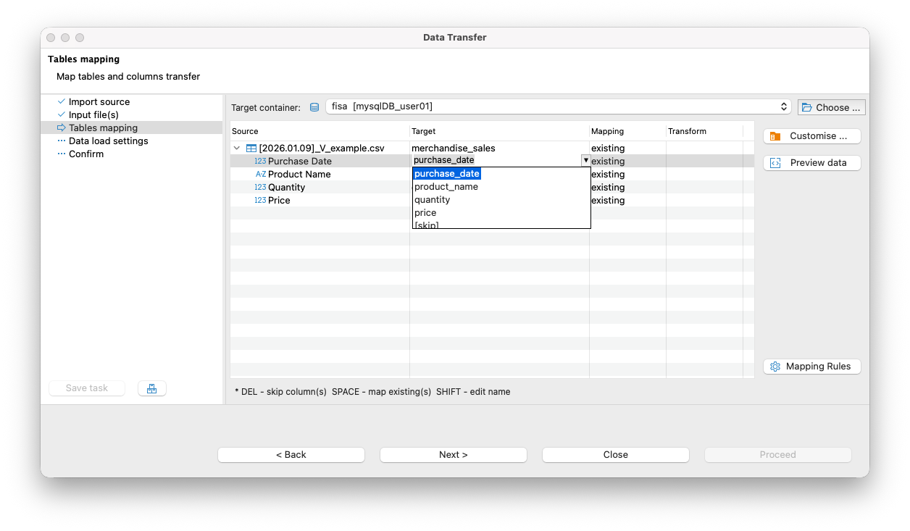
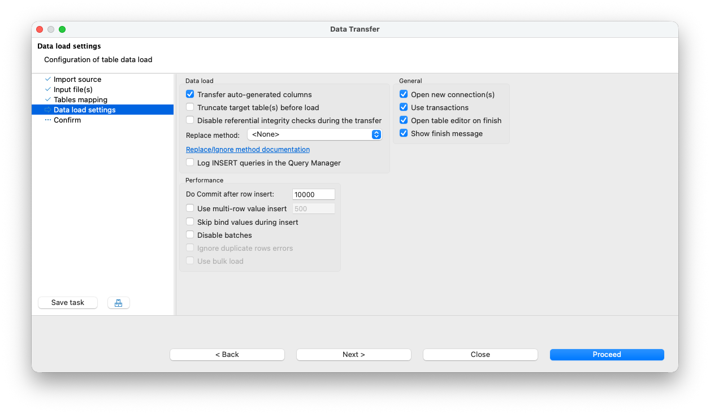

# DBeaver를 이용해서 DB에 데이터 불러오기

## 1. CSV 데이터 전처리

* 보안 및 데이터 보호를 위해 실제 실습 데이터 및 테이블 구조와 상이하게 재구성된 임의의 예제 데이터를 사용하였습니다.

### 1.1 예제 데이터

```Plain text
20260107,hololive closet,2,52700
20251022,Concert Merch,5,125947
20250809,holonatsu Paradise,6,98680
20250501,Birthday Celebration,1,242669
20250405,Color Rise Harmony,3,68296
```

### 1.2 헤더 (Header) 추가

* 구매 일자, 구매 제품명, 수량, 가격

```Plain text
Purchase Date,Product Name,Quantity,Price
20260107,hololive closet,2,52700
20251022,Concert Merch,5,125947
20250809,holonatsu Paradise,6,98680
20250501,Birthday Celebration,1,242669
20250405,Color Rise Harmony,3,68296
```

## 2. 타겟 테이블(Target Table) 설계

* Oracle

    ```SQL
    CREATE TABLE merchandise_sales (
    purchase_date DATE,             -- 구매 날짜
    product_name  VARCHAR2(500),    -- 상품명
    quantity      NUMBER(10),       -- 수량
    price         NUMBER(10)        -- 가격
    );
    ```

* MySQL

    ```SQL
    CREATE TABLE merchandise_sales (
    purchase_date DATE,             -- 구매 날짜
    product_name  VARCHAR(500),     -- 상품명
    quantity      INT,              -- 수량
    price         INT               -- 가격
    );
    ```

## 3. 데이터 불러오기

* MySQL을 대상으로 진행했습니다. Oracle도 과정은 동일합니다.

### 3.1  대상 DB 선택 및 마법사 실행
    
* 임포트할 데이터베이스 혹은 테이블을 우클릭하여 [Import Data]를 실행

    

### 3.2 소스 설정

* 준비한 CSV 파일을 지정
    
    

    

### 3.3 컬럼 매핑 (Column Mapping)

* CSV의 헤더와 테이블의 컬럼명이 일치하는지 확인

    

### 3.4 최종 확인 및 쿼리 검증



* 임포트 완료 후 SELECT 문을 통해 데이터가 유실 없이, 혹은 깨짐 없이 들어갔는지 확인

    ```SQL
    SELECT * FROM merchandise_sales;
    ```
    
    ```Plain text
    purchase_date|product_name        |quantity|price |
    -------------+--------------------+--------+------+
       2026-01-07|hololive closet     |       2| 52700|
       2025-10-22|Concert Merch       |       5|125947|
       2025-08-09|holonatsu Paradise  |       6| 98680|
       2025-05-01|Birthday Celebration|       1|242669|
       2025-04-05|Color Rise Harmony  |       3| 68296|
    ```