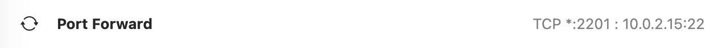
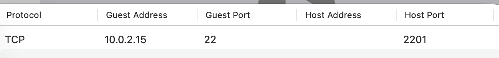
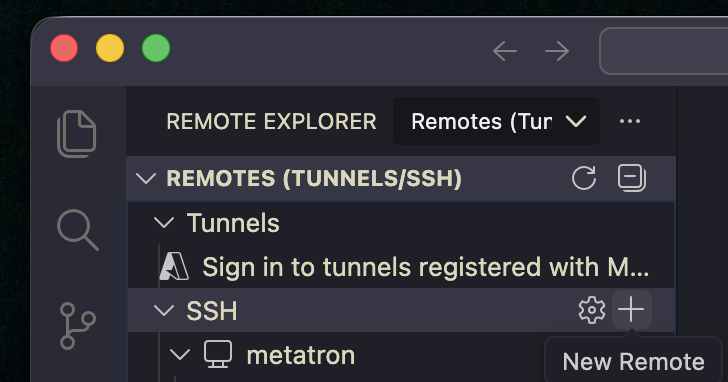
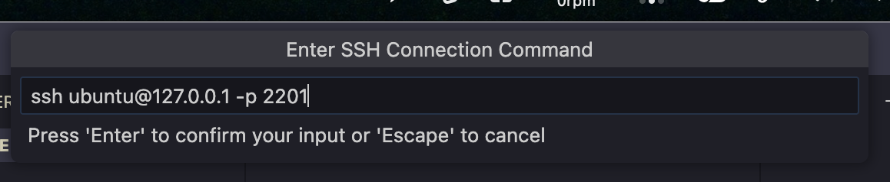
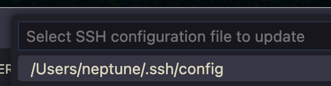
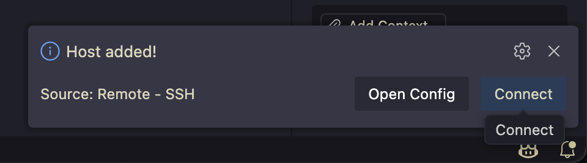
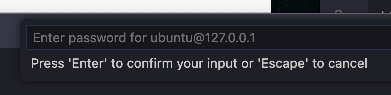
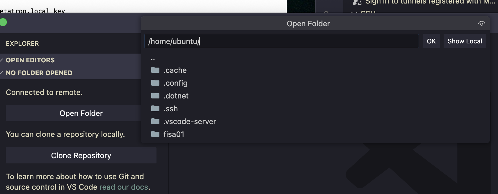
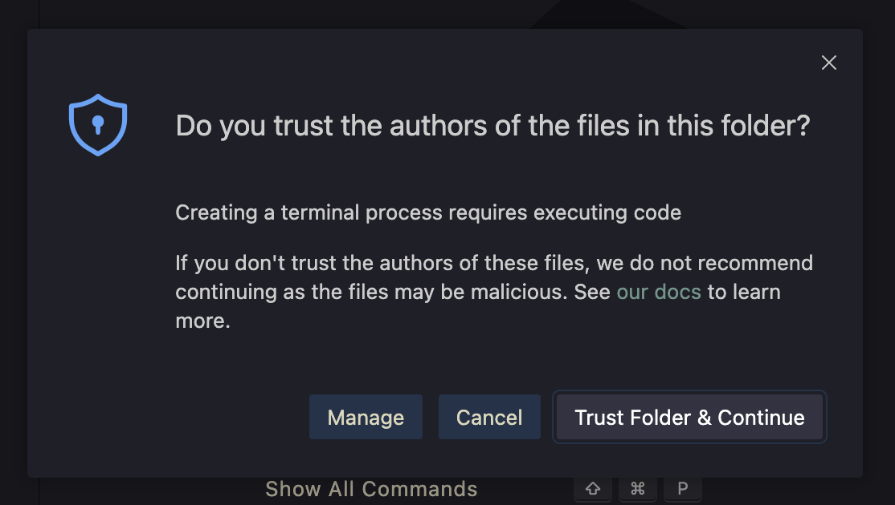
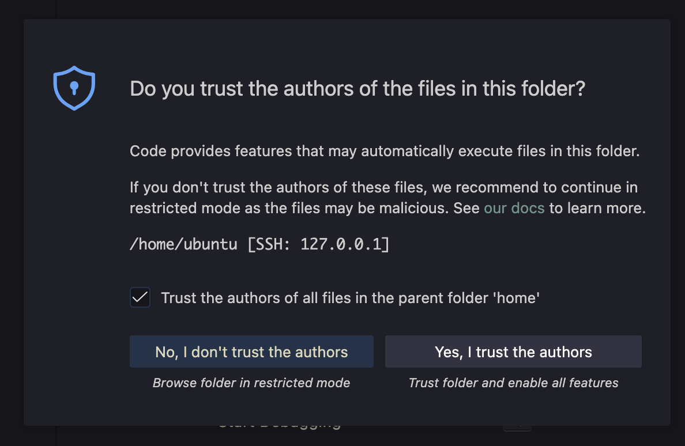

# Visual Studio Code를 이용해서 Linux 서버에 접속

## 1. 필요한 플러그인 다운로드 및 설치

[Remote - SSH by Microsoft](https://marketplace.visualstudio.com/items?itemName=ms-vscode-remote.remote-ssh)

* *UTM 포트포워딩 확인 (서버 내부 22번, 외부에서 2201번 포트로 접속)

    

    

## 2. Linux 서버에 접속

### 2.1 새 호스트 추가

* `Primary Side Bar` → `Remote Explorer` → `SSH` → `+ (New Remote)`

    

### 2.2 호스트 정보 입력

* A. 연결 정보 입력

    

    ```Bash
    ssh <USER>@<SERVER_UP> [-p <PORT>]
    # -p : 기본 포트 (22)를 사용하지 않는 경우 입력
    ```

* B. SSH 저장 위치 지정 → `Connect`

    

    

* C. 비밀번호 입력

    

* D. `Open Folder`

    

* E. 폴더를 신뢰 할 것인지 묻는 창이 뜨면 신뢰한다 선택

    

    


## 3. Bonus: ssh 설정 파일 직접 열어보기

[호스트 정보 입력 단계에서 지정한 위치](#22-호스트-정보-입력/)에 있는 `.ssh/config` 파일 열기

```Bash
sudo nano ~/.ssh/config
# ~ : 현재 사용자 홈 디렉토리
```

```Bash
Host myserver01      #호스트 이름
  HostName 127.0.0.1 #호스트 주소
  User ubuntu        #사용자명
  Port 2201          #접속 포트 번호
```