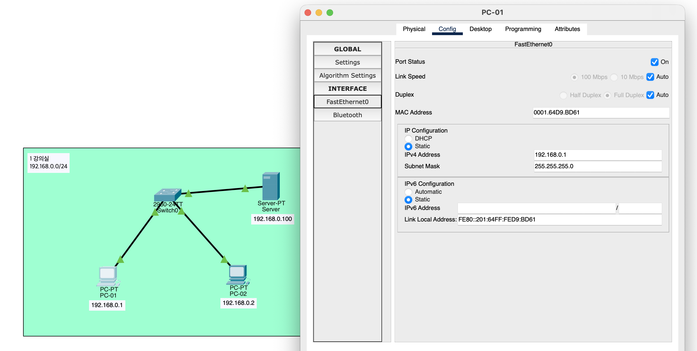
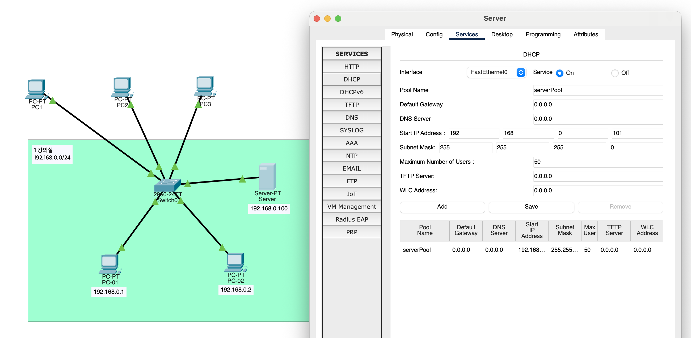

# Network Day 03

[1. Cisco Packet Tracer](#1-cisco-packet-tracer)

[2. MAC: Media Access Control](#2-mac-media-access-control)

[3. ARP: Address Resolution Protocol](#3-arp-address-resolution-protocol)

[4. MAC 주소와 IP 주소를 모두 사용하는 이유](#4-mac-주소와-ip-주소를-모두-사용하는-이유)

[5. DHCP: Dynamic Host Configuration Protocol](#5-dhcp-dynamic-host-configuration-protocol)

[6. Ethernet](#6-ethernet)

## 1. Cisco Packet Tracer

[Download Cisco Packet Tracer](https://www.netacad.com/resources/lab-downloads?courseLang=en-US)

* PC 2대, Server 1대, Switch 1대로 네트워크 구성

    

## 2. MAC: Media Access Control

* **16진수로 이루어진 48-bit 물리적 주소**

    * 상위 24-bit 제조사 식별자 (OUI: Organizationally Unique Identifier)

    * 하위 24-bit 제조사에서 할당한 고유 식별자

* NIC (Network Interface Card)에 할당되어 있는 고유 주소

* 1:1 통신 환경에서는 MAC 주소가 필요 없음

* Multiple Access (MA) 환경에서는 MAC 주소가 필요

* 상대가 보낸 프레임이 자신의 MAC 주소와 일치하는지 확인

    * 프레임을 받았을 때 CPU까지 가서 처리 하지 않고, NIC에서 MAC 주소를 확인하여 불필요한 CPU 자원 낭비 방지

* LAN에서는 MAC 주소가 같으면 충돌, 다른 LAN에서는 충돌하지 않음

* 프레임이 전송 되는 동안, 출발지와 목적지 MAC 주소가 변경될 수 있음

    * IP 주소는 변경되지 않음

## 3. ARP: Address Resolution Protocol

* IP 주소를 MAC 주소로 변환하는 2계층과 3계층의 다리 역할을 하는 프로토콜

* **ARP Request:** 목적지 IP 주소에 해당하는 MAC 주소를 묻는 Broadcast 메시지

    * 목적지의 MAC 주소를 모르기 때문에, 프레임의 목적지 MAC 주소를 FF:FF:FF:FF:FF:FF (Broadcast)로 설정

    * 자신의 IP 주소가 아니면, 해당 요청은 무시

* **ARP Reply:** 목적지 IP 주소에 해당하는 MAC 주소를 응답하는 Unicast 메시지

* **ARP Cache:** IP-MAC 주소 매핑 정보를 저장하는 캐시

    * 만료되는 시간 설정이 중요함 (너무 길면 비효율, 너무 짧으면 자주 요청 발생)

    * 장비의 IP가 변경이 되면, ARP Cache 초기화가 필요함

    * 그래서 재부팅을 하면 안되던 장비가 되기도 함

* **Gratuitous ARP:** 자신의 IP-MAC 주소 매핑 정보를 네트워크에 알리는 메시지

    * 장비가 부팅될 때, 자신의 IP 주소가 이미 사용 중인지 확인하기 위해 Gratuitous ARP를 전송

## 4. MAC 주소와 IP 주소를 모두 사용하는 이유

* **불필요한 자원 낭비 방지 및 효율적인 데이터 전송:** 프레임 수신 시 NIC가 MAC 주소를 먼저 확인하여, 본인 것이 아니면 CPU까지 데이터를 올리지 않고 즉시 폐기

* **역할의 분담**

    * 동일 네트워크 (L2): MAC 주소만으로 실제 장치 간의 물리적인 데이터 전달 수행

    * 다른 네트워크 (L3): IP 주소는 최종 목적지를 찾는 역할, MAC 주소는 그 과정에서 다음 목적지로 건너가기 위한 역할

## 5. DHCP: Dynamic Host Configuration Protocol

* **전달하는 정보:** IP 주소, 서브넷 마스크, 기본 게이트웨이, DNS 서버 주소 등

* **Lease Time:** 할당된 IP 주소를 사용할 수 있는 기간

* **IP 주소 자동 할당 프로토콜**

    * DHCP Discover: 클라이언트가 네트워크에 연결될 때, IP 주소를 요청하는 Broadcast 메시지

    * DHCP Offer: DHCP 서버가 사용 가능한 IP 주소를 제안하는 Unicast 메시지

    * DHCP Request: 클라이언트가 제안된 IP 주소를 요청하는 Unicast 메시지

    * DHCP Acknowledgment: DHCP 서버가 IP 주소 할당을 확인하는 Unicast 메시지

* Server를 DHCP 서버로 사용

    

## 6. Ethernet

* **MTU: Maximum Transmission Unit**

    * 1500 bytes

* **MSS: Maximum Segment Size**

    * TCP MSS: 1460 bytes

* **Jumbo Frame**

    * MTU가 1500 bytes보다 큰 프레임
    
    * 예: 9000 bytes

    * AWS: 특정 EC2 인스턴스 혹은 특정 네트워크 환경에 따라 9001 bytes까지 지원