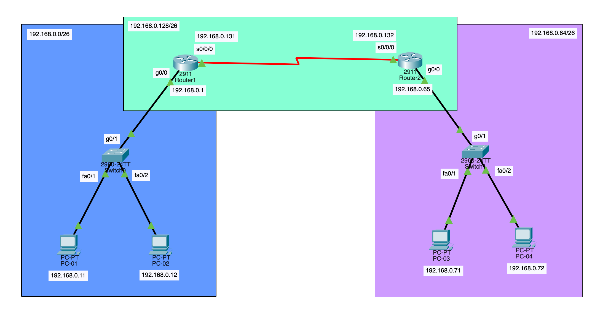
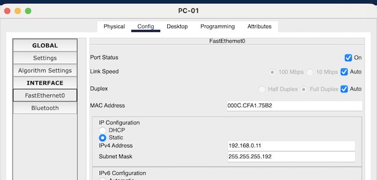
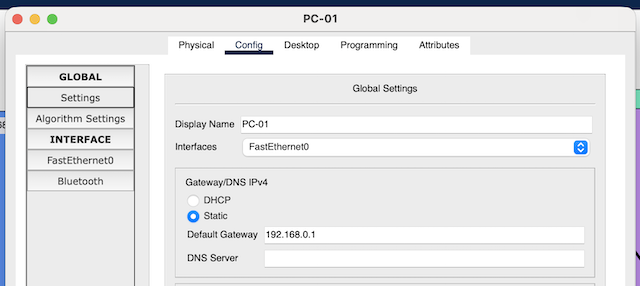

# Network Day 04

[1. Gateway 이중화](#1-gateway-이중화)

[2. Special IP Addresses](#2-special-ip-addresses)

[3. Cisco Packet Tracer - Router IP Configuration](#3-cisco-packet-tracer---router-ip-configuration)

[4. Cable](#4-cable)

[5. NTP: Network Time Protocol](#5-ntp-network-time-protocol)

[6. Steps to Configure Devices](#6-steps-to-configure-devices)

[7. Cisco Packet Tracer - Router Time Configuration](#7-cisco-packet-tracer---router-time-configuration)

[8. Cisco IOS](#8-cisco-ios)

## 1. Gateway 이중화

* **HSRP: Hot Standby Router Protocol (Cisco Proprietary)**

* **VRRP: Virtual Router Redundancy Protocol**

* **Virtual IP & Virtual MAC**

## 2. Special IP Addresses

* **0.0.0.0/8:** This Network

    * 로컬 네트워크 내에서의 통신을 위해 예약

* **0.0.0.0/32:** This host on this network

    * 호스트가 부팅될 때 자신에게 할당된 IP 주소를 알기 전까지 사용

    * 예시: DHCP 클라이언트가 IP를 할당받기 전, 출발지 주소로 사용하는 나 주소 없음 상태를 의미

* **127.0.0.0/8:** Loopback Address

* **169.254.0.0/16:** Link-Local Address

    * APIPA: Automatic Private IP Addressing

    * DHCP 서버로부터 IP 주소를 할당받지 못했을 때 자동으로 할당되는 IP 주소 대역

* **100.64.0.0/10:** Shared Address Space

    * Carrier-Grade NAT: ISP가 공유 주소 공간을 사용하여 NAT를 구현할 때 사용하는 IP 주소 대역

    * Private IP와 Public IP 사이의 중간 역할

## 3. Cisco Packet Tracer - Router IP Configuration

### 3.1 `2. Default-Gateway.pkt`

* Privileged EXEC 모드 진입

    ```Plain text
    Router>enable
    Router#
    ```

* 인터페이스 상태 확인

    ```Plain text
    Router#show ip interface brief
    Interface              IP-Address      OK? Method Status                Protocol 
    GigabitEthernet0/0     8.8.8.1         YES manual up                    up 
    GigabitEthernet0/1     192.168.0.254   YES manual up                    up 
    GigabitEthernet0/2     unassigned      YES unset  administratively down down 
    Vlan1                  unassigned      YES unset  administratively down down
    ```

* Global configuration 모드 진입

    ```Plain text
    Router#configure terminal
    Router(config)#
    ```

* 인터페이스 설정 모드 진입 | 설정 대상 인터페이스 선택

    ```Plain text
    Router(config)#interface g0/1
    Router(config-if)#
    ```

* 인터페이스에 할당된 IP 주소 제거

    ```Plain text
    Router(config-if)#no ip address
    ```

* 인터페이스에 IP 주소 할당 | IP 주소, 서브넷 마스크

    ```Plain text
    Router(config-if)#ip address 192.168.0.1 255.255.255.0
    ```

* 인터페이스 설정 모드 종료

    ```Plain text
    Router(config-if)#end
    Router#
    ```

* 정적 라우팅 설정 | 목적지 네트워크, 서브넷 마스크, 다음 홉 IP 주소 (상대 라우터의 인터페이스 IP)

    ```Plain text
    Router(config)#ip route 164.124.101.0 255.255.255.224 164.124.101.226
    ```

## 4. Cable

* **UTP: Unshielded Twisted Pair**

* **STP: Shielded Twisted Pair**

* **Wiring Standard**

    

* **568A**

    * `흰/초록` | `초록` | `흰/주황` | `파랑` | `흰/파랑` | `주황` | `흰/갈색` | `갈색`

* **568B:** 주로 사용되는 이더넷 케이블 배선 규격

    * `흰/주황` | `주황` | `흰/초록` | `파랑` | `흰/파랑` | `초록` | `흰/갈색` | `갈색`

* **Straight-Through Cable (a.k.a Direct Cable)**

    * 같은 배선 규격 (568A - 568A or 568B - 568B)

    * 서로 다른 장비 연결 (예: PC - Switch, Switch - Router)

* **Crossover Cable**

    * 다른 배선 규격 (568A - 568B)

    * 같은 종류의 장비 연결 (예: PC - PC, Switch - Switch, Router - Router)

    * 예외적으로 Router - PC 연결 시에도 사용

* **Auto-MDIX: Automatic Medium Dependent Interface Crossover**

    * 장비가 자동으로 케이블 유형을 감지하고 적절한 송수신 핀을 매핑하여 연결하는 기술

    * 대부분의 장비에서 지원되어 Straight-Through와 Crossover 케이블 구분 없이 사용 가능

* **PoE: Power over Ethernet**

    * 이더넷 케이블을 통해 전력 공급

    * 15W, 30W, 60W, 90W

* **WOL: Wake On LAN**

    * 네트워크를 통해 원격으로 컴퓨터를 켜는 기술

## 5. NTP: Network Time Protocol

* **세슘 원자 시계:** Stratum 0

* **NTP 서버:** Stratum 1

    * Stratum 0과 직접 연결된 서버

    * GPS, 라디오 시계 등에서 시간 정보를 받아 Stratum 2 이하의 클라이언트에 시간 제공

* **NTP 클라이언트:** Stratum 2 이상

* **EC2 내부 NTP 서버:** 169.254.169.123

* **NTP Port:** UDP 123

## 6. Steps to Configure Devices

1. Date/Time 설정 → `timedatectl`

2. Hostname 설정 → `hostnamectl`

3. Password 설정 → `passwd`

4. IP/Subnet/Gateway 설정

5. 접속 가능하도록 설정 → Windows: Remote Desktop, Linux: SSH

## 7. Cisco Packet Tracer - Router Time Configuration

* 현재 시간 확인

    ```Plain text
    Router#show clock
    *0:2:33.10 UTC Mon Mar 1 1993
    ```

* 타임존 설정 | Timezone Offset

    ```Plain text
    Router(config)#clock timezone KST 9
    ```

* **UTC:** Coordinated Universal Time

* **GMT:** Greenwich Mean Time (UTC +0)

* **KST:** Korea Standard Time (UTC +9)

* 시간 설정 | HH:MM:SS DD MMM YYYY

    ```Plain text
    Router#clock set 15:25:30 13 Feb 2026
    ```

## 8. Cisco IOS

* **IOS: Internetwork Operating System**

* **User Mode**

    ```Plain text
    Router>
    ```

* **Privileged Mode**

    ```Plain text
    Router>enable
    Router#
    ```

    * Privileged Mode에서만 실행 가능한 명령어 예시

        ```Plain text
        Router#show ip interface brief
        Interface              IP-Address      OK? Method Status                Protocol 
        GigabitEthernet0/0     unassigned      YES unset  administratively down down 
        GigabitEthernet0/1     unassigned      YES unset  administratively down down 
        GigabitEthernet0/2     unassigned      YES unset  administratively down down 
        Vlan1                  unassigned      YES unset  administratively down down
        ```

* **Global Configuration Mode**

    ```Plain text
    Router#configure terminal
    Router(config)#
    ```

* **Interface Configuration Mode**

    ```Plain text
    Router(config)#interface g0/1
    Router(config-if)#
    ```

* **Exit to Previous Mode**

    ```Plain text
    Router(config-if)#exit
    Router(config)#
    ```

* **Exit to Privileged Mode**

    ```Plain text
    Router(config)#end
    Router#
    ```

### 8.1 `[2026.02.13]_IV_Network_Day_04.pkt`



* **PC IP Address Setup**

    

    

* **Set Interface IP Address**

    ```Plain text
    Router(config-if)#ip address 192.168.0.1 255.255.255.192
    ```

* **Enable Interface**

    ```Plain text
    Router(config-if)#no shutdown
    ```

* **Set Route**

    ```Plain text
    Router(config)#ip route 192.168.0.64 255.255.255.192 192.168.0.132
    ```