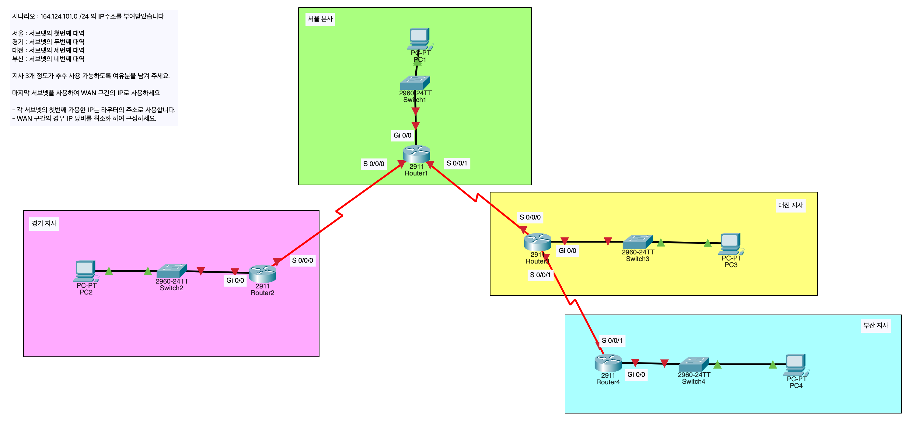
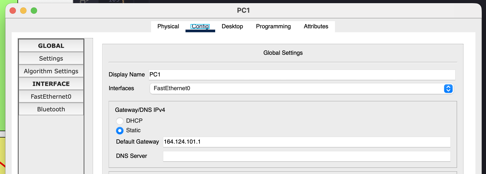
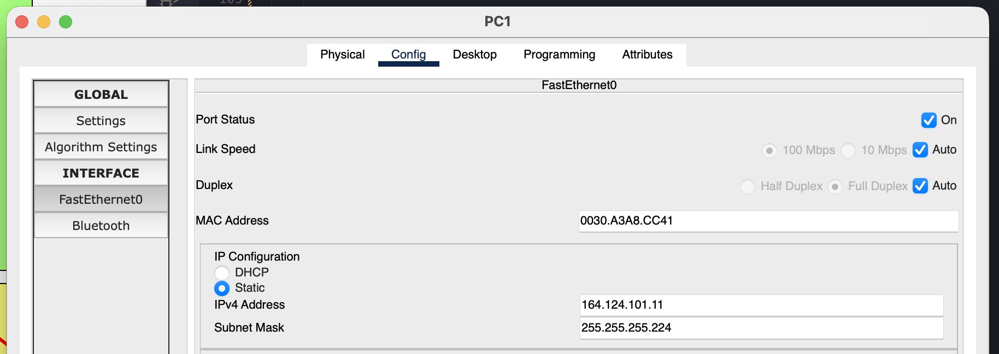
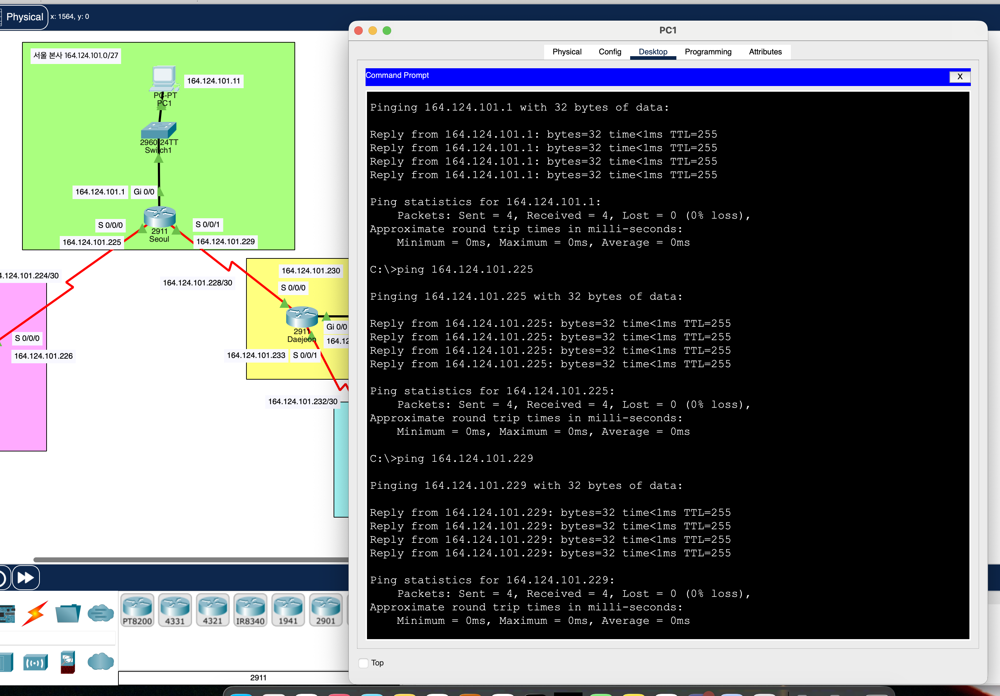
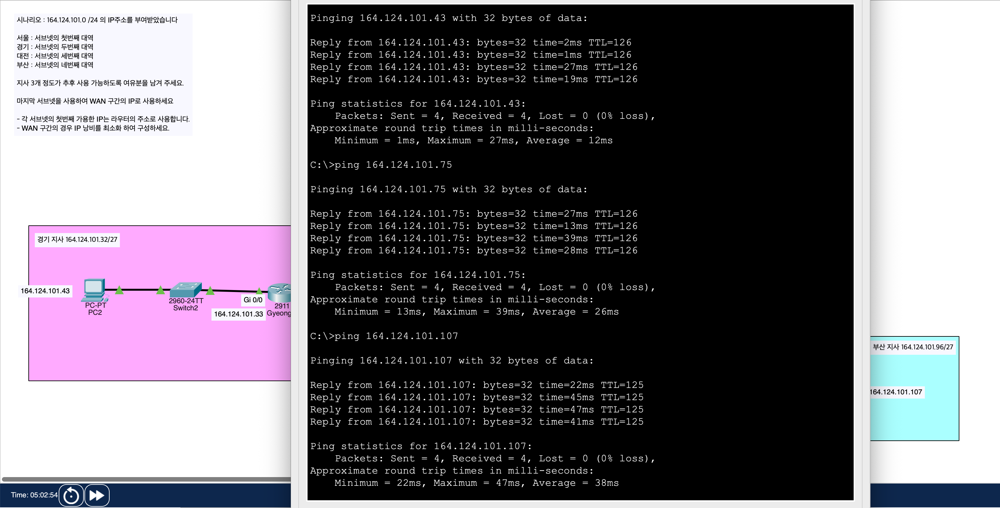

# Network Day 05

[1. Review](#1-review)

[2. `3. Tony-VLSM.pkt`](#2-3-tony-vlsmpkt)

[3. Remote Login Configuration](#3-remote-login-configuration)

[4. Routing Protocols](#4-routing-protocols)

[5. Network in AWS](#5-network-in-aws)

[6. L2: Switch](#6-l2-switch)

[7. `[2026.02.19]_V_Network_Day_05.pkt`](#7-20260219_v_network_day_05pkt)

## 1. Review

### 1.1 Router Basic Configuration

* **Timezone 설정**

    ```Plain text
    Router(config)#clock timezone KST 9
    ```

* **Clock 설정**

    ```Plain text
    Router#clock set 10:19:00 19 Feb 2026
    Router#show clock
    19:19:5.134 KST Thu Feb 19 2026
    ```

* **Hostname 설정**

    ```Plain text
    Router(config)#hostname Seoul
    Seoul(config)#
    ```

* **Enable password 설정**

    ```Plain text
    Seoul(config)#enable password cisco
    ```

### 1.2 IP Address Configuration

* **IP Address 설정**

    ```Plain text
    Seoul(config)#interface gigabitEthernet 0/0
    Seoul(config-if)#ip address 202.147.10.1 255.255.255.0
    Seoul(config-if)#no shutdown 
    ```

* **Routing Table 확인**

    ```Plain text
    Router#show ip route
    Codes: L - local, C - connected, S - static, R - RIP, M - mobile, B - BGP
        D - EIGRP, EX - EIGRP external, O - OSPF, IA - OSPF inter area
        N1 - OSPF NSSA external type 1, N2 - OSPF NSSA external type 2
        E1 - OSPF external type 1, E2 - OSPF external type 2, E - EGP
        i - IS-IS, L1 - IS-IS level-1, L2 - IS-IS level-2, ia - IS-IS inter area
        * - candidate default, U - per-user static route, o - ODR
        P - periodic downloaded static route

    Gateway of last resort is not set
    ```

* **Remote Login 설정**

    ```Plain text
    Router(config)#line vty 0 4
    Router(config-line)#login local
    Router(config-line)#password cesco
    ```

## 2. `3. Tony-VLSM.pkt`

### 2.0 Network Topology (Before Configuration)



### 2.1 Router Basic Configuration

```Plain text
Router(config)#hostname Seoul
Seoul(config)#enable password cisco
Seoul(config)#clock timezone KST 9
Seoul#clock set 10:40:00 19 Feb 2026
```

### 2.2 Subnetting (VLSM)

* 7개의 Subnet이 필요 -> 8개의 Subnet으로 나눌 수 있는 Subnet Mask 필요 -> /27 (Subnet 8개, Host 30개)

* 마지막 Subnet을 이용해서 WAN 구간 설정 -> IP 낭비 최소화 -> /30 (Subnet 8개, Host 2개)

* 164.124.101.0/24

    * 164.124.101.0/27 -> Seoul

    * 164.124.101.32/27 -> Gyeonggi

    * 164.124.101.64/27 -> Daejeon

    * 164.124.101.96/27 -> Busan

    * 164.124.101.128/27 -> Slot 1

    * 164.124.101.160/27 -> Slot 2

    * 164.124.101.192/27 -> Slot 3

    * 164.124.101.224/27 -> WAN (Will be further subnetted)

        * 164.124.101.224/30 -> Seoul - Gyeonggi

        * 164.124.101.228/30 -> Seoul - Daejeon

        * 164.124.101.232/30 -> Daejeon - Busan

        * 164.124.101.236/30 -> Slot 1

        * 164.124.101.240/30 -> Slot 2

        * 164.124.101.244/30 -> Slot 3

        * 164.124.101.248/30 -> Slot 4

        * 164.124.101.252/30 -> Slot 5

### 2.3 IP Address Configuration

* **Router - Switch 연결**

    ```Plain text
    Seoul(config)#int g0/0
    Seoul(config-if)#ip address 164.124.101.1 255.255.255.224
    Seoul(config-if)#no shutdown
    ```

* **Router - Router 연결**

    ```Plain text
    Seoul(config-if)#int s0/0/0
    Seoul(config-if)#ip address 164.124.101.225 255.255.255.252
    Seoul(config-if)#no shutdown
    ```

### 2.4 PC Basic Configuration







### 2.5 Routing Table Configuration

* **Seoul**

    * Gyeonggi

        ```Plain text
        Seoul(config)#ip route 164.124.101.32 255.255.255.224 164.124.101.226
        ```

    * Daejeon

        ```Plain text
        Seoul(config)#ip route 164.124.101.64 255.255.255.224 164.124.101.230
        ```

    * Busan

        ```Plain text
        Seoul(config)#ip route 164.124.101.96 255.255.255.224 164.124.101.230
        ```

    * After Configuration

        ```Plain text
        Seoul#show ip route
        S       164.124.101.32/27 [1/0] via 164.124.101.226
        S       164.124.101.64/27 [1/0] via 164.124.101.230
        S       164.124.101.96/27 [1/0] via 164.124.101.230
        ```

        

* **Gyeonggi**

    * Seoul, Daejeon, Busan -> Stub Network

        ```Plain text
        Gyeonggi(config)#ip route 0.0.0.0 0.0.0.0 164.124.101.225
        ```

    * After Configuration

        ```Plain text
        Gyeonggi#show ip route
        S*   0.0.0.0/0 [1/0] via 164.124.101.225
        ```

* **Daejeon**

    * Seoul

        ```Plain text
        Daejeon(config)#ip route 164.124.101.0 255.255.255.224 164.124.101.229
        ```

    * Gyeonggi

        ```Plain text
        Daejeon(config)#ip route 164.124.101.32 255.255.255.224 164.124.101.229
        ```

    * Busan

        ```Plain text
        Daejeon(config)#ip route 164.124.101.96 255.255.255.224 164.124.101.234
        ```

    * After Configuration
    
        ```Plain text
        Daejeon#show ip route
        S       164.124.101.0/27 [1/0] via 164.124.101.229
        S       164.124.101.32/27 [1/0] via 164.124.101.229
        S       164.124.101.96/27 [1/0] via 164.124.101.234
        ```

* **Busan**

    * Seoul, Gyeonggi, Daejeon -> Stub Network

        ```Plain text
        Busan(config)#ip route 0.0.0.0 0.0.0.0 164.124.101.233
        ```

    * After Configuration

        ```Plain text
        Busan#show ip route
        S*   0.0.0.0/0 [1/0] via 164.124.101.233
        ```

### 2.6 Network Topology (After Configuration)


### 2.7 Problems in Routing Table Configuration

* Seoul -> Daejeon과 Busan 사이의 WAN 구간을 알지 못함

    ```Plain text
    Seoul(config)#ip route 164.124.101.232 255.255.255.252 164.124.101.230
    ```

* Daejeon -> Seoul과 Gyeonggi 사이의 WAN 구간을 알지 못함

    ```Plain text
    Daejeon(config)#ip route 164.124.101.224 255.255.255.252 164.124.101.229
    ```

* Gyeonggi와 Busan -> WAN 구간까지 포함하는 Default Route 설정되어 있어 문제 없음

## 3. Remote Login Configuration

### 3.1 ID 물어보지 않고 Telnet 접속

```Plain text
Seoul(config)#line vty 0 4
Seoul(config-line)#login
Seoul(config-line)#password cesco
```

### 3.2 Router의 local 사용자 계정으로 Telnet 접속

```Plain text
Seoul(config)#username tony password pa$$w0rd
Seoul(config)#line vty 0 4
Seoul(config-line)#login local
```

### 3.3 SSH 접속

**1. Hostname 설정**

```Plain text
Seoul(config)#hostname Seoul
```

**2. Domain Name 설정**

```Plain text
Seoul(config)#ip domain-name cesco.com
```

**3. rsa key 생성**

```Plain text
Seoul(config)#crypto key generate rsa
The name for the keys will be: Seoul.cesco.com
Choose the size of the key modulus in the range of 360 to 2048 for your
General Purpose Keys. Choosing a key modulus greater than 512 may take
a few minutes.

How many bits in the modulus [512]: 2048
```

**4. 사용자 계정 생성 (Privilege 15: 최고 권한)**

```Plain text
Seoul(config)#username tony privilege 15 password pa$$w0rd
```

**5. SSH 활성화**

```Plain text
Seoul(config)#ip ssh version 2
Seoul(config)#line vty 0 4
Seoul(config-line)#login local
Seoul(config-line)#transport input ssh
```

## 4. Routing Protocols

* **RIP: Routing Information Protocol**

    * AD: 120

    * Metric: Hop Count (Up to 15)

    * 경로 선택 기준: 목적지 라우터까지의 라우터 수 (최소 홉 수)

* **EIGRP: Enhanced Interior Gateway Routing Protocol**

    * AD: 90

    * (Composite) Metric: Bandwidth, Delay

    * 단점: 높은 부하, 비표준 프로토콜

* **OSPF: Open Shortest Path First**

    * AD: 110

    * Metric: $\text{Cost} = \frac{10^8}{\text{Bandwidth (bps)}}$

* **BGP: Border Gateway Protocol**

    * AD: 20 (External), 200 (Internal)

* **IGP: Interior Gateway Protocol**

    * AS 내부에서 사용되는 라우팅 프로토콜

    * RIP, EIGRP, OSPF

* **EGP: Exterior Gateway Protocol**

    * AS 간에 사용되는 라우팅 프로토콜

    * BGP

* **Default Route (Last Resort Route | Stub Network)**

    * `0.0.0.0/0`
    
    * `0.0.0.0 0.0.0.0`

    * 모든 IP를 대상으로 하는 라우트

## 5. Network in AWS

* **Region**

* **AZ: Availability Zone**

    * 각 Region은 여러 개의 AZ로 구성

    * 데이터 센터의 집합

* **VPC: Virtual Private Cloud**

    * 가상의 격리된 네트워크 공간

    * CIDR 표기법 및 RFC 1918 사설 IP 주소 사용

    * /16 ~ /28 사이의 CIDR 블록만 허용

* **Subnet**

    * VPC CIDR 블록 내에서 생성

    * 192.168.1.0/24

        * 192.168.1.0 -> Network Address

        * 192.168.1.255 -> Broadcast Address

    * AWS Specific IP Address

        * 192.168.1.1 -> VPC Router

        * 192.168.1.2 -> DNS
        
        * 192.168.1.3 -> Reserved

    * Public Subnet: 인터넷 게이트웨이를 통해 인터넷과 통신 가능

    * Private Subnet: 인터넷과 직접 통신 불가능, NAT 게이트웨이를 통해 통신 가능

    * VPN Only Subnet: VPN 연결을 통해서만 통신 가능

* **VPC Router**

    * VPC 내에서 라우팅을 담당하는 가상 라우터

    * VPC 내의 모든 서브넷은 VPC Router를 통해 통신

* **IGW: Internet Gateway**

    * VPC와 인터넷 간의 통신을 가능하게 하는 가상 라우터

    * 0.0.0.0/0 -> IGW

    * 1:1 NAT Gateway

```Plain text
┌────────────────────────────────────────────────────┐
│ Region                                             │
│  ┌─────────────────────IGW──────────────────────┐  │
│  │ VPC                                          │  │
│  │  ┌──────────────────┐  ┌──────────────────┐  │  │
│  │  │ AZ-2a            │  │ AZ-2b            │  │  │
│  │  │  ┌────────────┐  │  │  ┌────────────┐  │  │  │
│  │  │  │ Subnet     │  │  │  │ Subnet     │  │  │  │
│  │  │  └────────────┘  │  │  └────────────┘  │  │  │
│  │  │  ┌────────────┐  │  │  ┌────────────┐  │  │  │
│  │  │  │ Subnet     │  │  │  │ Subnet     │  │  │  │
│  │  │  └────────────┘  │  │  └────────────┘  │  │  │
│  │  └──────────────────┘  └──────────────────┘  │  │
│  └──────────────────────────────────────────────┘  │
└────────────────────────────────────────────────────┘
```

## 6. L2: Switch

* **MAC Learning**

    * 수신된 프레임의 Source MAC Address와 수신 포트를 MAC Address Table에 저장

    * 이후 동일한 MAC Address로 프레임이 수신되면 해당 포트로 프레임을 전달

* **MAC Address Table**

    * MAC Address와 Port의 매핑 정보 (Source MAC Address, Port)

    * MAC Address Table을 기반으로 프레임을 전달

* **Forwarding**

    * 수신된 프레임의 Destination MAC Address가 MAC Address Table에 있는 경우 해당 포트로 프레임을 전달

* **Filtering**

    * 수신된 프레임의 Destination MAC Address가 수신된 포트와 동일한 경우 프레임을 버림

* **Flooding**

    * 아래의 경우 모든 포트로 프레임을 전달

        * Unknown Unicast: Destination MAC Address가 MAC Address Table에 없는 경우

        * Broadcast: Destination MAC Address가 FF:FF:FF:FF:FF:FF인 경우

        * Multicast: Destination MAC Address가 특정 범위에 속하는 경우

    * 수신된 포트로는 프레임을 전달하지 않음

* **Collision Domain**

    * 충돌이 발생할 수 있는 네트워크 세그먼트 (범위)

    * 허브는 하나의 Collision Domain을 가지며, 스위치는 각 포트마다 별도의 Collision Domain을 가짐

* **3-Tier Network Architecture**

    * Core Layer: 네트워크의 중심 계층으로, 고속의 라우팅과 스위칭을 담당 (Core Switch, Backbone 장비 급)

    * Distribute Layer: Access Layer와 Core Layer를 연결하는 계층 (Distribution Switch, Backbone 장비 급)

    * Access Layer: 사용자가 네트워크에 접속하는 계층 (Access Switch)

    * Virtual Access Layer: 가상화 환경에서 Access Layer의 역할을 하는 계층

## 7. `[2026.02.19]_V_Network_Day_05.pkt`

* MAC Address Table 확인

    ```Plain text
    Switch#show mac-address-table 
               Mac Address Table
    -------------------------------------------

    Vlan    Mac Address       Type        Ports
    ----    -----------       --------    -----

       1    0001.4368.c907    DYNAMIC     Fa0/3
       1    0050.0f3b.ed1c    DYNAMIC     Fa0/1
    ```

* 연결된 다른 스위치에 연결된 장치의 MAC Address도 Table에 저장