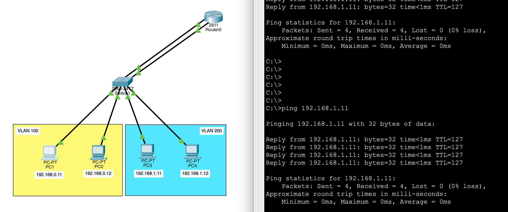
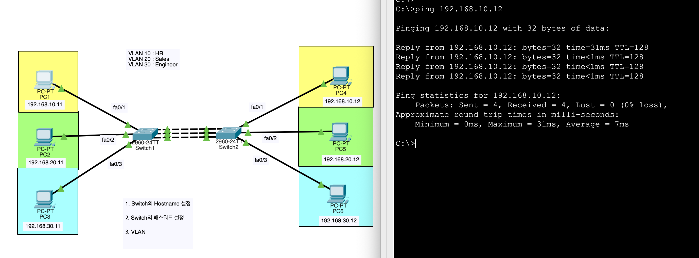
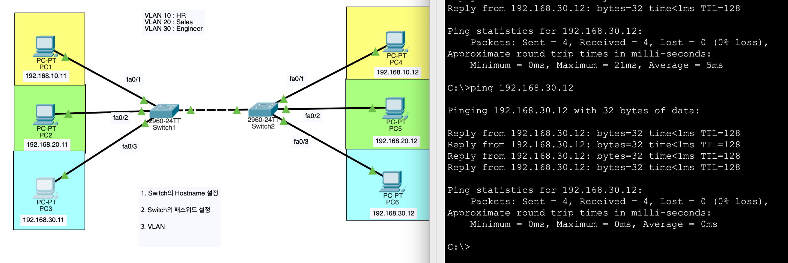
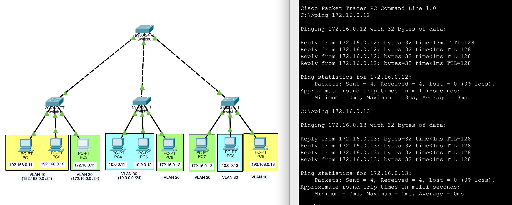
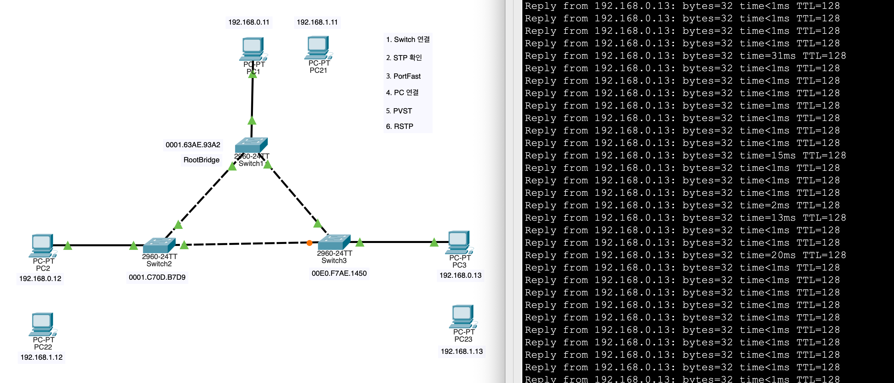
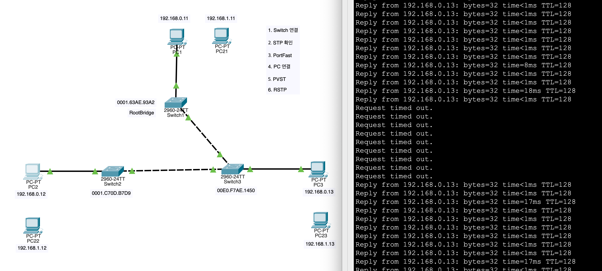
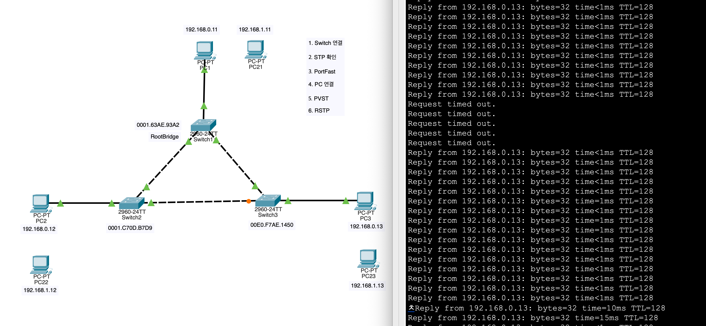

# Network Day 06

[1. VLAN: Virtual Local Area Network](#1-vlan-virtual-local-area-network)

[2. Router를 이용한 VLAN 구성 - `5. Switch.pkt`](#2-router를-이용한-vlan-구성---5-switchpkt)

[3. Trunk 없이 VLAN 구성 - `6. VLAN.pkt`](#3-trunk-없이-vlan-구성---6-vlanpkt)

[4. Implementing Trunks](#4-implementing-trunks)

[5. Trunk 포트 설정 - `6. VLAN.pkt`](#5-trunk-포트-설정---6-vlanpkt)

[6. L2 Switch Port Mode](#6-l2-switch-port-mode)

[7. DTP: Dynamic Trunking Protocol](#7-dtp-dynamic-trunking-protocol)

[8. Trunk Port Configuration](#8-trunk-port-configuration)

[9. Switch Port Configuration](#9-switch-port-configuration)

[10. CAUTION!!](#10-caution)

[11. `LAN.pkt`](#11-lanpkt)

[12. Types of VLAN](#12-types-of-vlan)

[13. VTP: VLAN Trunking Protocol](#13-vtp-vlan-trunking-protocol)

[14. STP: Spanning Tree Protocol](#14-stp-spanning-tree-protocol)

[15. `9. STP.pkt`](#15-9-stppkt)

[16. RSTP: Rapid Spanning Tree Protocol](#16-rstp-rapid-spanning-tree-protocol)

## 1. VLAN: Virtual Local Area Network

* **하나의 물리적 스위치를 여러 개의 독립적인 가상 스위치로 나누어 Broadcast Domain을 최소화하는 기술**

* **동일 IP 대역 사용 시 (L2 Isolation)**

    * VLAN ID가 다르면 프레임이 전달되지 않으므로 IP가 겹쳐도 충돌이 발생하지 않습니다.
    
    * 하지만 외부로 나가거나 서로 통신해야 할 때, 라우터가 동일한 IP 대역을 가진 두 곳 중 어디로 패킷을 보낼지 결정할 수 없는 라우팅 모호성이 발생합니다.

* **다른 IP 대역 사용 권장 (L3 Routing)**

    * 1 VLAN = 1 Subnet 공식을 따르는 것이 표준입니다.
    
    * 서로 다른 VLAN 간 통신을 하려면 라우터나 L3 스위치 같은 3계층 장비가 반드시 필요하며, 이때 각 VLAN은 고유한 IP 대역을 가져야 합니다.

## 2. Router를 이용한 VLAN 구성 - `5. Switch.pkt`

* **VLAN 생성**

    ```Plain text
    Switch(config)#vlan 100
    Switch(config-vlan)#
    ```

* **VLAN 이름 설정**

    ```Plain text
    Switch(config-vlan)#name Sales
    ```

* **인터페이스에 VLAN 할당**

    ```Plain text
    Switch(config-vlan)#interface f0/1
    Switch(config-if)#switchport access vlan 100
    ```

* **Router 인터페이스 설정**

    ```Plain text
    Router(config)#int g0/1
    Router(config-if)#ip add 192.168.0.1 255.255.255.0
    Router(config-if)#no shutdown
    ```

* **Switch VLAN 설정**

    ```Plain text
    Switch(config-if)#int g0/1
    Switch(config-if)#switchport access vlan 100
    ```

* **VLAN 간 통신 테스트 (PC1 → PC3)**

    

## 3. Trunk 없이 VLAN 구성 - `6. VLAN.pkt`

* **Switch 기본 설정**

    ```Plain text
    Switch(config)#hostname Switch-1
    Switch-1(config)#enable password cisco
    ```

* **VLAN 생성 및 이름 설정**

    ```Plain text
    Switch-1(config)#vlan 10
    Switch-1(config-vlan)#name HR
    Switch-1(config-vlan)#vlan 20
    Switch-1(config-vlan)#name Sales
    Switch-1(config-vlan)#vlan 30
    Switch-1(config-vlan)#name Engineer
    ```

* **인터페이스에 VLAN 할당**

    * Switch - PC

        ```Plain text
        Switch-1(config-vlan)#int f0/1
        Switch-1(config-if)#switchport access vlan 10
        Switch-1(config-if)#int f0/2
        Switch-1(config-if)#switchport access vlan 20
        Switch-1(config-if)#int f0/3
        Switch-1(config-if)#switchport access vlan 30
        ```

    * Switch - Switch

        ```Plain text
        Switch-1(config-if)#int f0/10
        Switch-1(config-if)#switchport access vlan 10
        Switch-1(config-if)#int f0/11
        Switch-1(config-if)#switchport access vlan 20
        Switch-1(config-if)#int f0/12
        Switch-1(config-if)#switchport access vlan 30
        ```

* **통신 테스트 (PC1 → PC4)**

    

## 4. Implementing Trunks

* **ISL: Inter Switch Link**

    * Cisco 독점 프로토콜로, 프레임에 VLAN ID를 추가하여 어떤 VLAN에 속하는지 식별하는 방식입니다.

    * 기존의 이더넷 프레임을 변형시켰기 때문에, Hub를 통해 전송 할 수 없습니다.

    * 다른 장비에서 지원되지 않아 호환성 문제가 발생할 수 있습니다.

    `switchport trunk encapsulation isl`

* **802.1Q Trunk Protocol**

    * 프레임이 어떤 VLAN에 속하는지 식별하기 위해 VLAN ID를 프레임에 추가하는 과정입니다.

    * IEEE 표준이며, 다양한 벤더와 장치에서 지원되어 호환성이 뛰어납니다.

    * Native VLAN (Default VLAN)

        * Trunk 포트에서 태그가 없는 프레임이 들어올 때, 해당 프레임이 속하는 VLAN을 지정하는 역할을 합니다.

        * 일반적으로 VLAN 1이 기본 Native VLAN으로 설정되어 있지만, 보안상의 이유로 다른 VLAN으로 변경하는 것이 권장됩니다.

        * Untagged Frame이 들어올 때, Native VLAN으로 간주되어 해당 VLAN에 속하는 것으로 처리됩니다.

    `switchport trunk encapsulation dot1q`

* **VLAN 0:** System VLAN

* **VLAN 1:** Default VLAN

* **VLAN 2-1001:** User VLAN

* **VLAN 1002-1005:** Reserved VLANs

* **VLAN 1006-4094:** Extended VLANs

* **VLAN 4095:** Reserved VLAN

## 5. Trunk 포트 설정 - `6. VLAN.pkt`

* **Trunk 포트 설정**

    ```Plain text
    Switch-1(config-if)#int g0/1
    Switch-1(config-if)#switchport mode trunk
    ```

* **통신 테스트 (PC3 → PC6)**

    

* **VLAN 확인**

    ```Plain text
    Switch-2#show vlan brief

    VLAN Name                             Status    Ports
    ---- -------------------------------- --------- -------------------------------
    1    default                          active    Fa0/4, Fa0/5, Fa0/6, Fa0/7
                                                    Fa0/8, Fa0/9, Fa0/13, Fa0/14
                                                    Fa0/15, Fa0/16, Fa0/17, Fa0/18
                                                    Fa0/19, Fa0/20, Fa0/21, Fa0/22
                                                    Fa0/23, Fa0/24, Gig0/2
    10   HR                               active    Fa0/1, Fa0/10
    20   Sales                            active    Fa0/2, Fa0/11
    30   Engineer                         active    Fa0/3, Fa0/12
    1002 fddi-default                     active    
    1003 token-ring-default               active    
    1004 fddinet-default                  active    
    1005 trnet-default                    active    
    ```

## 6. L2 Switch Port Mode

* **Cisco: Access-Port | HPE: Untagged-Port**

    * 일반적으로 PC나 프린터 같은 단말기가 연결되는 포트에 설정됩니다.

    * VLAN 태그가 없는 프레임이 들어오면, 해당 프레임이 속하는 VLAN으로 간주되어 처리됩니다.

    * `switchport mode access`

* **Cisco: Trunk-Port | HPE: Tagged-Port**

    * 스위치 간 연결되는 포트에 설정됩니다.

    * VLAN 태그가 있는 프레임이 들어오면, 해당 프레임이 속하는 VLAN으로 간주되어 처리됩니다.

    * `switchport mode trunk`

* **Dynamic-Port**

    * 포트가 트렁크 모드로 설정될 수 있도록 허용하지만, 상대방이 트렁크 모드로 설정되어 있지 않으면 자동으로 액세스 모드로 전환됩니다.

    * `switchport mode dynamic auto`

## 7. DTP: Dynamic Trunking Protocol

* **Desirable:** 적극적으로 Trunk를 형성하려는 모드입니다. 상대방이 Trunk Mode로 설정되어 있으면, 자동으로 Trunk를 형성합니다.

* **Auto:** 수동적으로 Trunk를 형성하려는 모드입니다. 상대방이 Trunk Mode로 설정되어 있으면, 자동으로 Trunk를 형성하지만, 그렇지 않으면 Access Mode로 유지됩니다.

* **DTP 비활성화:** `switchport nonegotiate`

|  | Auto | Desirable | Trunk | Access |
| --- | --- | --- | --- | --- |
| **Auto** | Access | Trunk | Trunk | Access |
| **Desirable** | Trunk | Trunk | Trunk | Access |
| **Trunk** | Trunk | Trunk | Trunk | Not recommended |
| **Access** | Access | Access | Not recommended | Access |

## 8. Trunk Port Configuration

* **Trunk 인터페이스 설정:** `interface g0/1` 

* **802.1Q Trunk 포트 설정:** `switchport trunk encapsulation dot1q`

* **특정 VLAN만 허용:** `switchport trunk allowed vlan 10,20,30`

* **모든 VLAN 허용:** `switchport trunk allowed vlan all`

* **Native VLAN 설정:** `switchport trunk native vlan 99`

* **DTP 비활성화:** `switchport nonegotiate`

* **Trunk-Port 설정:** `switchport mode trunk`

## 9. Switch Port Configuration

* **한꺼번에 Access-Port 설정**

    ```Plain text
    Switch-1(config)#int range f0/1-24
    Switch-1(config-if-range)#switchport mode access
    ```

* **Trunk-Port 설정**

    ```Plain text
    Switch-1(config-if-range)#int g0/1
    Switch-1(config-if)#switchport mode trunk
    Switch-1(config-if)#switchport nonegotiate 
    Switch-1(config-if)#switchport trunk native vlan 99
    Switch-1(config-if)#switchport trunk allowed vlan 10,20,30
    ```

* **Port 설정 확인**

    ```Plain text
    Switch-1#show interface g0/1 switchport
    Name: Gig0/1
    Switchport: Enabled
    Administrative Mode: trunk
    Operational Mode: trunk
    Administrative Trunking Encapsulation: dot1q
    Operational Trunking Encapsulation: dot1q
    Negotiation of Trunking: Off
    Access Mode VLAN: 1 (default)
    Trunking Native Mode VLAN: 99 (Inactive)
    Voice VLAN: none
    Administrative private-vlan host-association: none
    Administrative private-vlan mapping: none
    Administrative private-vlan trunk native VLAN: none
    Administrative private-vlan trunk encapsulation: dot1q
    Administrative private-vlan trunk normal VLANs: none
    Administrative private-vlan trunk private VLANs: none
    Operational private-vlan: none
    Trunking VLANs Enabled: 10,20,30
    Pruning VLANs Enabled: 2-1001
    Capture Mode Disabled
    Capture VLANs Allowed: ALL
    Protected: false
    Unknown unicast blocked: disabled
    Unknown multicast blocked: disabled
    Appliance trust: none
    ```

## 10. CAUTION!!

* **Trunk Port는 여러 VLAN의 트래픽을 전송할 수 있지만, 스위치 자체에 해당 VLAN이 생성되어 있지 않으면 그 트래픽은 통과하지 못하고 폐기됩니다.**

* **Trunk: VLAN을 구분해주도록 하는 프로토콜**

* **Trunk Port: 모든 VLAN의 트래픽이 통과할 수 있도록 하는 포트**

## 11. `LAN.pkt`

* **VLAN 10, 20, 30 생성**

    ```Plain text
    Switch(config)#vlan 10
    Switch(config-vlan)#vlan 20
    Switch(config-vlan)#vlan 30
    ```

* **Trunk 포트 설정**

    ```Plain text
    Switch(config-vlan)#int range f0/11-13
    Switch(config-if-range)#switchport nonegotiate
    Switch(config-if-range)#switchport mode trunk
    Switch(config-if-range)#switchport trunk allowed vlan 10,20,30
    ```

* **PC가 연결된 포트는 Access-Port로 설정**

    ```Plain text
    Switch(config)#int range f0/1-3
    Switch(config-if-range)#switchport mode access
    Switch(config-if-range)#int f0/1
    Switch(config-if)#switchport access vlan 10
    Switch(config-if-range)#int f0/2
    Switch(config-if)#switchport access vlan 10
    Switch(config-if-range)#int f0/3
    Switch(config-if)#switchport access vlan 20
    ```

* **Trunk 포트만 있는 Switch0에 VLAN을 추가하지 않으면, Trunk 포트를 통해 들어오는 트래픽이 폐기됩니다.**

* **PC3 → PC6, PC7 통신 테스트**

    

## 12. Types of VLAN

* **Port Based VLAN**

    * 스위치 포트에 VLAN을 할당

    * 특정 포트에 장치를 연결하면, 해당 포트가 속한 VLAN에 자동으로 할당되어 통신이 이루어지는 방식

    * 다른 포트에 장치를 연결하면 다른 VLAN에 접근하게 되는 보안 이슈가 발생할 수 있음

* **MAC Based VLAN**

    * 장치의 MAC 주소를 기반으로 VLAN을 할당

    * 다른 포트에 장치를 연결해도 동일한 VLAN에 할당

    * 보안이 중요한 환경 혹은 이동이 잦은 환경에서 유용

* **Voice VLAN, Data VLAN**

    * VoIP: Voice over IP

    * Voice VLAN과 Data VLAN을 분리하여 음성 트래픽과 데이터 트래픽을 구분하는 데 사용

* **Overlay**

    * 물리적 네트워크 위에 가상 네트워크를 구축하는 기술

    * e.g. VXLAN: Virtual Extensible LAN

## 13. VTP: VLAN Trunking Protocol

* Cisco 독점 프로토콜, VLAN 정보를 스위치 간에 자동으로 동기화하는 데 사용

* **VTP Domain:** VTP가 적용되는 스위치 그룹을 정의하는 논리적 영역

* **Server**

    * VLAN 정보를 생성, 수정, 삭제할 수 있는 권한이 있는 스위치

    * VLAN 정보를 다른 스위치에 전송하여 동기화

* **Client**

    * VLAN 정보를 수신하여 적용하지만, VLAN 정보를 생성, 수정, 삭제할 수 없는 스위치

    * 수신 받은 VLAN 정보를 다른 스위치에 전송하여 동기화

* **Transparent**

    * VTP 정보를 수신하거나 전송하지 않으며, VLAN 정보를 관리하지 않는 스위치

    * 서버로부터 받은 VLAN 정보를 다른 스위치에 전송하지만, 자신은 VLAN 정보를 관리하지 않음

* **VTP Configuration**

    ```Plain text
    Switch(config)#vtp domain FISA
    Switch(config)#vtp password cisco
    Switch(config)#vtp mode server
    ```

    ```Plain text
    Switch(config)#vtp domain FISA
    Switch(config)#vtp password cisco
    Switch(config)#vtp mode client
    ```

    ```Plain text
    Switch(config)#vtp domain FISA
    Switch(config)#vtp password cisco
    Switch(config)#vtp mode transparent
    ```

## 14. STP: Spanning Tree Protocol

* **802.1D**

* **Problems with Loops**

    * Broadcast Storm: 네트워크에 루프가 발생하여 브로드캐스트 패킷이 무한히 전송되는 현상

    * Duplicate Frame: 네트워크에 루프가 발생하여 동일한 프레임이 여러 번 전송되는 현상

* **Switch Roles**

    * Root Bridge: STP에서 네트워크의 중심이 되는 스위치로, 모든 경로 계산의 기준이 되는 스위치

    * Non-Root Bridge: Root Bridge가 아닌 스위치로, Root Bridge로 가는 최적의 경로를 계산하여 포트 상태를 결정

* **BID: Bridge ID**

    * 스위치를 식별하는 고유한 값으로, Bridge Priority와 MAC으로 구성

    * 값이 낮을수록 우선순위가 높음

    * Bridge Priority : 0 - 65535 사이의 값 중 4096의 배수 (Default: 32768)

* **BPDU: Bridge Protocol Data Unit**

    * STP에서 스위치 간에 정보를 교환하는 데 사용되는 메시지

    * BPDU를 통해 스위치는 자신이 Root Bridge인지, Root Bridge로 가는 최적의 경로가 무엇인지 등을 알 수 있음

    * Root Bridge ID, Root Path Cost, Sender Bridge ID, Sender Port ID

        * Lowest Root Path Cost

    * Root Bridge가 결정되면, Root Bridge만 BPDU를 생성하여 네트워크에 전송

    * BPDU를 받지 못한 Non-Root Bridge는 다른 스위치 포트를 차단 해제 하여 Root Bridge로 가는 최적의 경로를 유지

* **Ports Roles**

    * Root Port: Non-Root Bridge에서 Root Bridge로 가는 최적의 경로가 연결된 포트

    * Designated Port: 각 세그먼트 (링크)에서 Root Bridge로 가는 가장 낮은 Cost를 가진 포트

    * Blocked Port: 루프를 방지하기 위해 차단된 포트

## 15. `9. STP.pkt`

* **Topology**

    

* **Failover**

    

* **Failback**

    

## 16. RSTP: Rapid Spanning Tree Protocol

* **802.1w**

* 기존 STP보다 빠르게 네트워크 루프를 방지하는 프로토콜로, 포트 상태 전환이 더 빠르게 이루어짐