# Network Day 07

[1. STP: Spanning Tree Protocol States](#1-stp-spanning-tree-protocol-states)

[2. PVST: Per VLAN Spanning Tree](#2-pvst-per-vlan-spanning-tree)

[3. `9. STP.pkt`](#3-9-stppkt)

[4. RSTP: Rapid Spanning Tree Protocol](#4-rstp-rapid-spanning-tree-protocol)

[5. PVRST: Per VLAN Rapid Spanning Tree](#5-pvrst-per-vlan-rapid-spanning-tree)

[6. PortFast](#6-portfast)

[7. `9. STP-2.pkt`](#7-9-stp-2pkt)

* [7.12 RoaS: Router on a Stick](#712-roas-router-on-a-stick)

[8. Link Aggregation with EtherChannel](#8-link-aggregation-with-etherchannel)

[9. `[2026.02.23]_VII_Network_Day_07.pkt`](#9-20260223_vii_network_day_07pkt)

[10. `9. STP-3.pkt`](#10-9-stp-3pkt)

[11. Limits of Load-Balancing](#11-limits-of-load-balancing)

* [11.1 현재 Load-Balance 방식 확인](#111-현재-load-balance-방식-확인)

* [11.2 Load-Balance 방식 변경](#112-load-balancing-방식-변경)

* [11.3 Interface에 설명 추가](#113-interface에-설명-추가)

[12. MLS: Multilayer Switch (Layer 3 Switch)](#12-mls-multilayer-switch-layer-3-switch)

[13. `[2026.02.23]_VII_Network_Day_07-2.pkt`](#13-20260223_vii_network_day_07-2pkt)

* [13.6 Routing 활성화](#136-routing-활성화)

[14. `11.MLS-01.pkt`](#14-11mls-01pkt)

[15. `12. LAN.pkt`](#15-12-lanpkt)

## 1. STP: Spanning Tree Protocol States

* **Blocking**

    * 데이터 프레임 전송 및 MAC 주소 학습을 하지 않습니다.

    * 오직 BPDU 수신만 가능하며, 루프를 방지하기 위해 논리적으로 막혀 있는 상태입니다.

    * BPDU는 2초마다 전송되며, BPDU를 수신하지 못하면 포트 상태가 변경됩니다.

    * Max Age: 20s

* **Listening**

    * 포트 역할 (Root Port, Designated Port)을 결정하는 단계입니다.

    * 여전히 데이터 전송은 불가능하며, MAC 주소 학습도 하지 않습니다.

    * Forward Delay: 15s

* **Learning**

    * 이제 MAC 주소 테이블을 학습하기 시작합니다.

    * 하지만 보안과 루프 방지를 위해 여전히 실제 데이터 프레임은 전송하지 않습니다.

    * Forward Delay: 15s

* **Forwarding**

    * 데이터 프레임을 정상적으로 송수신하고 MAC 주소를 지속적으로 학습하는 상태입니다.

## 2. PVST: Per VLAN Spanning Tree

* VLAN마다 별도의 Spanning Tree를 운영하는 프로토콜

* Blocking Port가 VLAN마다 다르기 때문에, 포트 및 링크의 활용도를 최적화

* BID: Bridge ID = Priority + VLAN ID + MAC Address

## 3. `9. STP.pkt`

### 3.1 Spanning Tree 확인

* Root Bridge

    ```Plain Text
    Switch1#show spanning-tree
    VLAN0001
    Spanning tree enabled protocol ieee
    Root ID    Priority    32769
                Address     0001.63AE.93A2
                This bridge is the root
                Hello Time  2 sec  Max Age 20 sec  Forward Delay 15 sec

    Bridge ID  Priority    32769  (priority 32768 sys-id-ext 1)
                Address     0001.63AE.93A2
                Hello Time  2 sec  Max Age 20 sec  Forward Delay 15 sec
                Aging Time  20

    Interface        Role Sts Cost      Prio.Nbr Type
    ---------------- ---- --- --------- -------- --------------------------------
    Fa0/1            Desg FWD 19        128.1    P2p
    Fa0/11           Desg FWD 19        128.11   P2p
    Fa0/12           Desg FWD 19        128.12   P2p
    ```

* Non-Root Bridge

    ```Plain Text
    Switch2#show spanning-tree 
    VLAN0001
    Spanning tree enabled protocol ieee
    Root ID    Priority    32769
                Address     0001.63AE.93A2
                Cost        19
                Port        11(FastEthernet0/11)
                Hello Time  2 sec  Max Age 20 sec  Forward Delay 15 sec

    Bridge ID  Priority    32769  (priority 32768 sys-id-ext 1)
                Address     0001.C70D.B7D9
                Hello Time  2 sec  Max Age 20 sec  Forward Delay 15 sec
                Aging Time  20

    Interface        Role Sts Cost      Prio.Nbr Type
    ---------------- ---- --- --------- -------- --------------------------------
    Fa0/1            Desg FWD 19        128.1    P2p
    Fa0/11           Root FWD 19        128.11   P2p
    Fa0/13           Desg FWD 19        128.13   P2p
    ```

### 3.2 PVST

* VLAN 20 생성 후 Interface에 할당

    ```Plain Text
    Switch1(config)#vlan 20
    Switch1(config-vlan)#int f0/2
    Switch1(config-if)#switchport access vlan 20
    ```

* Trunk Port 설정

    ```Plain Text
    Switch1(config-if)#int range f0/11-13
    Switch1(config-if-range)#switchport mode trunk
    ```

* Trunk Port 확인

    ```Plain Text
    Switch1#show interfaces trunk
    Port        Mode         Encapsulation  Status        Native vlan
    Fa0/11      on           802.1q         trunking      1
    Fa0/13      on           802.1q         trunking      1

    Port        Vlans allowed on trunk
    Fa0/11      1-1005
    Fa0/13      1-1005

    Port        Vlans allowed and active in management domain
    Fa0/11      1,20
    Fa0/13      1,20

    Port        Vlans in spanning tree forwarding state and not pruned
    Fa0/11      1,20
    Fa0/13      1,20
    ```

* VLAN 20 연결 확인 (PC22 → PC23, PC22 → PC21)

    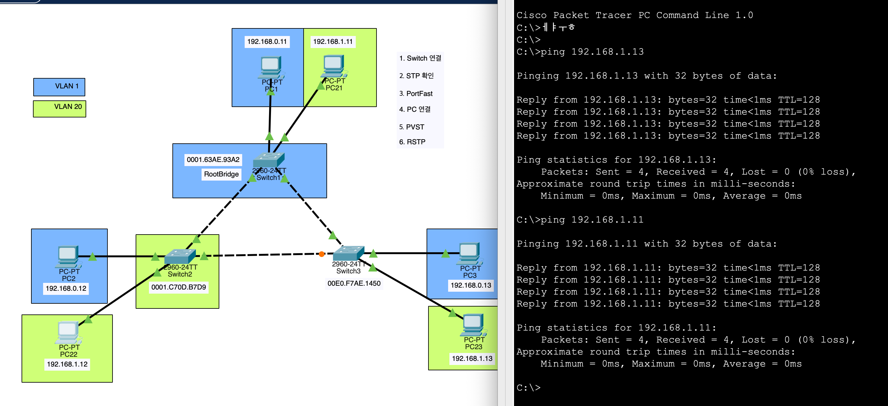

* Spanning Tree 확인 (VLAN 1, VLAN 20 모두 Switch 1이 Root Bridge)

    ```Plain Text
    Switch2#show spanning-tree 
    VLAN0001
    Spanning tree enabled protocol ieee
    Root ID    Priority    32769
                Address     0001.63AE.93A2
                Cost        19
                Port        11(FastEthernet0/11)
                Hello Time  2 sec  Max Age 20 sec  Forward Delay 15 sec

    Bridge ID  Priority    32769  (priority 32768 sys-id-ext 1)
                Address     0001.C70D.B7D9
                Hello Time  2 sec  Max Age 20 sec  Forward Delay 15 sec
                Aging Time  20

    Interface        Role Sts Cost      Prio.Nbr Type
    ---------------- ---- --- --------- -------- --------------------------------
    Fa0/1            Desg FWD 19        128.1    P2p
    Fa0/11           Root FWD 19        128.11   P2p
    Fa0/13           Desg FWD 19        128.13   P2p

    VLAN0020
    Spanning tree enabled protocol ieee
    Root ID    Priority    32788
                Address     0001.63AE.93A2
                Cost        19
                Port        11(FastEthernet0/11)
                Hello Time  2 sec  Max Age 20 sec  Forward Delay 15 sec

    Bridge ID  Priority    32788  (priority 32768 sys-id-ext 20)
                Address     0001.C70D.B7D9
                Hello Time  2 sec  Max Age 20 sec  Forward Delay 15 sec
                Aging Time  20

    Interface        Role Sts Cost      Prio.Nbr Type
    ---------------- ---- --- --------- -------- --------------------------------
    Fa0/2            Desg FWD 19        128.2    P2p
    Fa0/11           Root FWD 19        128.11   P2p
    Fa0/13           Desg FWD 19        128.13   P2p
    ```

* VLAN 20에서 Switch 2가 Root Bridge가 되도록 설정

    ```Plain Text
    Switch2(config)#spanning-tree vlan 20 priority 16384
    ```

    * 값 입력 대신 `root primary` or `root secondary` 사용

        ```Plain Text
        Switch2(config)#spanning-tree vlan 20 root primary
        Switch2(config)#spanning-tree vlan 20 root secondary
        ```

* Spanning Tree 확인 (VLAN 20에서 Switch 2가 Root Bridge)

    * VLAN 1 - Switch 1이 Root Bridge

        ```Plain Text
        Switch1#show spanning-tree 
        VLAN0001
        Spanning tree enabled protocol ieee
        Root ID    Priority    32769
                    Address     0001.63AE.93A2
                    This bridge is the root
                    Hello Time  2 sec  Max Age 20 sec  Forward Delay 15 sec

        Bridge ID  Priority    32769  (priority 32768 sys-id-ext 1)
                    Address     0001.63AE.93A2
                    Hello Time  2 sec  Max Age 20 sec  Forward Delay 15 sec
                    Aging Time  20

        Interface        Role Sts Cost      Prio.Nbr Type
        ---------------- ---- --- --------- -------- --------------------------------
        Fa0/1            Desg FWD 19        128.1    P2p
        Fa0/11           Desg FWD 19        128.11   P2p
        Fa0/12           Desg FWD 19        128.12   P2p

        VLAN0020
        Spanning tree enabled protocol ieee
        Root ID    Priority    16404
                    Address     0001.C70D.B7D9
                    Cost        19
                    Port        11(FastEthernet0/11)
                    Hello Time  2 sec  Max Age 20 sec  Forward Delay 15 sec

        Bridge ID  Priority    32788  (priority 32768 sys-id-ext 20)
                    Address     0001.63AE.93A2
        ```

    * VLAN 20 - Switch 2가 Root Bridge

        ```Plain Text
        Switch2#show spanning-tree 
        VLAN0001
        Spanning tree enabled protocol ieee
        Root ID    Priority    32769
                    Address     0001.63AE.93A2
                    Cost        19
                    Port        11(FastEthernet0/11)
                    Hello Time  2 sec  Max Age 20 sec  Forward Delay 15 sec

        Bridge ID  Priority    32769  (priority 32768 sys-id-ext 1)
                    Address     0001.C70D.B7D9
                    Hello Time  2 sec  Max Age 20 sec  Forward Delay 15 sec
                    Aging Time  20

        Interface        Role Sts Cost      Prio.Nbr Type
        ---------------- ---- --- --------- -------- --------------------------------
        Fa0/1            Desg FWD 19        128.1    P2p
        Fa0/11           Root FWD 19        128.11   P2p
        Fa0/13           Desg FWD 19        128.13   P2p

        VLAN0020
        Spanning tree enabled protocol ieee
        Root ID    Priority    16404
                    Address     0001.C70D.B7D9
                    This bridge is the root
                    Hello Time  2 sec  Max Age 20 sec  Forward Delay 15 sec

        Bridge ID  Priority    16404  (priority 16384 sys-id-ext 20)
                    Address     0001.C70D.B7D9
                    Hello Time  2 sec  Max Age 20 sec  Forward Delay 15 sec
                    Aging Time  20

        Interface        Role Sts Cost      Prio.Nbr Type
        ---------------- ---- --- --------- -------- --------------------------------
        Fa0/2            Desg FWD 19        128.2    P2p
        Fa0/11           Desg FWD 19        128.11   P2p
        Fa0/13           Desg FWD 19        128.13   P2p
        ```

    * Switch 3 - Non-Root Bridge

        ```Plain Text
        Switch3#show spanning-tree 
        VLAN0001
        Spanning tree enabled protocol ieee
        Root ID    Priority    32769
                    Address     0001.63AE.93A2
                    Cost        19
                    Port        12(FastEthernet0/12)
                    Hello Time  2 sec  Max Age 20 sec  Forward Delay 15 sec

        Bridge ID  Priority    32769  (priority 32768 sys-id-ext 1)
                    Address     00E0.F7AE.1450
                    Hello Time  2 sec  Max Age 20 sec  Forward Delay 15 sec
                    Aging Time  20

        Interface        Role Sts Cost      Prio.Nbr Type
        ---------------- ---- --- --------- -------- --------------------------------
        Fa0/1            Desg FWD 19        128.1    P2p
        Fa0/12           Root FWD 19        128.12   P2p
        Fa0/13           Altn BLK 19        128.13   P2p

        VLAN0020
        Spanning tree enabled protocol ieee
        Root ID    Priority    16404
                    Address     0001.C70D.B7D9
                    Cost        19
                    Port        13(FastEthernet0/13)
                    Hello Time  2 sec  Max Age 20 sec  Forward Delay 15 sec

        Bridge ID  Priority    32788  (priority 32768 sys-id-ext 20)
                    Address     00E0.F7AE.1450
                    Hello Time  2 sec  Max Age 20 sec  Forward Delay 15 sec
                    Aging Time  20

        Interface        Role Sts Cost      Prio.Nbr Type
        ---------------- ---- --- --------- -------- --------------------------------
        Fa0/2            Desg FWD 19        128.2    P2p
        Fa0/12           Altn BLK 19        128.12   P2p
        Fa0/13           Root FWD 19        128.13   P2p
        ```

* After Configuration

    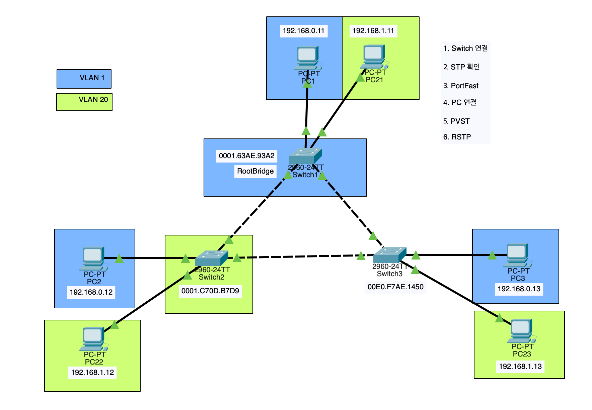

## 4. RSTP: Rapid Spanning Tree Protocol

* **802.1W:** STP의 단점을 보완하여 1초만에 포트 상태를 변경할 수 있는 프로토콜

* **Alternate Port**

    * 기존의 Blocking Port를 대체하는 포트로, Root Port가 실패할 경우 즉시 Forwarding 상태로 전환하여 네트워크의 빠른 수렴을 지원

    * Root Port가 실패한 경우 즉시 TCN (Topology Change Notification)를 전송하여 네트워크가 빠르게 수렴하도록 함

* **Enable RSTP**

    ```Plain Text
    Switch1(config)#spanning-tree mode rapid-pvst
    ```

## 5. PVRST: Per VLAN Rapid Spanning Tree

* RSTP의 기능을 VLAN마다 별도로 적용하는 프로토콜

* STP: Spanning Tree Protocol

    * CST: Common Spanning Tree

        * PVST: Per VLAN Spanning Tree

    * **RSTP: Rapid Spanning Tree Protocol**

        * **PVRST: Per VLAN Rapid Spanning Tree**

    * MSTP: Multiple Spanning Tree Protocol

## 6. PortFast

* 스위치 포트를 빠르게 Forwarding 상태로 전환하여 빠른 네트워크 연결을 지원하는 기능

* 해당 기능이 설정된 스위치 포트에 스위치를 연결하면 루프가 발생

* Switch Configuration

    ```Plain Text
    Switch(config)#int f0/1
    Switch(config-if)#spanning-tree portfast
    %Warning: portfast should only be enabled on ports connected to a single
    host. Connecting hubs, concentrators, switches, bridges, etc... to this
    interface  when portfast is enabled, can cause temporary bridging loops.
    Use with CAUTION

    %Portfast has been configured on FastEthernet0/1 but will only
    have effect when the interface is in a non-trunking mode.
    ```

## 7. `9. STP-2.pkt`

### 7.1 Switch 연결

* Cross-Over Cable로 각 스위치를 연결

* Trunk: Fa0/20-22

### 7.2 STP 확인

```Plain Text
Switch#show spanning-tree 
VLAN0001
  Spanning tree enabled protocol ieee
  Root ID    Priority    32769
             Address     0001.63AE.93A2
             This bridge is the root
             Hello Time  2 sec  Max Age 20 sec  Forward Delay 15 sec

  Bridge ID  Priority    32769  (priority 32768 sys-id-ext 1)
             Address     0001.63AE.93A2
             Hello Time  2 sec  Max Age 20 sec  Forward Delay 15 sec
             Aging Time  20

Interface        Role Sts Cost      Prio.Nbr Type
---------------- ---- --- --------- -------- --------------------------------
Fa0/1            Desg FWD 19        128.1    P2p
Fa0/20           Desg FWD 19        128.20   P2p
Fa0/21           Desg FWD 19        128.21   P2p
```

### 7.3 PortFast 설정

```Plain Text
Switch(config)#int range f0/1-19
Switch(config-if-range)#spanning-tree portfast
```

### 7.4 PC 연결

* VLAN 10: Fa0/1-9

* VLAN 20: Fa0/11-19

### 7.5 VLAN & Trunk 설정

* VLAN 설정

    ```Plain Text
    Switch(config-if-range)#vlan 10
    Switch(config-vlan)#int range f0/1-9
    Switch(config-if-range)#switchport access vlan 10
    Switch(config-if-range)#vlan 20
    Switch(config-if-vlan)#int range f0/11-19
    Switch(config-if-range)#switchport access vlan 20
    ```

* Trunk 설정

    ```Plain Text
    Switch(config-if-range)#int range f0/20-22
    Switch(config-if-range)#switchport mode trunk
    ```

### 7.6 PVRST 설정

```Plain Text
Switch(config)#spanning-tree mode rapid-pvst
```

### 7.7. VLAN 10번은 Switch 1번이 RootBridge가 되도록 하고

```Plain Text
Switch1(config)#spanning-tree vlan 10 root primary 
```

* 설정 확인

    ```Plain Text
    Switch1#show spanning-tree 
    VLAN0010
    Spanning tree enabled protocol rstp
    Root ID    Priority    24586
                Address     0001.63AE.93A2
                This bridge is the root
                Hello Time  2 sec  Max Age 20 sec  Forward Delay 15 sec

    Bridge ID  Priority    24586  (priority 24576 sys-id-ext 10)
                Address     0001.63AE.93A2
                Hello Time  2 sec  Max Age 20 sec  Forward Delay 15 sec
                Aging Time  20

    Interface        Role Sts Cost      Prio.Nbr Type
    ---------------- ---- --- --------- -------- --------------------------------
    Fa0/1            Desg FWD 19        128.1    P2p
    Fa0/20           Desg FWD 19        128.20   P2p
    Fa0/21           Desg FWD 19        128.21   P2p

    VLAN0020
    Spanning tree enabled protocol rstp
    Root ID    Priority    24596
                Address     00E0.F7AE.1450
                Cost        19
                Port        21(FastEthernet0/21)
                Hello Time  2 sec  Max Age 20 sec  Forward Delay 15 sec

    Bridge ID  Priority    32788  (priority 32768 sys-id-ext 20)
                Address     0001.63AE.93A2
                Hello Time  2 sec  Max Age 20 sec  Forward Delay 15 sec
                Aging Time  20

    Interface        Role Sts Cost      Prio.Nbr Type
    ---------------- ---- --- --------- -------- --------------------------------
    Fa0/11           Desg FWD 19        128.11   P2p
    Fa0/20           Desg FWD 19        128.20   P2p
    Fa0/21           Root FWD 19        128.21   P2p
    ```

### 7.8 VLAN 20번은 Switch 3번이 RootBridge가 되도록 해주세요

```Plain Text
Switch3(config)#spanning-tree vlan 20 root primary 
```

* 설정 확인

    ```Plain Text
    Switch3#show spanning-tree 
    VLAN0010
    Spanning tree enabled protocol rstp
    Root ID    Priority    24586
                Address     0001.63AE.93A2
                Cost        19
                Port        21(FastEthernet0/21)
                Hello Time  2 sec  Max Age 20 sec  Forward Delay 15 sec

    Bridge ID  Priority    32778  (priority 32768 sys-id-ext 10)
                Address     00E0.F7AE.1450
                Hello Time  2 sec  Max Age 20 sec  Forward Delay 15 sec
                Aging Time  20

    Interface        Role Sts Cost      Prio.Nbr Type
    ---------------- ---- --- --------- -------- --------------------------------
    Fa0/21           Root FWD 19        128.21   P2p
    Fa0/22           Altn BLK 19        128.22   P2p

    VLAN0020
    Spanning tree enabled protocol rstp
    Root ID    Priority    24596
                Address     00E0.F7AE.1450
                This bridge is the root
                Hello Time  2 sec  Max Age 20 sec  Forward Delay 15 sec

    Bridge ID  Priority    24596  (priority 24576 sys-id-ext 20)
                Address     00E0.F7AE.1450
                Hello Time  2 sec  Max Age 20 sec  Forward Delay 15 sec
                Aging Time  20

    Interface        Role Sts Cost      Prio.Nbr Type
    ---------------- ---- --- --------- -------- --------------------------------
    Fa0/11           Desg FWD 19        128.11   P2p
    Fa0/21           Desg FWD 19        128.21   P2p
    Fa0/22           Altn BLK 19        128.22   P2p
    ```

### 7.9 Router를 연결해서 VLAN 간에 통신이 가능하도록 해주세요

* Router: Gi0/1 - VLAN 10, Gi0/2 - VLAN 20

* Switch 2 Configuration

    ```Plain Text
    Switch2(config)#int g0/1
    Switch2(config-if)#switchport access vlan 10
    Switch2(config-if)#int g0/2
    Switch2(config-if)#switchport access vlan 20
    ```

* Router Configuration

    ```Plain Text
    Router(config)#int g0/1
    Router(config-if)#ip address 192.168.0.1 255.255.255.0
    Router(config-if)#no shut
    Router(config)#int g0/2
    Router(config-if)#ip address 192.168.1.1 255.255.255.0
    Router(config-if)#no shut
    ```

* PC Default Gateway 설정

### 7.10 Ping Test

* PC2 Test (Default Gateway, PC1, PC3)

    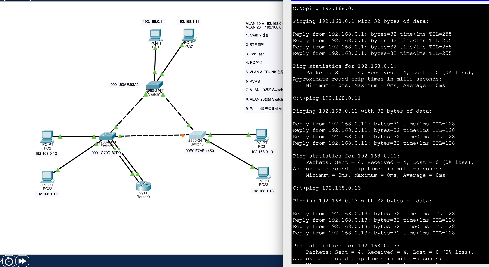

* PC22 Test (Default Gateway, PC21, PC23)

    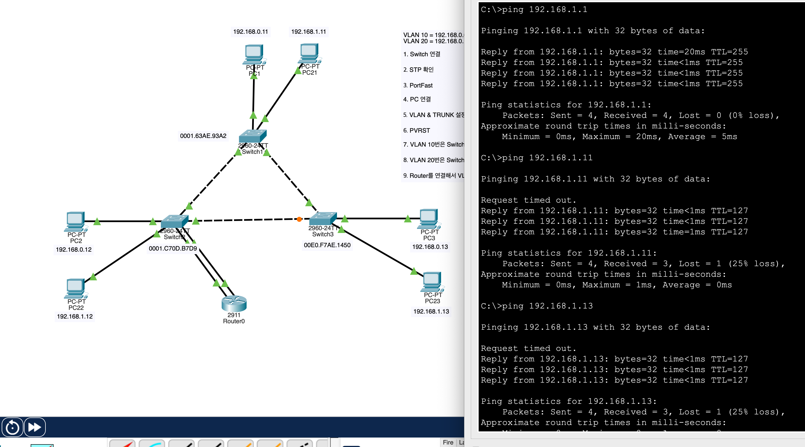

* PC1 Test (PC2, PC23)

    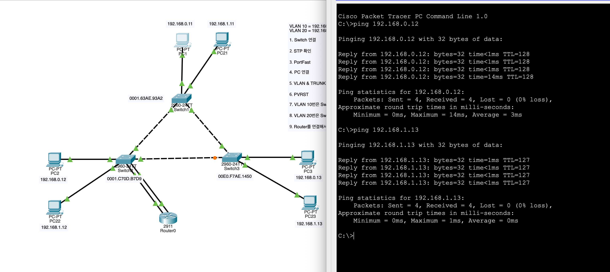

### 7.11 After Configuration

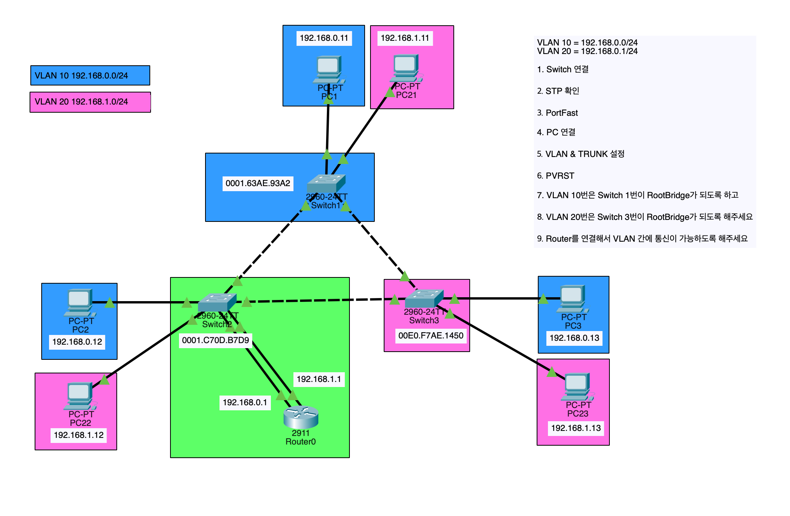

### 7.12 RoaS: Router-on-a-Stick

* Router Configuration

    ```Plain Text
    Router(config)#int range g0/1-2
    Router(config-if-range)#no ip address
    Router(config-if-range)#int g0/1.10
    Router(config-subif)#encapsulation dot1q 10
    Router(config-subif)#ip address 192.168.0.1 255.255.255.0
    Router(config-subif)#int g0/1.20
    Router(config-subif)#encapsulation dot1q 20
    Router(config-subif)#ip address 192.168.1.1 255.255.255.0
    ```

    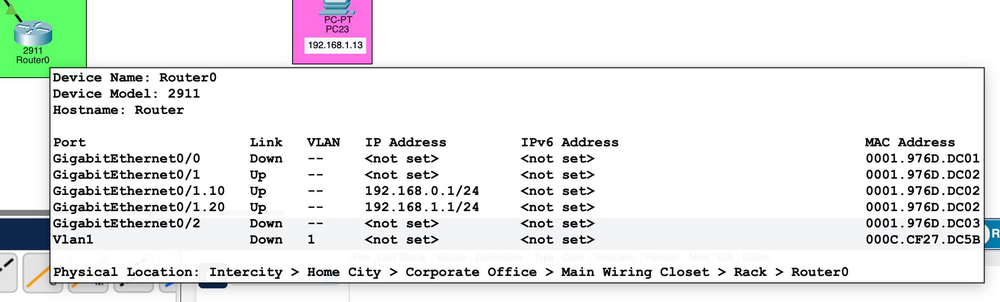

* Switch 2 Configuration

    ```Plain Text
    Switch2(config)#int g0/1
    Switch2(config-if)#switchport mode trunk
    ```

    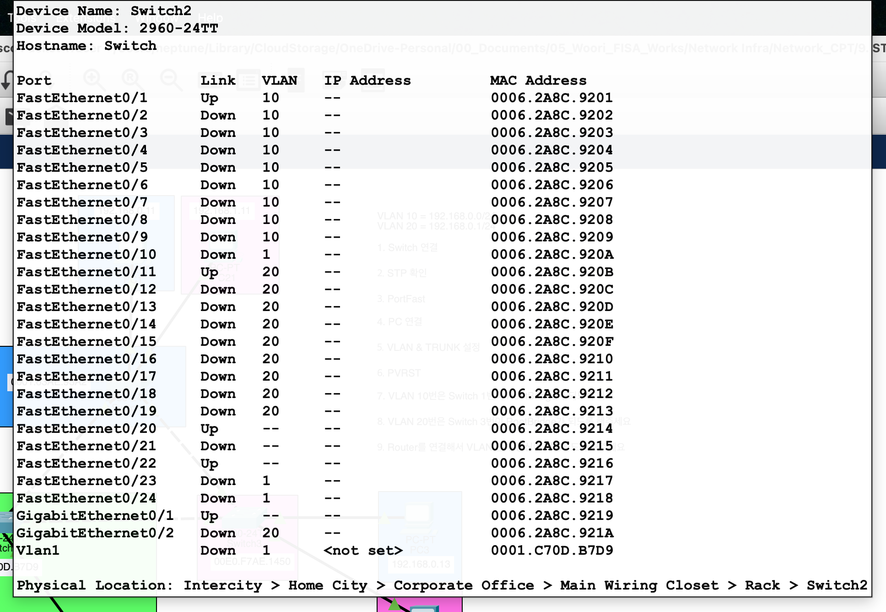

### 7.13 Ping Test

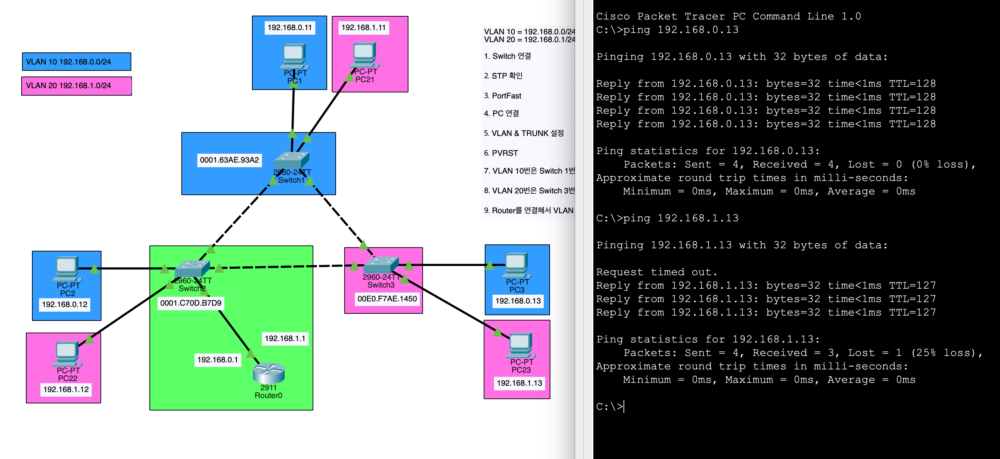

### 7.14 Final Configuration

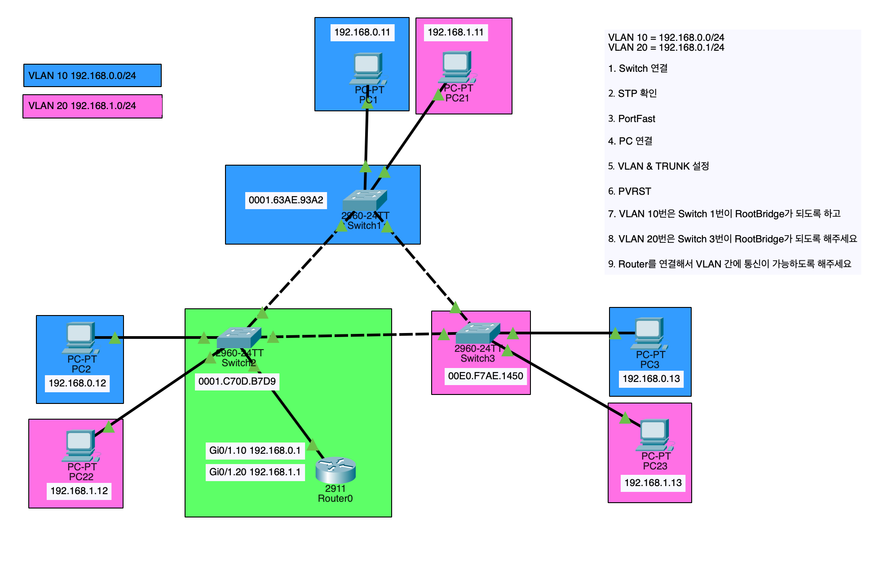

## 8. Link Aggregation with EtherChannel

* **용어 정리**

    * **IEEE 802.3ad → Link Aggregation**

    * **Cisco → EtherChannel**

    * **Juniper → Aggregation**

    * **HPE/Broadcom/Extreme → Trunking**

        * Cisco의 Trunking하고 다른 개념

    * **Linux → Bonding**

    * **Windows → Teaming**

* **PAgP: Port Aggregation Protocol**

    * Cisco 독점 프로토콜

    * Channel-Group: EtherChannel을 구성하는 포트 그룹

    * Port-Channel: Channel-Group에 의해 생성된 논리적 인터페이스

* **LACP: Link Aggregation Control Protocol**

    * IEEE 802.3ad 표준 프로토콜

* **Link Aggregation Mode**

    * **Active: LACP를 사용하여 동적으로 EtherChannel을 구성하는 모드**

    * Passive: LACP를 수신만 하는 모드

    * Desirable: PAgP를 사용하여 동적으로 EtherChannel을 구성하는 모드

    * Auto: PAgP를 수신만 하는 모드

    * On: 수동으로 EtherChannel을 구성하는 모드

* **VSS: Virtual Switching System | vPC: Virtual Port Channel:** 두 대의 스위치를 하나의 논리적 스위치로 구성하여 고가용성과 확장성을 제공하는 기술

* **아래와 같은 조건에서 EtherChannel이 구성**

    * 동일한 속도와 듀플렉스 설정

    * 동일한 Switchport 모드 설정

    * 동일한 VLAN 구성

* 최대 16개의 포트를 하나의 EtherChannel로 구성 가능, 8개만 Active 나머지 8개는 Standby 상태

## 9. `[2026.02.23]_VII_Network_Day_07.pkt`

### 9.1 LACP 설정

```Plain text
Switch(config)#int range f0/1-4
Switch(config-if-range)#channel-group 1 mode active
```

### 9.2 LACP 확인

```Plain Text
Switch#show etherchannel 
                Channel-group listing:
                ----------------------

Group: 1
----------
Group state = L2
Ports: 4 Maxports = 16
Port-channels: 1 Max Port-channels = 16
Protocol:   LACP
```

```Plain Text
Switch#show etherchannel summary 
Flags:  D - down        P - in port-channel
        I - stand-alone s - suspended
        H - Hot-standby (LACP only)
        R - Layer3      S - Layer2
        U - in use      f - failed to allocate aggregator
        u - unsuitable for bundling
        w - waiting to be aggregated
        d - default port


Number of channel-groups in use: 1
Number of aggregators:           1

Group  Port-channel  Protocol    Ports
------+-------------+-----------+----------------------------------------------

1      Po1(SU)           LACP   Fa0/1(P) Fa0/2(P) Fa0/3(P) Fa0/4(P)
```

### 9.3 Trunk 설정

```Plain Text
Switch(config)#int port-channel 1
Switch(config-if)#switchport mode trunk 
```

## 10. `9. STP-3.pkt`

### 10.1 LACP 설정

```Plain Text
Switch(config)#int range f0/11-12
Switch(config-if-range)#channel-group 1 mode active
Switch(config)#int range f0/13-14
Switch(config-if-range)#channel-group 2 mode active
```

### 10.2 Trunk 설정

```Plain Text
Switch(config)#int port-channel 1
Switch(config-if)#switchport mode trunk
Switch(config)#int port-channel 2
Switch(config-if)#switchport mode trunk
```

### 10.3 LACP & Trunk 확인

```Plain Text
Switch#show etherchannel summary
Flags:  D - down        P - in port-channel
        I - stand-alone s - suspended
        H - Hot-standby (LACP only)
        R - Layer3      S - Layer2
        U - in use      f - failed to allocate aggregator
        u - unsuitable for bundling
        w - waiting to be aggregated
        d - default port


Number of channel-groups in use: 2
Number of aggregators:           2

Group  Port-channel  Protocol    Ports
------+-------------+-----------+----------------------------------------------

1      Po1(SU)           LACP   Fa0/13(P) Fa0/14(P) 
2      Po2(SU)           LACP   Fa0/15(P) Fa0/16(P) 
```

```Plain Text
Switch#show interfaces trunk 
Port        Mode         Encapsulation  Status        Native vlan
Po1         on           802.1q         trunking      1
Po2         on           802.1q         trunking      1

Port        Vlans allowed on trunk
Po1         1-1005
Po2         1-1005

Port        Vlans allowed and active in management domain
Po1         1
Po2         1

Port        Vlans in spanning tree forwarding state and not pruned
Po1         1
Po2         none
```

### 10.4 After Configuration

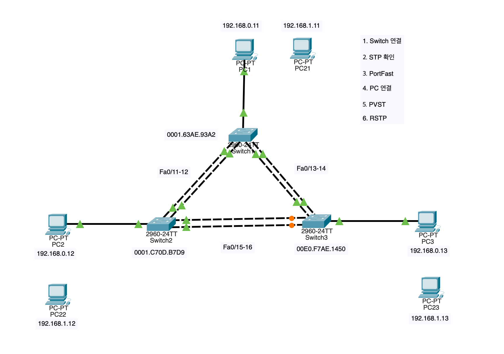

## 11. Limits of Load-Balancing

* **프레임 순서 역전 (Out-of-Order Delivery)**

    * 패킷들이 서로 다른 경로를 타고 전송되어 도착지에서는 순서가 뒤바뀌어 도착

    * 수신측에서 패킷의 순서를 다시 맞추는 과정에서 CPU 부하가 발생하거나, 실시간성 트래픽의 품질이 저하

* **홉 바이 홉 (Hop by Hop) 결정**

    * 데이터가 목적지까지 가는 경로 전체를 한 번에 결정하는 것이 아니라, 각 라우터/스위치를 지날 때마다 해당 장비가 독립적으로 경로를 결정

    * "A 장비는 왼쪽이 빠르다고 생각해서 보냈는데, 정작 B 장비는 오른쪽으로 보내버리는" 상황이 발생할 수 있어, 전체 경로의 최적화를 보장하기 어려움

* **핀홀 현상 (Pin-Hole Congestion)**

    * 여러 개의 링크를 묶었음에도 불구하고, 특정 한 포트에만 트래픽이 쏠려 병목 현상이 발생하는 현상

    * 해시 알고리즘이 불균형하거나, 하나의 거대한 트래픽이 특정 포트를 점유해 버리면 나머지 포트들이 놀고 있어도 전체 속도가 나지 않는 상황이 발생

* **Load-Balancing in LACP**

    * Source MAC Address 기준으로 전송할 포트를 결정

    * Source MAC Address가 동일한 트래픽이 많으면, 특정 포트에 트래픽이 집중되어 핀홀 현상이 발생할 수 있음

        * Inbound Traffic은 Source MAC Address가 동일한 경우가 많음 (Router MAC Address)

    * Destination MAC Address로 결정하는 경우에도, 특정 목적지로 트래픽이 집중되면 동일한 문제가 발생할 수 있음

### 11.1 현재 Load-Balance 방식 확인

```Plain Text
Switch#show etherchannel load-balance 
EtherChannel Load-Balancing Operational State (src-mac):
Non-IP: Source MAC address
    IPv4: Source MAC address
    IPv6: Source MAC address
```

### 11.2 Load-Balancing 방식 변경

```Plain Text
Switch(config)#port-channel load-balance ?
    dst-ip       Dst IP Addr
    dst-mac      Dst Mac Addr
    src-dst-ip   Src XOR Dst IP Addr
    src-dst-mac  Src XOR Dst Mac Addr
    src-ip       Src IP Addr
    src-mac      Src Mac Addr
Switch(config)#port-channel load-balance dst-mac
```

### 11.3 Interface에 설명 추가

```Plain Text
Switch(config)#int po1
Switch(config-if)#description ##### SW1-SW2 LACP Trunk #####
```

## 12. MLS: Multilayer Switch (Layer 3 Switch)

* **L2 Switch:** Access-Port, Trunk-Port, Dynamic-Port

* **L3 Switch - Routed Port**

    * `no switchport` 명령어로 L2 기능을 비활성화하여 라우터처럼 동작하는 포트

    * `ip address` 명령어로 IP 주소를 할당하여 라우팅 기능을 수행

    * Switch 연결 권장

    * Routed Port에 1:1로 직접 연결된 장비 또는 그 아래에 연결된 특정 대역만 라우팅이 가능

* **L3 Switch - SVI: Switch Virtual Interface**

    * 최근 L3 Switch는 Routed Port 대신 SVI를 사용하여 라우팅 기능을 제공

    * 해당 VLAN이 할당된 스위치의 모든 물리 포트에 연결된 장비들이 이 SVI를 게이트웨이로 삼아 라우팅을 수행

## 13. `[2026.02.23]_VII_Network_Day_07-2.pkt`

### 13.1 VLAN 생성

```Plain Text
Switch(config)#vlan 10
Switch(config-vlan)#vlan 20
```

### 13.2 VLAN에 IP 주소 할당

```Plain Text
Switch(config-vlan)#int vlan 10
Switch(config-if)#ip address 192.168.0.1 255.255.255.0
Switch(config-if)#int vlan 20
Switch(config-if)#ip address 192.168.1.1 255.255.255.0
```

### 13.3 Interface에 VLAN 할당

```Plain Text
Switch(config-if)#int range g1/0/1
Switch(config-if)#switchport access vlan 10
Switch(config-if)#int range g1/0/2
Switch(config-if)#switchport access vlan 20
```

### 13.4 Interface 확인

```Plain Text
Switch#show interfaces status 
Interface              IP-Address      OK? Method Status                Protocol 
GigabitEthernet1/0/1   unassigned      YES unset  up                    up 
GigabitEthernet1/0/2   unassigned      YES unset  up                    up 
Vlan10                 192.168.0.1     YES manual up                    up 
Vlan20                 192.168.1.1     YES manual up                    up
```

### 13.5 Routing Table 확인

```Plain Text
Switch#show ip route
```

### 13.6 Routing 활성화

```Plain Text
Switch(config)#ip routing
```

### 13.7 Routing Table 재확인

```Plain Text
Switch#show ip route
Codes: C - connected, S - static, I - IGRP, R - RIP, M - mobile, B - BGP
    D - EIGRP, EX - EIGRP external, O - OSPF, IA - OSPF inter area
    N1 - OSPF NSSA external type 1, N2 - OSPF NSSA external type 2
    E1 - OSPF external type 1, E2 - OSPF external type 2, E - EGP
    i - IS-IS, L1 - IS-IS level-1, L2 - IS-IS level-2, ia - IS-IS inter area
    * - candidate default, U - per-user static route, o - ODR
    P - periodic downloaded static route

Gateway of last resort is not set

    192.168.0.0/24 is variably subnetted, 2 subnets, 2 masks
C       192.168.0.0/24 is directly connected, Vlan10
L       192.168.0.1/32 is directly connected, Vlan10
    192.168.1.0/24 is variably subnetted, 2 subnets, 2 masks
C       192.168.1.0/24 is directly connected, Vlan20
L       192.168.1.1/32 is directly connected, Vlan20
```

### 13.8 Router 없이 VLAN 간 통신 확인

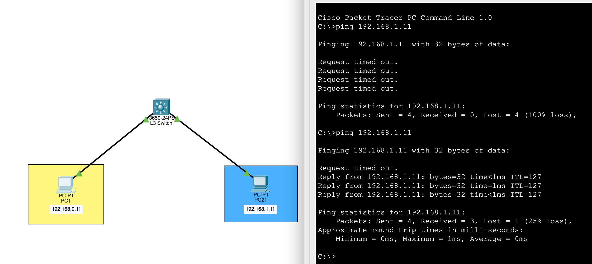

### 13.9 Router의 역할

* **Media Converter:** 서로 다른 매체 (예: 광섬유와 구리 케이블)를 연결하여 통신할 수 있도록 하는 장비

* **Protocol Converter:** 서로 다른 통신 프로토콜을 사용하는 네트워크 간에 데이터를 변환하여 전달하는 장비

## 14. `11.MLS-01.pkt`

### 14.0 Routing 활성화

```Plain Text
Switch(config)#ip routing
```

### 14.1 VLAN 생성 및 SVI 설정

```Plain Text
Switch(config)#vlan 10
Switch(config-vlan)#int vlan 10
Switch(config-if)#ip address 192.168.10.1 255.255.255.0
Switch(config-if)#vlan 20
Switch(config-vlan)#int vlan 20
Switch(config-if)#ip address 192.168.20.1 255.255.255.0
Switch(config-if)#vlan 30
Switch(config-vlan)#int vlan 30
Switch(config-if)#ip address 192.168.30.1 255.255.255.0
```

### 14.2 Interface에 VLAN 할당

```Plain Text
Switch(config-if)#int range f0/1-2
Switch(config-if-range)#switchport access vlan 10
Switch(config-if-range)#int range f0/3-4
Switch(config-if-range)#switchport access vlan 20
Switch(config-if-range)#int range f0/5-6
Switch(config-if-range)#switchport access vlan 30
```

### 14.3 Routing Table 확인

```Plain Text
Switch#show ip route
Codes: C - connected, S - static, I - IGRP, R - RIP, M - mobile, B - BGP
       D - EIGRP, EX - EIGRP external, O - OSPF, IA - OSPF inter area
       N1 - OSPF NSSA external type 1, N2 - OSPF NSSA external type 2
       E1 - OSPF external type 1, E2 - OSPF external type 2, E - EGP
       i - IS-IS, L1 - IS-IS level-1, L2 - IS-IS level-2, ia - IS-IS inter area
       * - candidate default, U - per-user static route, o - ODR
       P - periodic downloaded static route

Gateway of last resort is not set

C    192.168.10.0/24 is directly connected, Vlan10
C    192.168.20.0/24 is directly connected, Vlan20
C    192.168.30.0/24 is directly connected, Vlan30
```

### 14.4 VLAN 간 통신 확인

* PC1 → PC2 (VLAN 10 → VLAN 10) | PC3 (VLAN 10 → VLAN 20) | PC6 (VLAN 10 → VLAN 30)

    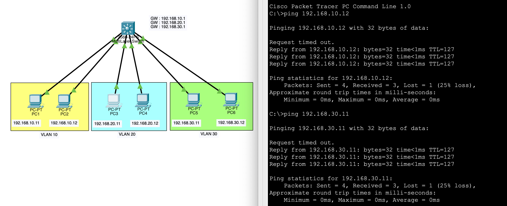

* PC3 → PC2 (VLAN 20 → VLAN 10) | PC5 (VLAN 20 → VLAN 30)

    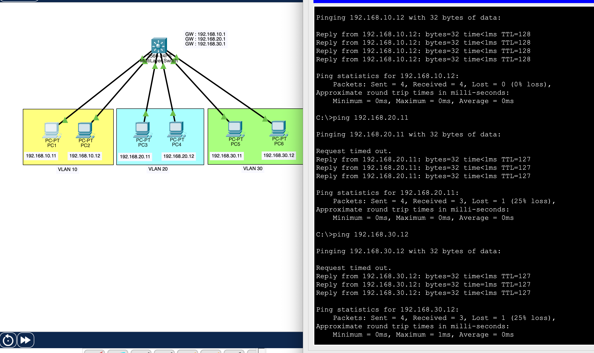

### 14.5 After Configuration

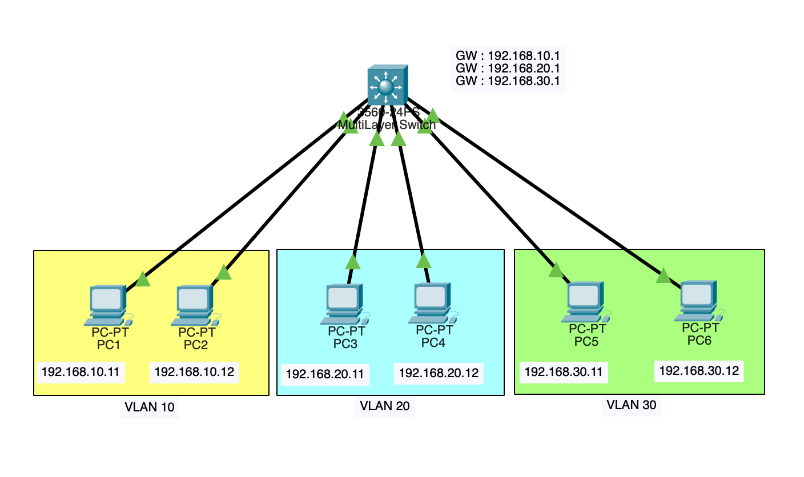

## 15. `12. LAN.pkt`

### 15.0 L3 Routing 활성화

* L3-SW-01, L3-SW-02

    ```Plain Text
    ip routing
    ```

### 15.1 PC 에 IP설정 (IP, SubnetMask, GW : .1 사용)

* L2-SW-01, L2-SW-02, L2-SW-03

    * Fa0/1-9: To PC

### 15.2 이중화 (케이블, 스위치 이중화)

* L2-SW-01, L2-SW-02, L2-SW-03

    * Fa0/21-22: To Multilayer Switch1

    * Fa0/23-24: To Multilayer Switch2

* L3-SW-01, L3-SW-02

    * Fa0/1-2: To L2 Switch

    * Fa0/3-4: To L2 Switch

    * Fa0/5-6: To L2 Switch

### 15.3 VTP 설정

* L3-SW-02: VTP Server

    ```Plain Text
    vtp domain fisa
    vtp password cisco
    vtp mode server
    ```

* L3-SW-01, L2-SW-01, L2-SW-02, L2-SW-03: VTP Client

    ```Plain Text
    vtp domain fisa
    vtp password cisco
    vtp mode client
    ```

### 15.4 EtherChannel, VLAN, Trunk 설정

#### 1. EtherChannel 설정

* L3-SW-01, L3-SW-02

    ```Plain Text
    int range f0/1-2
    channel-group 1 mode active
    int range f0/3-4
    channel-group 2 mode active
    int range f0/5-6
    channel-group 3 mode active
    ```

* L2-SW-01, L2-SW-02, L2-SW-03

    ```Plain Text
    int range f0/21-22
    channel-group 1 mode active
    int range f0/23-24
    channel-group 2 mode active
    ```

#### 2. VLAN 설정

* L3-SW-02

    ```Plain Text
    vlan 10
    name VLAN10
    vlan 20
    name VLAN20
    vlan 30
    name VLAN30
    ```

#### 3. Trunk 설정

* L3-SW-01, L3-SW-02

    ```Plain Text
    int po 1
    switchport trunk encapsulation dot1q
    switchport mode trunk
    int po 2
    switchport trunk encapsulation dot1q
    switchport mode trunk
    int po 3
    switchport trunk encapsulation dot1q
    switchport mode trunk
    ```

* L2-SW-01, L2-SW-02, L2-SW-03

    ```Plain Text
    int po 1
    switchport mode trunk
    int po 2
    switchport mode trunk
    ```

### 15.5 PortFast 설정

* L2-SW-01, L2-SW-02, L2-SW-03

    ```Plain Text
    int range f0/1-9
    spanning-tree portfast
    ```

### 15.6 Rapid-PVST 설정 (RootBridge는 백본 스위치로)

* L3-SW-01: VLAN 10, 20, 30번 Primary Root Bridge

    ```Plain Text
    spanning-tree mode rapid-pvst
    spanning-tree vlan 10 root primary
    spanning-tree vlan 20 root primary
    spanning-tree vlan 30 root primary
    ```

* L3-SW-02: VLAN 10, 20, 30번 Secondary Root Bridge

    ```Plain Text
    spanning-tree mode rapid-pvst
    spanning-tree vlan 10 root secondary
    spanning-tree vlan 20 root secondary
    spanning-tree vlan 30 root secondary
    ```

* L2-SW-01, L2-SW-02, L2-SW-03: VLAN 10, 20, 30번 Non-Root Bridge

    ```Plain Text
    spanning-tree mode rapid-pvst
    ```

### 15.7 SVI 설정

* L3-SW-01

    ```Plain Text
    int vlan 10
    ip address 192.168.0.1 255.255.255.0
    int vlan 20
    ip address 172.16.0.1 255.255.255.0
    int vlan 30
    ip address 10.0.0.1 255.255.255.0
    ```

* L3-SW-02

    ```Plain Text
    int vlan 10
    ip address 192.168.0.2 255.255.255.0
    int vlan 20
    ip address 172.16.0.2 255.255.255.0
    int vlan 30
    ip address 10.0.0.2 255.255.255.0
    ``` 

### 15.8 패스워드,원격접속,호스트네임,날짜,시간 설정등

* 패스워드

    ```Plain Text
    enable secret cisco
    ```

* 원격접속 (SSH)

    ```Plain Text
    ip domain-name fisa.com
    crypto key generate rsa
    4096
    username admin secret cisco
    line vty 0 4
    login local
    transport input ssh
    ```

* 호스트네임 (사전 설정 완료)

* 날짜, 시간, 타임존

    ```Plain Text
    clock set 12:00:00 23 Feb 2026
    clock timezone KST 9
    ```

### 15.9 Ping Test

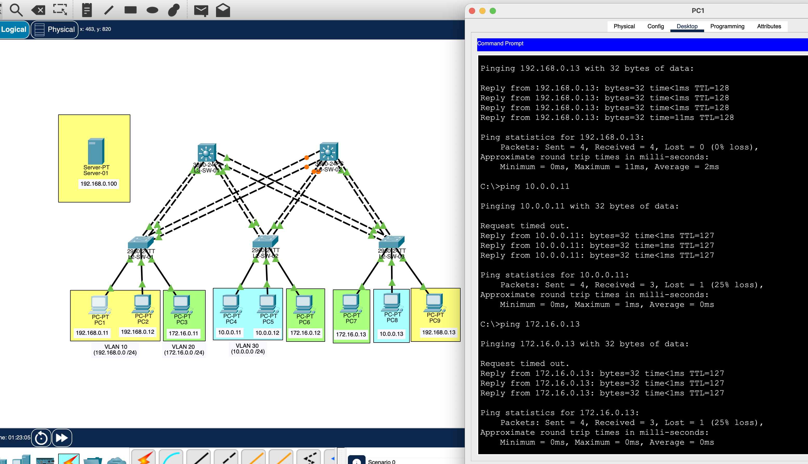

### 15.10 After Configuration

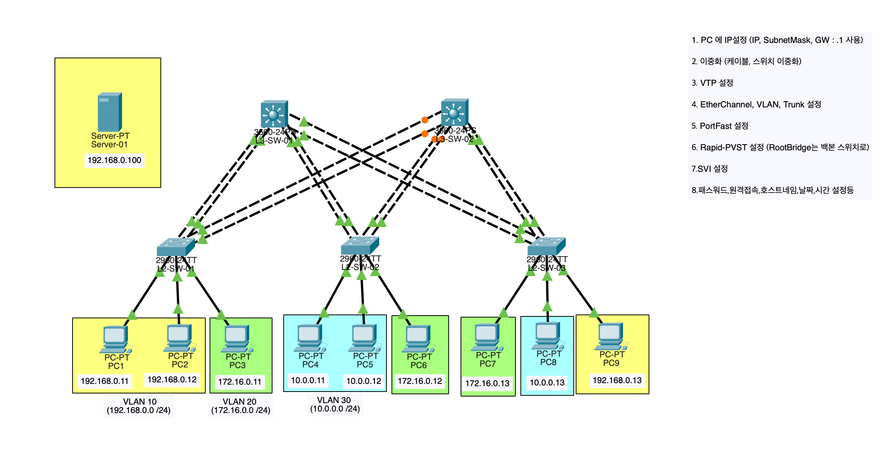

### 15.11 Connect L3-SW-01 and L3-SW-02

#### EtherChannel 설정

* L3-SW-01, L3-SW-02

    ```Plain Text
    int range g0/1-2
    channel-group 4 mode active
    ```

#### Trunk 설정

* L3-SW-01, L3-SW-02

    ```Plain Text
    int po 4
    switchport trunk encapsulation dot1q
    switchport mode trunk
    ```

### 15.12 Connect Server to L3-SW-01

#### Port 설정

* L3-SW-01

    ```Plain Text
    int f0/20
    switchport access vlan 10
    ```

### 15.13 Final Configuration

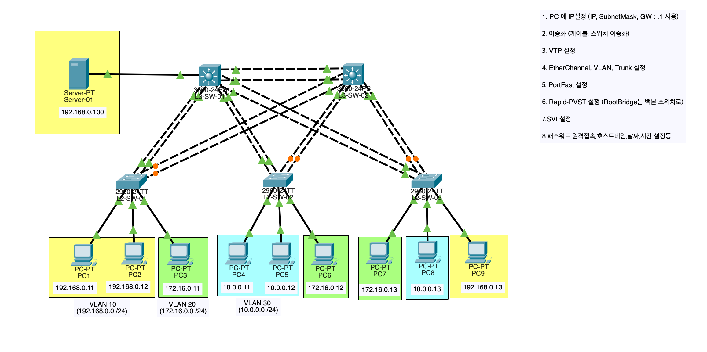

### 15.14 Final Verdict

* L3 Switch 2개를 사용하고 있지만, 실제로는 L3-SW-01이 모든 라우팅을 처리하고 있기 때문에, L3-SW-02는 단순히 백업 역할만 수행하는 상황

* Gateway가 모두 *.1로 설정되어 있기 때문에, L3-SW-01이 다운되면 모든 VLAN 간 통신이 불가능해지는 상황 발생

* L3-SW-02가 라우팅을 처리하도록 설정을 변경하면, L3-SW-01이 다운되더라도 VLAN 간 통신이 유지될 수 있도록 개선 가능

* 지금의 구성에서는, L3-SW-01이 다운되면 L3-SW-02가 라우팅을 처리하도록 각 PC에서 Gateway를 *.2로 변경해야 하는 불편함이 존재

* FHRP (라우터 이중화 프로토콜 - HSRP, VRRP, GLBP)을 사용하여, L3-SW-01과 L3-SW-02가 동시에 라우팅을 처리하면서도, 한 쪽이 다운되더라도 다른 쪽이 자동으로 트래픽을 처리하도록 구성 가능

* 학습 범위를 벗어나기 때문에, 위의 과정은 STP, EtherChannel 실습용 L3-SW-02로 판단