# Server Virtualization Day 06

[1. About Instant Clone](#1-about-instant-clone)

[2. Working with Content Libraries](#2-working-with-content-libraries)

* [2.3 Lab: Create a Local Content Library](#23-lab-create-a-local-content-library)

[3. Modifying Virtual Machines](#3-modifying-virtual-machines)

[4. Lab: Create Amazon Linux 2023 VM from Content Library (OVA Template)](#4-lab-create-amazon-linux-2023-vm-from-content-library-ova-template)

[5. Migrating VMs with vSphere vMotion](#5-migrating-vms-with-vsphere-vmotion)

* [5.3 Lab: Configuring vSphere vMotion](#53-lab-configuring-vsphere-vmotion)

[6. EVC: Enhanced vMotion Compatibility](#6-evc-enhanced-vmotion-compatibility)

[7. Creating Virtual Machine Snapshots](#7-creating-virtual-machine-snapshots)

* [7.2 Lab: Create a VM Snapshot](#72-lab-create-a-vm-snapshot)

## 1. About Instant Clone

* VMware vCenter - Instant Clone

* VMware Workstation - Linked Clone

* 기존 디스크를 Snapshot으로 생성하여 새로운 VM이 해당 Snapshot을 참조하는 방식

* 변경된 부분에 대해서만 디스크 공간이 추가로 사용되며, 원본 디스크는 공유

* Instant Clone은 Linked Clone과 달리 원본 VM의 메모리 상태까지 복제하여 빠르게 VM을 생성할 수 있도록 지원

* Web이 아닌, 명령어를 통해 Instant Clone 생성 가능

## 2. Working with Content Libraries

### 2.1 About Content Libraries

* VM Template, ISO 이미지, 스크립트 등을 중앙에서 관리할 수 있는 저장소

    * VM은 불가능

* 여러 vCenter Server 간에 자동으로 동기화

### 2.2 Types of Content Libraries

* **Local:** vCenter Server에만 존재하는 Content Library

* **Published:** 다른 vCenter Server에서 구독할 수 있도록 게시된 Content Library

* **Subscribed:** 다른 vCenter Server에서 게시된 Content Library를 구독하여 사용하는 Content Library

    * 목록만 구독하여 요청시에 로컬에 저장

### 2.3 Lab: Create a Local Content Library

#### 1. Local Content Library 생성

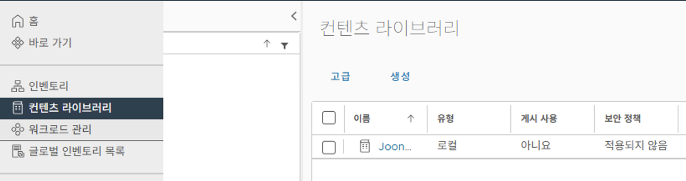

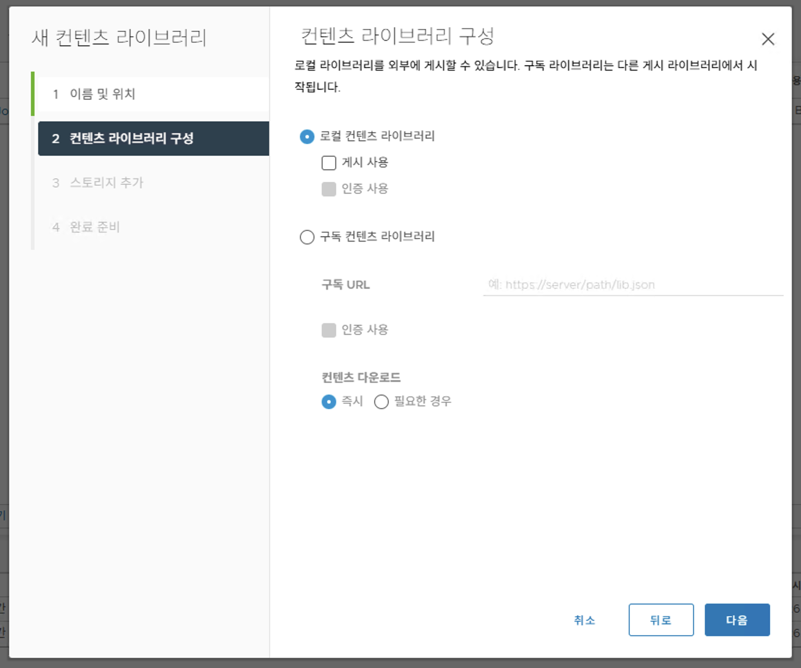

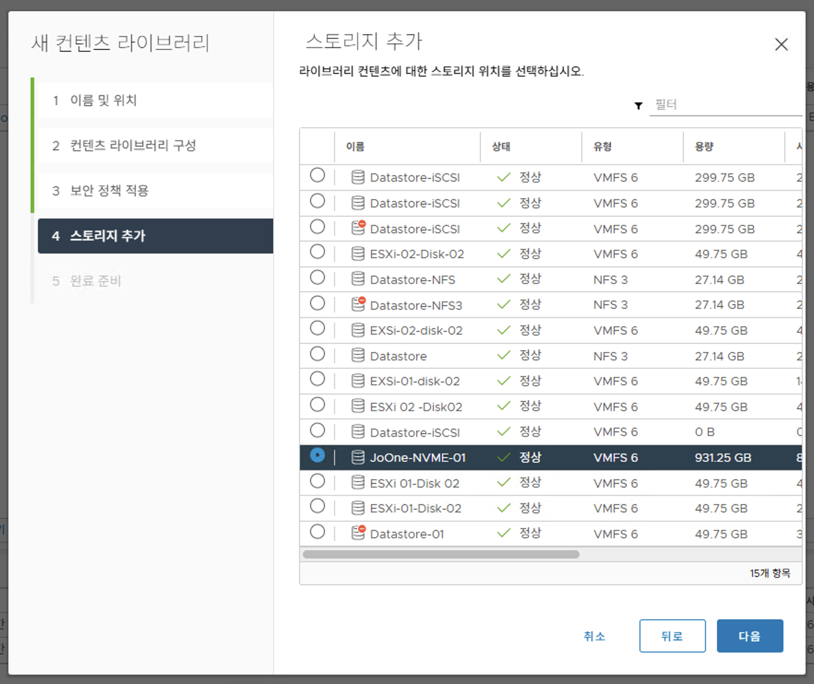

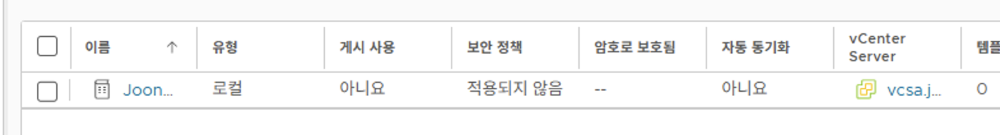

#### 2. Local Content Library에 항목 (ISO Image) 업로드

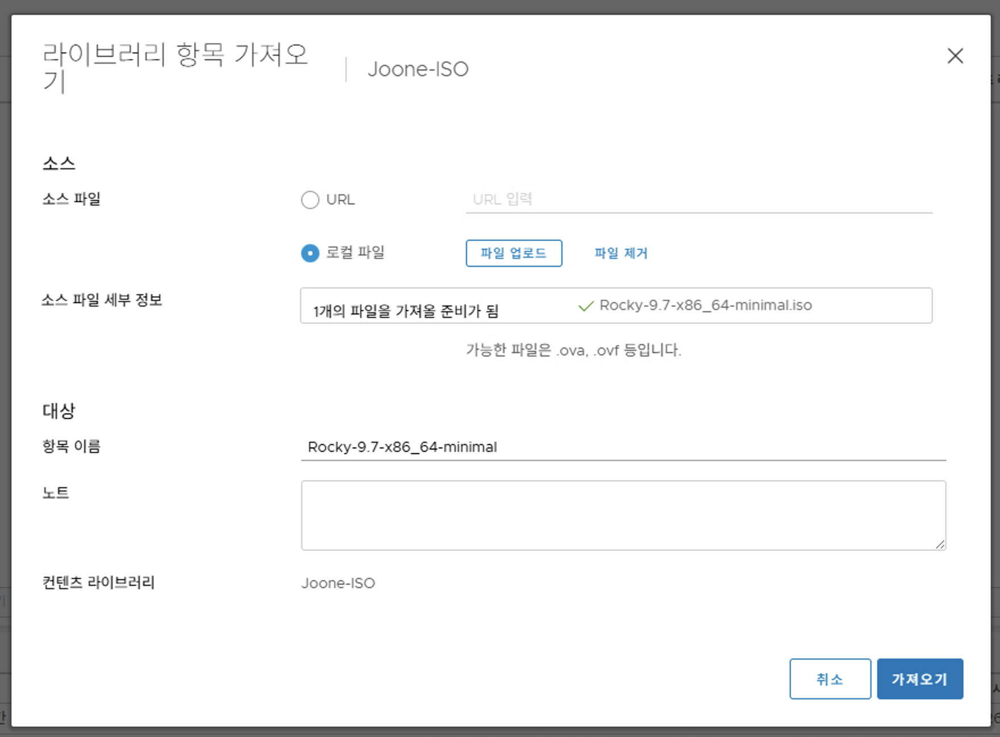

#### 3. Local Content Library에 VM Template 업로드

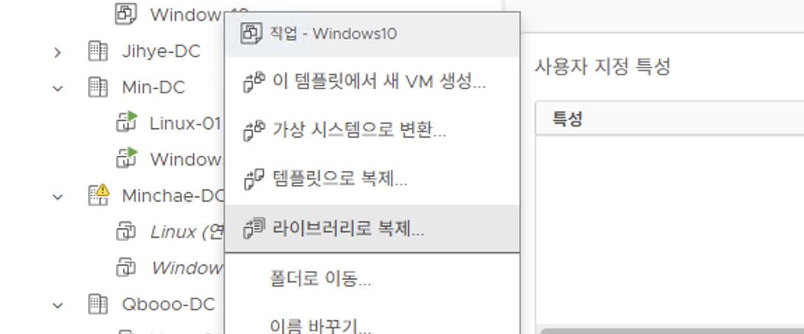

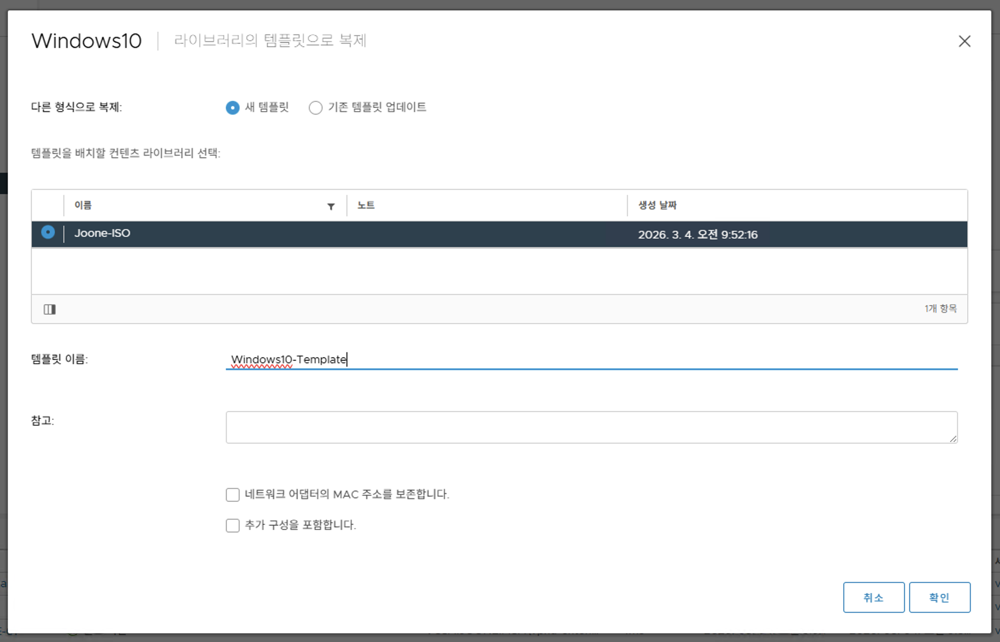

#### 4. Local Content Library에서 VM Template로 VM 생성

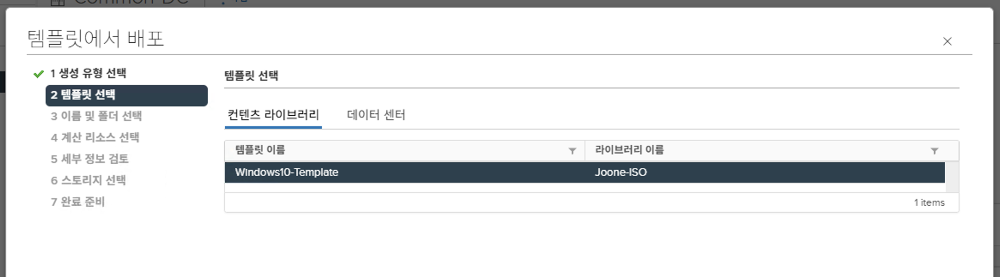

#### 5. Local Content Library 공유

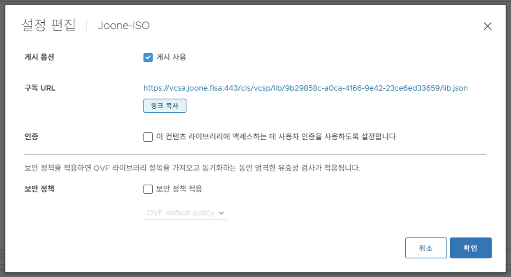

#### 6. Published Content Library 구독

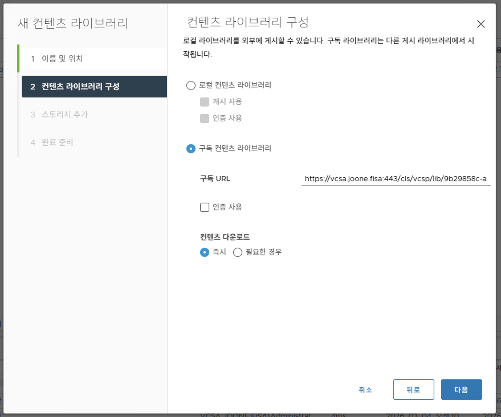

## 3. Modifying Virtual Machines

### 3.1 Hot Add CPU and Memory

* AWS에서는 실행중인 EC2를 종료하지 않고 CPU, 메모리 추가를 할 수 없음

* VMware에서는 실행중인 VM의 CPU, 메모리, 디스크 크기 등을 동적으로 변경 가능

* CPU, 메모리에 대해서 Hot Add 기능이 활성화 되어 있어야 함

### 3.2 Dynamically Increasing Virtual Disk Size

* Hard Disk는 Hot Add 기능이 없어도 실행중인 VM의 디스크 크기를 동적으로 증가시킬 수 있음

* 디스크 크기 증가 후, Guest OS에서 디스크 확장 작업 필요

## 4. Lab: Create Amazon Linux 2023 VM from Content Library (OVA Template)

### 4.1 Upload OVA Template to Content Library

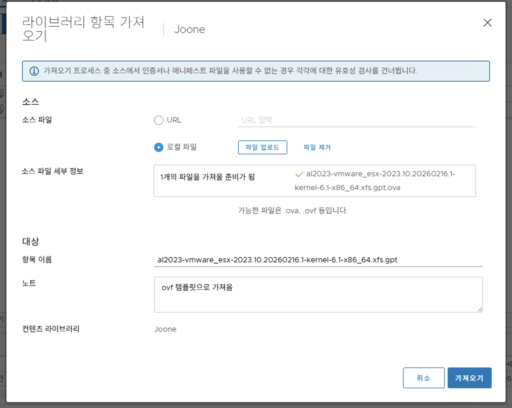

### 4.2 Deploy VM from OVA Template

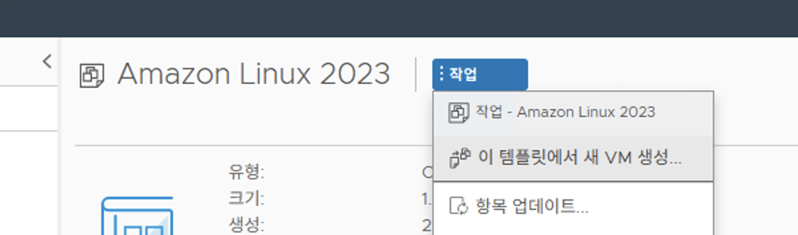

### 4.3 Create seed_network.iso for cloud-init

* `meta-data`

    ```
    local-hostname: al-2023-01
    ```

* `network-config`

    ```
    version: 2
    ethernets:
    ens192:
        addresses:
        - 172.16.10.24/24
        gateway4: 172.16.10.1
        nameservers:
        addresses:
            - 172.16.10.2
    ```

* `user-data`

    ```
    #cloud-config
    ssh_pwauth: True

    # 비밀번호 설정 및 만료 방지
    chpasswd:
    list: |
        ec2-user:VMware1!
    expire: False

    # 사용자 계정 생성 및 권한 부여
    users:
    - name: ec2-user
        passwd: VMware1!
        lock_passwd: false
        sudo: ALL=(ALL) NOPASSWD:ALL
        groups: [wheel, adm, systemd-journal]

    # 부팅 시 설정이 완전히 디스크에 기록되도록 보장
    final_message: "The system is finally up, after $UPTIME seconds"
    ```

* macOS

    ```Bash
    cd Downloads/seedconfig
    hdiutil makehybrid -o seed_network.iso -hfs -joliet -iso -default-volume-name cidata ./
    ```

* Mount `seed_network.iso`

    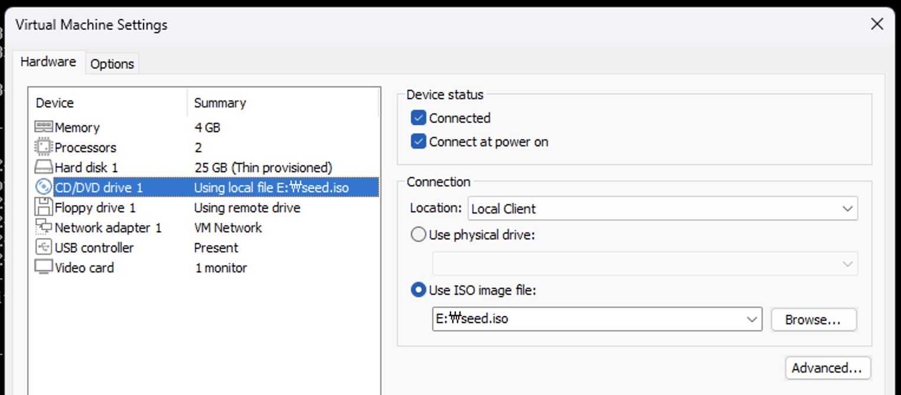

* Check Configuration

    ```Bash
    ls /etc/systemd/network/
    # e.g. 10-cloud-init-ens192.network

    sudo passwd ec2-user
    # 비밀번호 확실하게 고정
    ```

### 4.4 Power on VM and Verify cloud-init Configuration

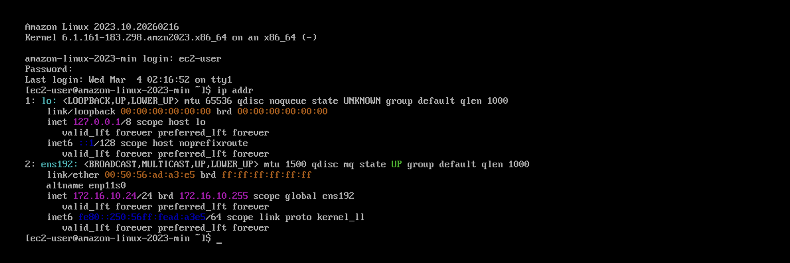

## 5. Migrating VMs with vSphere vMotion

### 5.1 About VM Migration

* **Cold Migration:** VM이 종료된 상태에서 호스트 간 이동

* **Hot Migration (vMotion):** VM이 실행 중인 상태에서 호스트 간 이동

### 5.2 About vSphere vMotion

* VM이 실행 중인 상태에서 호스트 간 이동을 지원하는 VMware의 기술

* 다운타임 없이 VM 이동 가능 (가용성 유지)

* **DRS (Dynamic Resource Scheduler):** 클러스터 내에서 VM을 자동으로 최적의 호스트로 이동하여 리소스 균형 유지

* **DPM (Distributed Power Management):** 클러스터 내에서 호스트의 전원을 자동으로 켜거나 끄는 기능으로, 에너지 효율성 향상

* 클러스터 내의 두 호스트 (ESXi)는 동일한 공유 스토리지에 접근 가능해야 하며, 전용 vMotion IP 네트워크 연결이 필요

### 5.3 Lab: Configuring vSphere vMotion

#### 1. Create a vMotion network

* vMotion 트래픽을 위한 별도의 VMkernel 포트 그룹 생성

    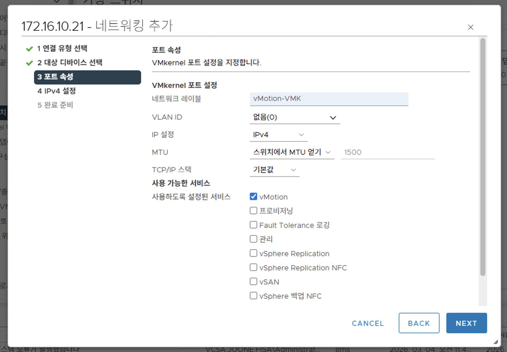

* 172.16.10.121/24

* 172.16.10.122/24

#### 2. Move VM to vMotion Network

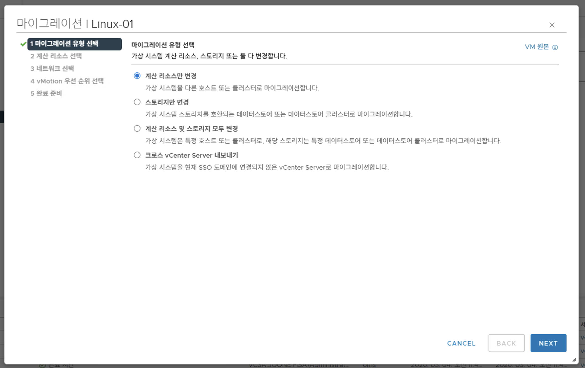

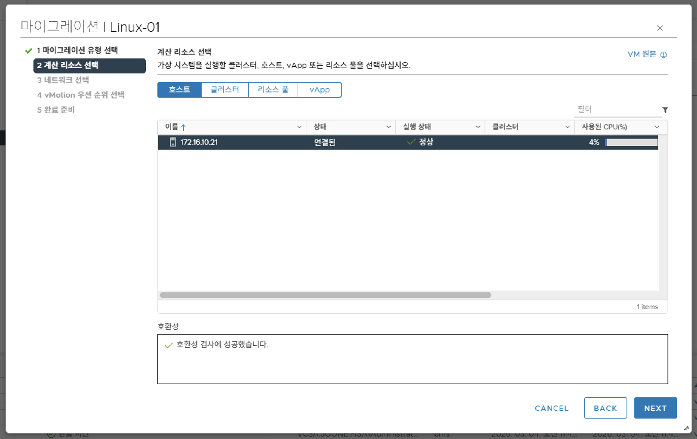

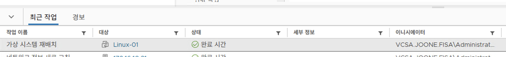

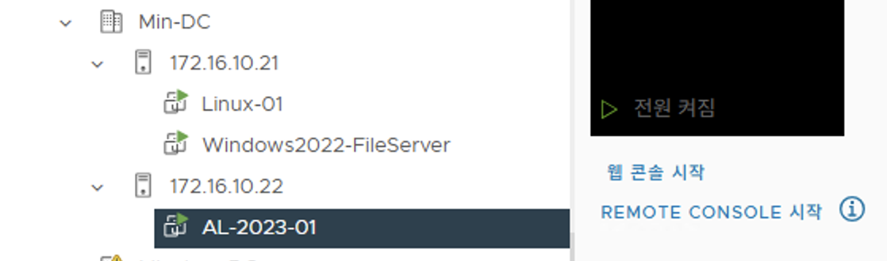

## 6. EVC: Enhanced vMotion Compatibility

* 같은 아키텍처의 CPU를 가진 호스트 간에만 vMotion이 가능

* Intel CPU에서 AMD CPU로는 vMotion 불가능

* VT-X, AMD-V와 같은 가상화 지원 기능이 활성화된 CPU는 모델이 달라도 vMotion 가능

* 동일 제조사 내에서 세대가 다른 CPU 간의 고급 명령어 셋을 하향 평준화하여 충돌 없이 vMotion이 가능하도록 지원

## 7. Creating Virtual Machine Snapshots

### 7.1 VM Snapshots

* VM의 전체 상태 (디스크, 메모리, 구성 설정 등)를 특정 시점으로 저장하고 원상 복구할 수 있는 기능

* **주의사항 - 백업 대체 불가:**

    * Snapshot은 체인 형태로 원본 디스크에 의존하므로, 원본 디스크 손상 시 복구 불가능 (백업 목적으로 사용 금지)

    * Snapshot 파일이 계속 커지면 스토리지 용량 고갈 및 VM 성능 저하를 유발함

    * VMware 공식 권장사항: 최대 72시간 이상 유지하지 않는 것을 강력히 권장하며, 패치나 업데이트 등의 단기 작업 전 안전망 용도로만 사용

### 7.2 Lab: Create a VM Snapshot

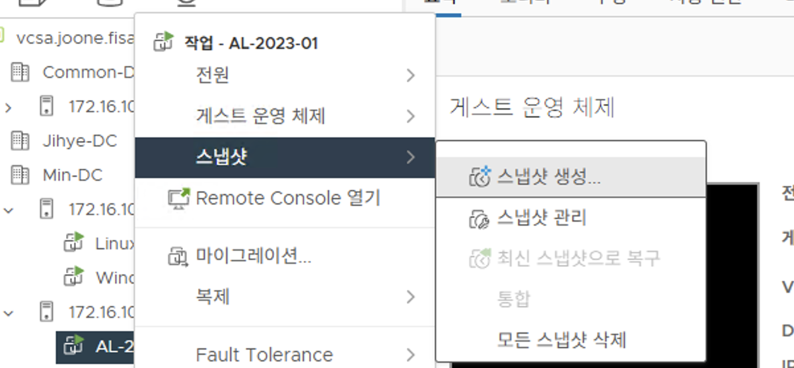

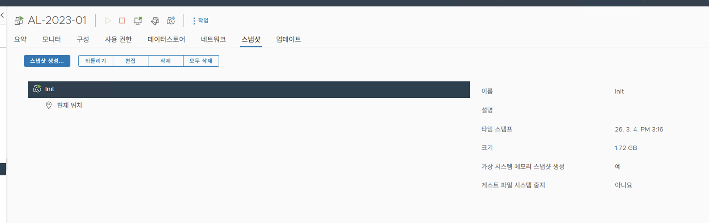

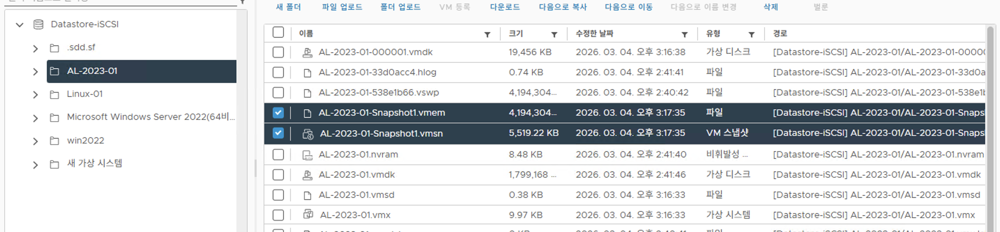

### 7.3 Delete VM Snapshots

* 스냅샷을 삭제한다는 것은 해당 시점으로 복원하는 것이 아니라, 해당 스냅샷 이후에 변경된 데이터를 부모 디스크에 병합하는 과정

* 스냅샷 삭제 중에는 스토리지 I/O 부하가 크게 발생

* **Snapshot A → Snapshot B → Snapshot C → You are here.**

    * C 삭제

        * C의 델타 데이터가 부모인 B에 병합
      
        * `Snapshot A → Snapshot B (+ C의 변경분) → You are here.`

    * B 삭제

        * B의 델타 데이터가 부모인 A에 병합
        
        * 나중 스냅샷인 C는 영향을 받지 않음.
      
        * `Snapshot A (+ B의 변경분) → Snapshot C → You are here.`

    * 모두 삭제

        * A, B, C의 모든 변경 데이터가 순차적으로 원본 디스크에 병합