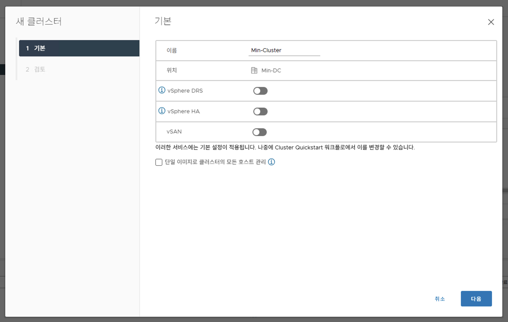
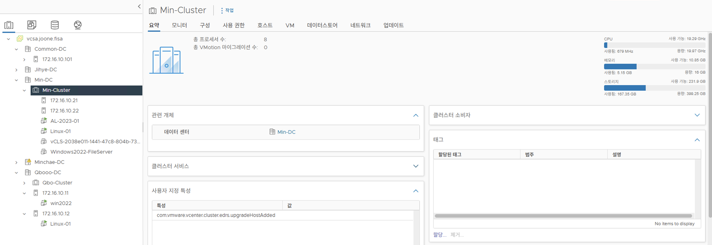
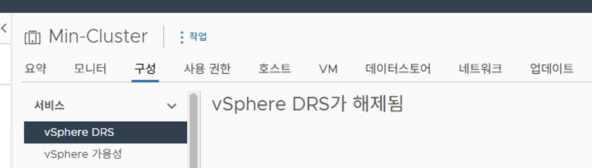
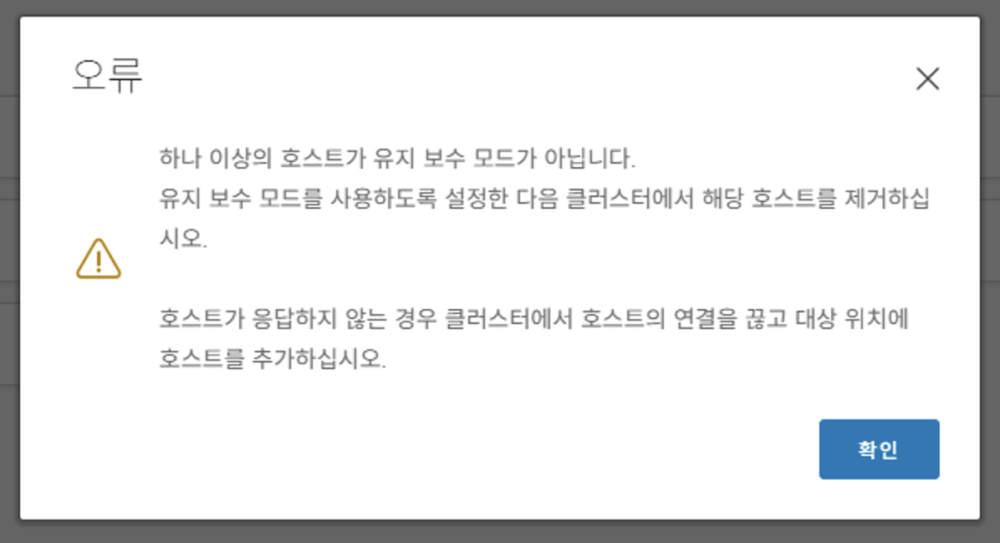
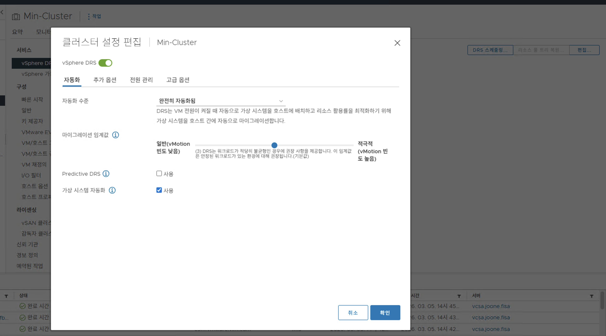
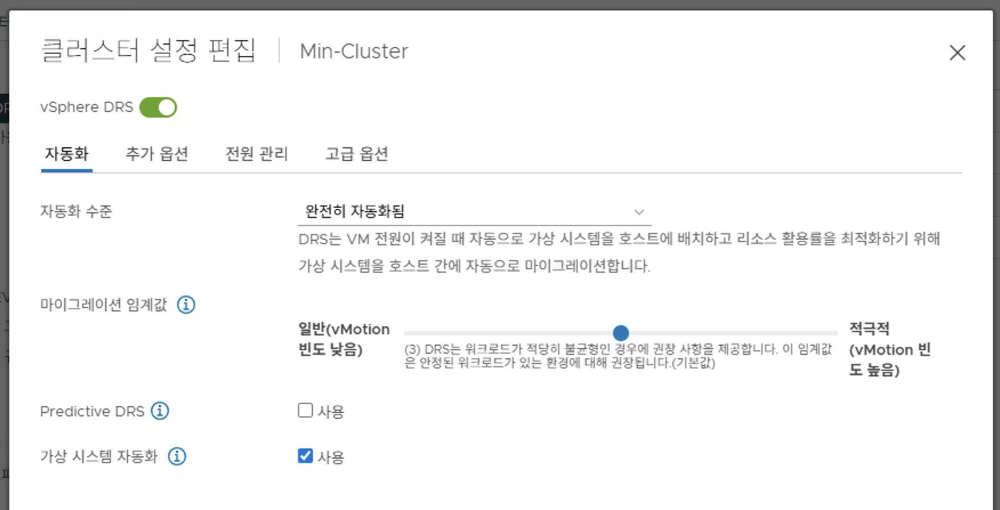
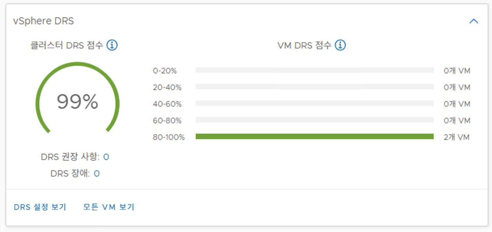
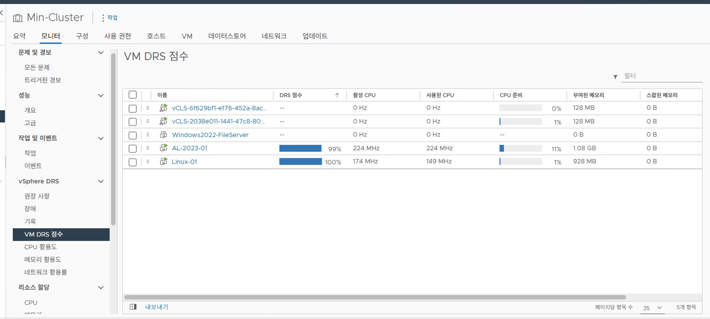
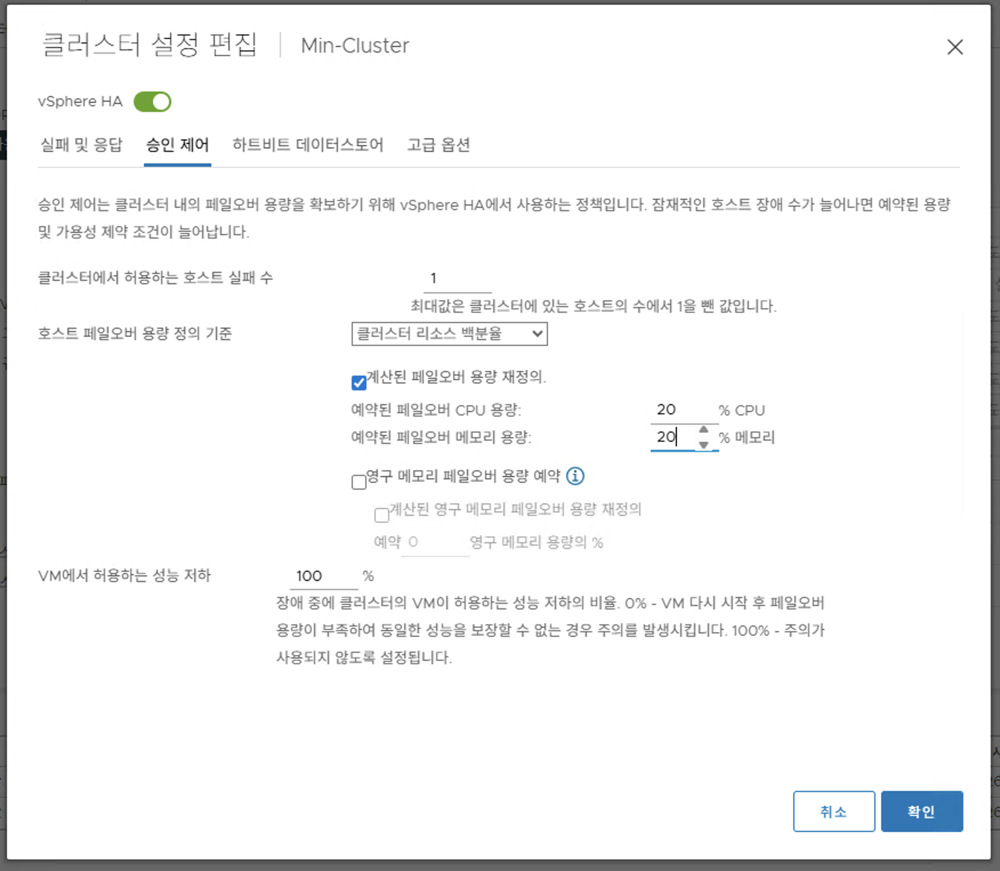

# Server Virtualization Day 07

[1. Virtual CPU and Memory Concept](#1-virtual-cpu-and-memory-concept)

[2. Resource Controls](#2-resource-controls)

[3. Resource Monitoring Tools](#3-resource-monitoring-tools)

[4. Using Alarms](#4-using-alarms)

[5. vSphere Clusters Overview](#5-vsphere-clusters-overview)

[6. vSphere DRS](#6-vsphere-drs)

[7. Introduction to vSphere HA](#7-introduction-to-vsphere-ha)

[8. vSphere HA Architecture](#8-vsphere-ha-architecture)

[9. Configuring vSphere HA](#9-configuring-vsphere-ha)

[10. Introduction to vSphere Fault Tolerance](#10-introduction-to-vsphere-fault-tolerance)

[11. vCLS: vSphere Cluster Service](#11-vcls-vsphere-cluster-service)

## 1. Virtual CPU and Memory Concept

### 1.1 VM Memory Overcommitment

* 물리적 호스트가 가진 실제 메모리 용량보다 가상 머신들에게 할당한 메모리의 총합이 더 많은 상태

* 디스크 스왑과 같이 다양한 메모리 최적화 기법을 통해 한정된 물리 리소스를 효율적으로 분배

* **.vswap 파일:** VM 전원이 켜질 때 생성되며, 호스트의 물리 메모리가 극도로 부족할 때 스왑 아웃 공간으로 사용되는 파일

### 1.2 Memory Overcommit Techniques

* **Transparent Page Sharing:** 동일한 내용의 메모리 페이지를 여러 가상 머신이 공유하여 메모리 공간을 절약

* **Ballooning:** 호스트 메모리가 부족할 때, Guest OS 내의 유휴 메모리를 강제로 회수하여 다른 VM에 할당하는 기술 (VMware Tools 설치 필수)

* **Memory Compression:** 디스크로 스왑되기 직전, 메모리 페이지를 압축하여 디스크 I/O로 인한 심각한 성능 저하를 방지

* **Host-level SSD swapping:** 메모리 압축으로도 부족할 때, 일반 디스크보다 빠른 호스트의 SSD를 스왑 공간으로 활용

* **VM memory paging to disk:** 최후의 수단으로 가상 머신의 메모리를 데이터스토어의 일반 디스크 (.vswap 파일)로 페이징 처리

### 1.3 About Hyperthreading

* 1개의 물리적 CPU 코어를 2개의 논리적 CPU (스레드)로 작동하게 하여 작업 처리 효율을 높이는 기술

* 보안 문제를 방어하거나, 특정 고성능 요구 환경 (HPC)에서는 하이퍼스레딩을 비활성화하기도 함

* 예: 강의실 노트북 - [13th Gen Intel(R) Core(TM) i5-1335U](https://www.intel.co.kr/content/www/kr/ko/products/sku/232153/intel-core-i51335u-processor-12m-cache-up-to-4-60-ghz/specifications.html)

    * 2개의 고성능 코어 (P-Core)와 8개의 효율 코어 (E-Core)로 구성

    * 고성능 코어에 하이퍼스레딩이 적용되어 총 (2 * 2) + 8 = 12 스레드 제공

* 예: 워크스테이션 - [Intel(R) Xeon(R) CPU E5-2630 v4 @ 2.20GHz](https://www.intel.co.kr/content/www/kr/ko/products/sku/92981/intel-xeon-processor-e52630-v4-25m-cache-2-20-ghz/specifications.html)

    * 10개의 물리적 코어로 구성

    * 하이퍼스레딩이 적용되어 코어당 2스레드, 총 20 스레드 제공

## 2. Resource Controls

* **Shares:** 호스트의 리소스가 부족하여 경합이 발생할 때, 설정된 가중치에 따라 VM들에게 리소스를 분배 (기본값: Normal)

* **Limits:** 리소스 경합 유무와 상관없이, 가상 머신이 최대로 사용할 수 있는 호스트 리소스의 상한선 (기본값: Unlimited)

* **Reservations:** 가상 머신이 항상 호스트로부터 물리적으로 보장받는 최소 리소스 (기본값: 0)

## 3. Resource Monitoring Tools

### 3.1 Using esxtop to Monitor VM Resources

* **`esxtop`:** ESXi 호스트에 SSH로 접속하여 CPU, 메모리, 디스크, 네트워크 리소스 사용량을 실시간으로 모니터링하는 CLI 도구 (리눅스의 `top` 명령어와 유사하지만 가상화 환경에 특화됨)

### 3.2 Chart Options: Real-Time and Historical

* 모니터링 데이터는 특정 수집 주기 단위로 기록됨

    * vCenter 실시간 차트: 20초 (기본값)
    
    * AWS EC2 CloudWatch: 기초 모니터링 5분 (세부 모니터링 1분)

* **주의점:** 차트에 점이 찍히는 값은 주기의 '최대/최소/평균'이 아니라 기록하는 바로 그 시점의 절대값

    * 짧은 순간 치솟았다가 내려오는 스파이크 현상은 샘플링 주기에 따라 차트에 누락될 수 있음

* **Roll Up (롤업):** 데이터 보관 용량을 줄이기 위해, 과거의 상세 데이터를 특정 주기 (예: 시간당, 일당)로 묶어서 평균값을 내고 압축 저장하는 기능

### 3.3 About Statistics Types

* **Rate:** 특정 시간 동안 리소스를 얼마나 사용했는가의 측정값 (예: 1초당 CPU 처리량 GHz, 초당 네트워크 전송량 KBps)

* **Delta:** 바로 직전 기록된 값과 현재 기록된 값 사이의 차이 (예: 디스크 기록 수 증가량)

* **Absolute:** 측정이 이루어지는 그 순간의 정확한 상태 또는 누적된 총량 (예: 현재 메모리 점유율 MB, 총 디스크 용량)

## 4. Using Alarms

* **Acknowledge:** 관리자가 알람을 확인했음을 시스템에 표시

* **Reset To Green:** 수동으로 경고 상태알람을 정상 상태로 초기화

## 5. vSphere Clusters Overview

* **High Availability:** 호스트 장애 발생 시, 다른 호스트에서 가상 머신을 재시작하여 서비스 복구 (짧은 다운타임 허용, 예: 99.999% 가용성)

* **Fault Tolerance:** 장애 발생 시, 실시간 동기화 중인 VM으로 즉시 전환하여 무중단 서비스 제공 (다운타임 없음)

* **Pre-requisites:** 클러스터의 핵심 기능이 작동하려면 호스트 간 VM 이동이 가능해야 하므로 공유 스토리지와 vMotion 네트워크 구성이 필수적

* vCenter → Data Center → ESXi Host → VM

* vCenter → Data Center → Cluster → ESXi Host & VM

### 5.1 Why Clusters?

* **HA:** 호스트 장애 시 VM 자동 재시작

* **DRS:** 호스트 간 리소스 자동 로드밸런싱 및 분산

* **vSAN:** 로컬 디스크들을 모아 공유 스토리지처럼 사용

### 5.2 Create a Simple Cluster

* Cluster로 구성에서 Host를 제거 하려면, 모든 VM을 다른 Host로 이동시켜야 함

    

## 6. vSphere DRS

### 6.1 About vSphere DRS

* **DRS: Distributed Resource Scheduler**

* 클러스터 내 호스트와 가상 머신의 CPU 및 메모리 자원을 모니터링하여, 초기 배치를 자동으로 결정하고 지속적으로 분산을 수행하는 기능

### 6.2 Enable DRS

### 6.3 vShpere DRS Settings: Automation Level

* **Fully Automated**

    * 가상 머신 구동 시 최적의 배치 호스트를 자동으로 찾아 할당함

    * 운영 중 리소스 불균형이 발생하면 DRS 스스로 판단하여 자동으로 마이그레이션 (vMotion)을 수행함

* **Partially Automated**

    * 가상 머신 구동 시 최적의 배치 호스트를 자동으로 찾아 할당함

    * 운영 중에는 마이그레이션 권장 사항만 띄우며, 관리자가 수동으로 승인해야 실제로 이동함

* **Manual**

    * 초기 배포 시에도 권장 사항만 제공하므로 관리자가 호스트를 직접 선택해야 함

    * 운영 중 이동 역시 권장 사항만 제공하며 관리자가 수동으로 승인해야 함

### 6.4 vSphere DRS Settings: Migration Threshold

### 6.5 VM DRS Score List

### 6.6 vSphere DRS Settings: Predictive DRS

* 외부 모니터링 솔루션의 데이터를 분석하여 호스트 부하를 미리 예측하고 사전에 가상 머신을 이동시키는 기능

* 예: 주말 야간에 특정 가상 머신 사용량이 급증하는 패턴이 있다면, 부하가 발생하기 전에 미리 가상 머신을 다른 호스트로 대피시켜 성능 저하를 차단함

### 6.7 vSphere DRS Settings: VM Affinity

* 특정 소프트웨어 라이선스 정책이나 고가용성 설계를 위해 가상 머신 간의 배치 위치를 강제하거나 떨어뜨리는 규칙

* Affinity Rule: 트래픽 연결이 잦은 특정 가상 머신들이 항상 같은 호스트 안에 모여서 실행되도록 묶는 규칙

* Anti-Affinity Rule: 분산 처리 중인 가상 머신들이 호스트 장애 시 한 번에 다운되지 않도록 무조건 서로 다른 호스트에 배치하는 규칙

### 6.8 vSphere DRS Settings: DRS Groups

* **Host Group:** 특정 기능이나 스펙을 가진 호스트들끼리 논리적으로 묶어둔 단위

* **VM Group:** 특정 목적이나 부서를 가진 가상 머신들끼리 논리적으로 묶어둔 단위

### 6.9 vSphere DRS Settings: VM-Host Affinity Rules

* 생성한 가상 머신 그룹이 어느 호스트 그룹에서 실행되어야 하는지 연결해주는 규칙

* **Should 규칙:** 가급적 지정한 호스트 그룹에서 실행되도록 노력하지만, HA 복구 등 불가피한 장애 상황에서는 다른 곳으로의 대피를 허용함

* **Must 규칙:** 어떠한 상황에서도 지정된 호스트 그룹에서만 실행되어야 하는 강력한 강제 조항

## 7. Introduction to vSphere HA

* 호스트 하드웨어 장애 시스템 운영체제 에러 등이 발생했을 때, 해당 호스트에서 돌고 있던 가상 머신들을 클러스터 내의 건강한 다른 호스트에서 신속하게 재시작시켜 서비스 중단 시간을 최소화

## 8. vSphere HA Architecture

### 8.1 vSphere HA Architecture: Datastore Heartbeat

* **Network Heartbeat:** 호스트들은 자신이 살아있음을 알리기 위해 기본적으로 관리 네트워크를 통해 서로 하트비트를 주고받음

* **Datastore Heartbeat:** 관리 네트워크에 장애가 생겨 호스트 간 통신이 끊어졌을 때, 실제로 호스트가 죽은 것인지 네트워크만 끊어진 것인지 이중으로 확인하기 위해 공유 스토리지 영역에 하트비트를 기록

* **Split Brain:** 네트워크가 단절되어 호스트들이 서로를 죽었다고 판단하고 각자 동일한 가상 머신을 구동시켜 충돌이 일어나는 문제

## 9. Configuring vSphere HA

* **Admission Control:** 클러스터 내 호스트 1-2대가 예기치 않게 죽더라도, 나머지 호스트들이 죽은 호스트의 가상 머신들을 모두 감당할 수 있도록, 평상시에 가용 자원의 일정 비율 (예: 25%)을 미리 예약해두고 사용을 제한

* 고가용성 설계 시, 서버 고장에 대비한 여분의 Dedicated Server 리소스를 미리 산정

## 10. Introduction to vSphere Fault Tolerance

* 호스트 장애 발생 시 다운타임이 발생 하는 HA의 한계를 넘어, 다운타임 없이 무중단 서비스를 제공하는 내결함성 기술

* Primary VM의 메모리 상태와 실행 명령을 실시간으로 Secondary (Shadow) VM에 복제

* 대역폭 요구량이 매우 높으므로 FT 로깅 전용 VMkernel 네트워크 인터페이스 셋업이 필요

## 11. vCLS: vSphere Cluster Service

* 클러스터 환경을 관리하는 중앙 컨트롤 타워인 vCenter Server 자체에 장애가 발생하여 죽더라도, 클러스터의 핵심 자원 분산 기능이 멈추지 않고 독립적으로 계속 작동할 수 있도록 보장

* 클러스터를 구성하고 호스트를 추가하면, 각 호스트 베이스에 작고 가벼운 에이전트 가상 머신들이 자동으로 생성

* 관리자가 인벤토리 정리 등의 이유로 이 가상 머신들을 강제로 삭제하더라도, 클러스터 유지를 위해 시스템이 자동으로 다시 생성